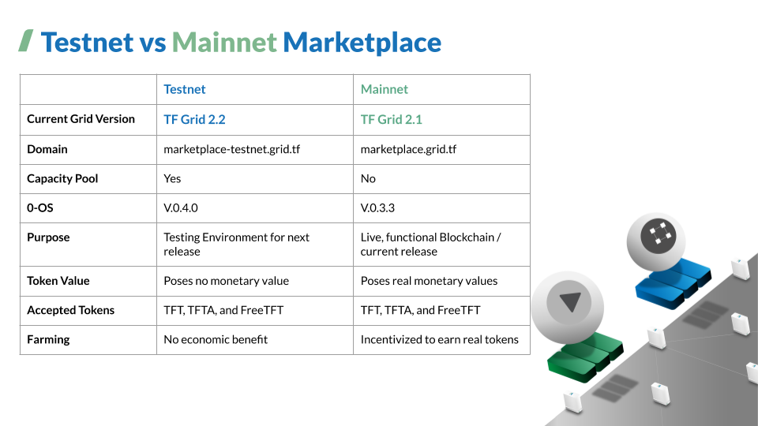

# Threefold Grid 2.2 (Tesnet) Manual


Hi! Welcome to the __TF Grid 2.2 (Testnet) Manual__, a knowledge base for those interested in learning more about deploying a network and solutions on top of the __TF Grid 2.2 Testnet Environment__ via [__TF Grid Demo__](demo.grid.tf) And [__3Bot__](deploy3bot.grid.tf) . 

## Navigate Your Way on the Manual

- [__Introduction__](learn.md)
- [__Getting Started__](getting_started.md)
- [__TF Grid Demo__](marketplace.md)
- [__3Bot__](3bot.md)
- [__Advance Development__](develop.md)


The Manual is sectioned into 5 major sections to cater to each of these different actions in the TF Grid Ecosystem. If you're interested in learning about the Threefold Ecosystem, see the [__Introduction__](learn.md) section.

To learn all the basics you would need to complete before deploying a solution on top of the TF Grid, head over to the [__Getting Started__](getting_started.md) section of the Manual. 

Feel free to try deploying all available built-in TF Grid solutions (demo) and easy deployment manuals via [__TF Grid Demo__](marketplace.md) section. 

If you're interested in deploying a cloud solution project on top of TF Grid (testnet), you would need to firstly run a 3Bot locally or online on a hosted environment. Feel free to check [__3Bot__](3bot.md) section to deploy a hosted 3Bot. 

If you're interested in more advanced technical hand-outs on cloud solution deployment by using a 3Bot that is installed on a local machine, check out our [__Advance Development__](develop.md) guide section. It will guide you from scratch on how to run your local 3Bot and deploy first cloud solution on the grid by using a step-by-step procedure and primitives.

If you're looking for an introduction to Threefold in general, please go to our main [__Threefold Wiki__](wiki.Threefold.io) 


## TF Grid: Where Are We Now?


```
Release Stats (Aug 2020)

- Threefold Grid 
 - Current: TF Grid 2.1.0
 - Next: TF Grid 2.2.0

- TF Grid Demo
 - Mainnet (2.1) - Production
 - Testnet (2.2) - Staging

- 0-OS
 - Current: 0-OS V0.3.3
 - Next: 0-OS V.0.4.0
```

In brief, the Threefold Grid is composed of three different types of networks environments; Mainnet (production), Testnet (Staging), and Dev (Development). 

The latest versions of 0-OS (TF Grid’s operating system) and their associated new features are first deployed for testing to the ‘Devnet’ and ‘Testnet’, before being released on the ‘Mainnet’ grid. Any farmer and partner will be able to choose to run their node on any of the 3 networks, by configuring their 0-OS boot process accordingly.

We’ve been working hard to make it even easier for projects to deploy solutions on top of the grid with the new __TF Grid Demo__; enabling projects to deploy solutions on a hosted environment. 

Currently TF Grid Demo 2.1 is released on Mainnet. Our next release - __TF Grid 2.2__ - will include certain exciting features like the Capacity Pools- where you could order IT capacity on the dashboard for your project directly from the farms. This feature is currently only available on the [__3Bot System Administrator Panel__](deploy3bot.grid.tf). this is where we hope you could contribute as a __Testnet alpha tester__ and try to build your cloud solutions on. This manual is aimed to serve as your how-to on  easy solution deployment by using [__TF Grid Demo__](demo.grid.tf) (testnet).

## Testnet vs MainNet

Below is a diagram that will help you understand the difference in between the testnet version and the mainnet version of the TF Grid. 

