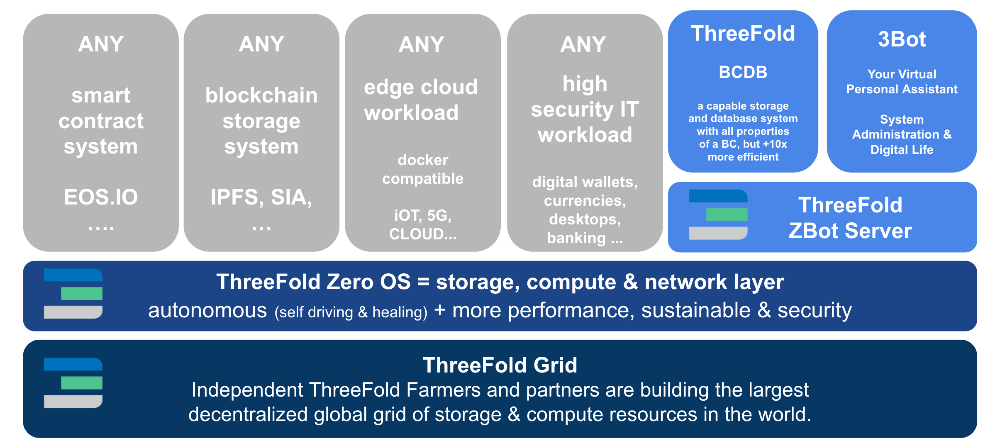
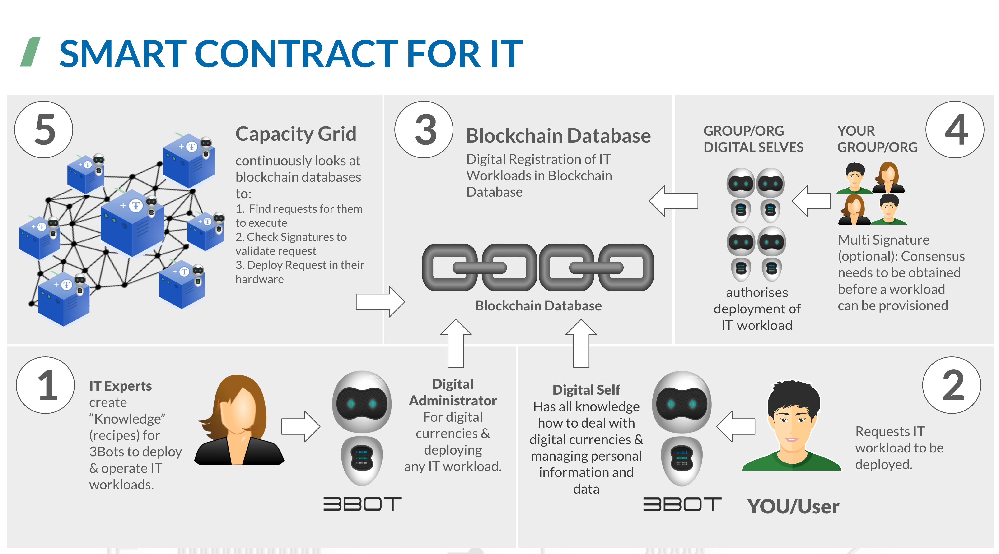

## Architecture in general

### Built by many for anyone
The peer2peer nature is embedded in the architecture by the token economy.  The technology stack is open source and allows anyone to participate as a producer or a consumer of capacity.  Capacity producers (Farmers) create compute, storage and network utility by which they mint the digital currency called TFT.  Capacity consumers use capacity to create digital services and architect IT worklaods.  The only accepted currency for the consumed capacity is the TFT.  So the architecture is from the ground up a peer to peer techonlogy

### Use cases

The technology stack aims to be a universal substrate (build by many for anyone) for generic IT workloads.  Any (linux based) workload can be ported to the substrate and use capacity (compute, storage and networking) spread over many devices.  These devices can exists in traditional  datacenters, but also in other locations where people have opted in to be a capacity provider.

Use cases span a gamma of different industries and specific purposes but the ones that show most early adopter interest are blockchain projects who habve a needs to break out of the capcitivity of the current internet (cloud ) provider monopolies.  Many project relay for more than 50% of their "distributed" and "decentralised" blockchain nodes infrastructure on a hand full of market leader in the cloud world.  They welcome a distributed anc decentralised architecture like [cloud.threefold.io](http://cloud.threefold.io) offers/

### How does it all work under the hood?

The technology stack creates autonomous IT capacity that produces usable slices of capacity in a very efficient way. 

This diagram shows the inner working of the autonomous grid.  Every element of it operates in a peer to peer manner.  Every participant (entity) is this systems needs to have a digital representation.  This jumpscale SDK is you digital representation carrying yout identity, your wallet, and a lot of "knowledge" in terms of completing tasks.  This SDK is also reffered to as a 3bot.

#### Nodes (5)
The nodes making up the grid, owner and hosted by farmers, run a very lightweight operating system. This operating system on nodes is called [zero OS](https://github.com/threefoldtech/zos) and is a lightweight single purpose operating system.  It exposes all available peripheals in the nodes and announces the available capacity in a so called explorer.  The operating system does not have interfaces for people to use, not locally not remotely over the network.  Therefore this operating system is very secure as there are no attack vectors locally nor remotely.  It has so called "watchers" that periodically reaches out over the network to a blockchain database to see if there is any workload for them to execute.  The only way that nodes will execute any code is for it to have been committed to the blockchain database (3).

#### Blockchain database (3) and the "smart contract for IT" process
The blockchain database (BCDB) is a innovation by TF Tech.  It is a database with database functionality that has embedded blockchain characteristics.  Think of it as records in a database that are written immutable and always append, the unique characteristics of a blockchain.  So the blockchain databased has record chains that store information immutable, always append with a query mechanism to provide fast searches.  This BCDB stores the result of peer2peer negotiations and contracting results between farmers (5), architects (1) and consumers (2) of capacity.  The blockchain database stores the results of such a (smart) contract (agreement) and not the smart contract (process) itself.  The smart contract process is conducted based on logic implemented in the digital representatives of farmers (5), architects (1) and consumers (1).  This is very safe as there is no central record of how that smart contract came into existence, only the **end** result of the contracting process (the deliverables) are stored.

Last but not least the smart contracting process has the capability of including many more participants and create a "multi signatore" contracting process where an umnlimited number of people can be added ro form consensus.  We like to call that the "human blockchain".

<!--
TODO Topics:  >