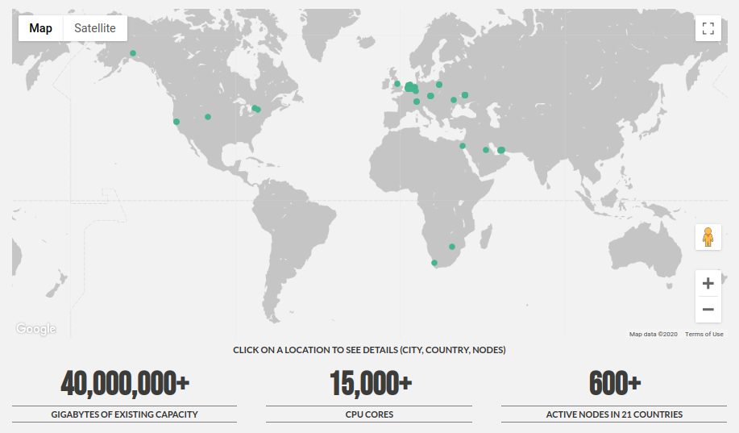

## 3Node architecture 

### Introduction
3nodes are hardware which rund the Zero-OS software.  All 3nodes make up the capacity layers for the TF Grid.  Today we have about 600 3nodes in the field. See more details [here](http://www2.cloud.threefold.io)
<!--
TODO #45 Change URL to real URL once published
-->

All of these 3nodes have zero software installed on their local storage devices.  The Zero-US is delivered to them over the network and the boot facility is hosted on the TF grid itself.

### 3node operations
To install a 3node and make it part of the TF Grid a few steps need to be completed:
1. acquire some (Intel or AMD) powered hardware
2. get a farmer indentity
3. create and download a bootloader (of a mechanism of your choice)
4. power the hardware with electricity and internet access
5. Boot!

That's all! All details regarding this process are listed in the TF Grid [wiki](https://wiki.threefold.io/grid/readme#/grid/tf_farming/v2_jsx_farmsetup).  The actual bootloader is very small and brings up the network interface of you hardware and then queries (web) servers for the remainder of the installation files needed.  The operating system is not installed on any local storate facility nor is any state with regards to this operating system stored locally, the hardware does not store any state of the OS and all of it's containers and other Zero-OS primitives.

The mechanism to allow this to work in a safe and efficient manner if a Threefold innovation called flist.  This is explained in more detail [here](./architecture_flist.md)

## Zero-OS

Zero-OS is a very lightweight and efficient operating system.  It supports a small number of primitives, meaning low level functions it can perform natively in the operating system.  There is no shell, local nor remote, and it does not allows for inboud networks connections. There is a dedicated githib repository for [Zero-OS](https://github.com/threefoldtech/zos/tree/master/docs)

