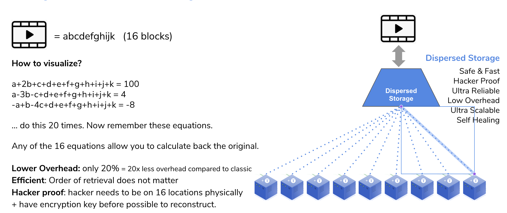
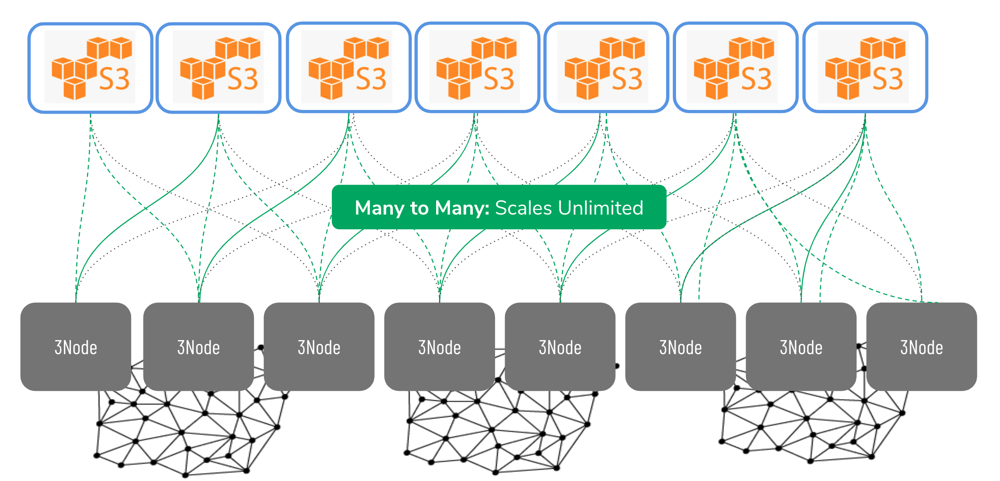
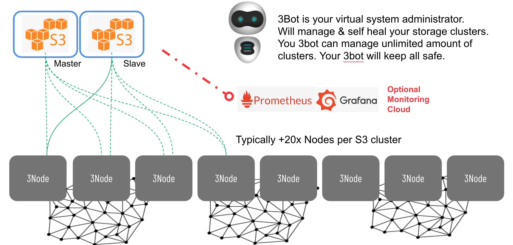

## Storage architecture

### Introduction
The storage architecture follows the true peer2peer design of this grid.  Any participating node can store elements of objects (files, photos, movies, databases etc.) by offering a slice of the present (local) storage devices. Managing storage and retrieval of all of these distributed fragments is done by software that creates delopment or enduser interfaces for this storage algorithm.  We call this dispersed storage.  More details later.

Peer2peer provides the unique proposition of selecting storage providers that match your application, service of business criteria. For example you might be looking to store data for you application in a certain geographic area (for goveernance and compliance) reasons.  Also you might want to use different "storage policies" for different types of data.  Exmaples are live versus archived data.  All  of these uses cases are possible with this storage architecture and can be build by using the same building blocks produced by farmers and consumed by developers / end users.

### Dispersed storage architecture design philosophie

#### Classic storage

Classic storage designs reliability arround (multiple) copies of the same data. The reasoning is to build storage solutions around the following structure:
- The **first copy** is the active which is being worked on.  Intense storage and retrieval processes.
- Then there is a (hot) **second copy** of the data that is continuously being synchornised with the live one and is available in case the active copy fails for immediate (uninterrupted) failover
- The **third copy** is a cold, off-line copy, also referred to as a backup.  This is a complete copy of the data which is available but not (live accessible)
- The fourth copy is what is usally referenced to as "archive".  On off-site, securedly stored (physical storage) offline copy of the data that can be pulled in in case all of the above fails.

The overhead is 100% per copy so you quite easily end of with **400%** overhead for reliability.

All of the above concepts were invented when datasets were small(er) and could still fit on one device, or is a single (dual redundant) box.  This is no longer the case and therefore these storage principles are outdated.


#### Dispersed storage

Today we produce more data than ever before (in the last two years we produced more data than in the history of mankind, and this is accelarating exponentialy).  We cannot continue to make full copies of data to make sure it is stored in a realiable manner.  This will simply not scale.  We need to move from securing the whoel dataset to securing all the objects that make up a dataset.

Dispersed storage is using space technology to store data(fragments) over multiple devices (physical storage devices in 3Nodes).  The solution does not distribute and store parts of an object (file, photo, movie etc.) but describes the part of an object.  This van be visualised by thinking of it as equations.  



Let `a,b,c,d....` be the parts of that original object. Then by creating equations which those parts you can create endless unique equations using these parts.  Simple example: let's assume we have 3 parts of an original objects that have the following values:
```
a=1
b=2
c=3
```
(and for reference that part of real world objects is not a simple number like `1` but a unique digital number describing the part, like the binary code for it `110101011101011101010111101110111100001010101111011.....`).  With these numbers we can create endless amounts of equations:
```
1: a+b+c=6
2: c-b-a=0
3: b-c+a=0
4: 2b+a-c=2
5: 5c-b-a=12
......
```
Mathematically we only need 3 to descibe the content (=value) of the fragments. But creating more add reliability.  Now store those equations distributed (one equation per physical storage device) and forget the original object.  So we no longer have access to the values of `a, b, c` and see and we just remember the locations of all the equations created with the original data fragments.  Mathematically we need three equations (any 3 of the total) to recover the original values for `a, b` or `c`. So do a request to retrieve 3 of themany equations and the first 3 to arrive are good enough to recalculate the original values. Three randomly retrieved equations are:
```
5c-b-a=12
b-c+a=0
2b+a-c=2
```
And this is a mathematical system we can solve:
- First: `b-c+a=0 -> b=c-a`
- Second: `2b+a-c=2 -> c=2b+a-2 -> c=2(c-a)+a-2 -> c=2c-2a+a-2 -> c=a+2`
- Third: `5c-b-a=12 -> 5(a+2)-(c-a)-a=12 -> 5a+10-(a+2)+a-a=12 -> 5a-a-2=2 -> 4a=4 -> a=1`

Now that we know `a=1` we can solve the rest `c=a+2=3` and `b=c-a=2`.  And we have from 3 random equations regenerated the original fragments and can now recreate the orinal object.  

The redundancy and reliability in such a system comes in the form of creating (more than needed) equations and storing them.  As shown these equations in any randon order can recreate the original fragments and therefore   
redundancy comes in at a much lower overhad.

Example:  each object is fragmented into 16 parts.  So we have 16 original fragement for which we need 16 equations to mathematically describe them.  Now let's make 20 equations and storing them dispersed on 20 devices.  To recreate the original object we only need 16 equations, the first 16 that we find and collect which allows us to recover the fragment and in the end the original object.  We can loose any 4 of those original 20 equations.

The likelyhood of loosing 4 independent, dispersed storage devices at the same time is very low and since we have continuos monitoring of all of the stored equations we can create additional equations immediately when one of them is missing.  Autoregenration of lost data and a selfreparing storage system.

The overhead in this example is 4 out of 20 which is a mere **20%** instead of (up to) **400%**.

### Available today



## Storage details




