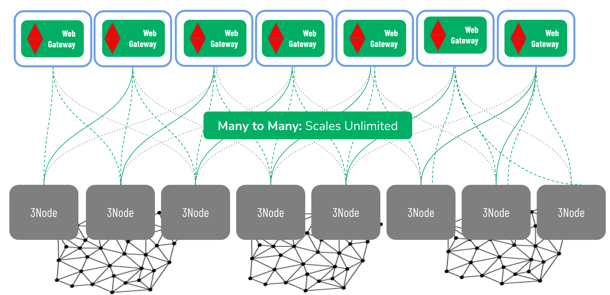

## Webgateway architecture

### Introduction
The webgateway is an important component of exposing anything deployed on the TF grid to the open internet.  TF Grid works natively with IPv6 (and IPv4 in locations where IPv6 is not available) and is by default not exposing any of the reserver overlay networks to the open internet (please find more informaition on the [network](./architecture_network.md) section). The webgateway is the element that bridges (in a secure way) the open internet and the private overlay network.  

### Capacity farming and network farming
TG Grid is built by farmers that inverst and deploy hardware on which Zero-OS runs creating a peer2peer grid capacity generating grid.  Each node is as important as any other node and all together they form this universal substrate for IT workloads. Although all nodes are equal in thus grid they do not all come equal in the sense of networks connectivity.  Besides the obvious differences of have redundant network upstream connections (most datacenter setups) of having small, mediumn and large upstream bandwidth available (home setups versus office and datacenter setups).

Beyond these differences there will be another one?: The number of available IP adresses on a site.  Some sited will not be able to have more than one IP address available (IPv6 or IPv4) and therefore re not suited to services online services for anyone. The 3nodes that are connected to the internet with only one IP address available are called "hidden" 3nodes.  More details can be found [here]() <<!-- TODO Insert link to JAn's network story -->>.  To be able to allow anyone to participate and create capacity to this universal substrate (capacity farming) we require network farming to connect hidden nodes to the internet to expose digital services.

Network farmers are farmers that have access to a location where there is good network connectivity and a large(r) amount of IP adresses.  This large(r) amount of IP adresses and good upstream connectivity makes these sites ideal to create Ingress/Egress points for private overlay networks.

This architecture allows for total freedom to choose where to process and store data. When the data / content is ready to be exposed to the rest of the world the webgateway provides total freedom to select the best possible location for that to happen.  True peer2peer in every aspect.

<!--
Source code can be found here: https://github.com/threefoldtech/tcprouter
-->

### Scaleout architecture.

The independence of network and location created by the webgateway allows this architecture to scale endless. There is not limit to the amount of 3nodes that can be added to the TF Grid create more universal substrate and the number of Ingress and Egress point scales independently from that.  Peer2Peer and scaleout architecture.