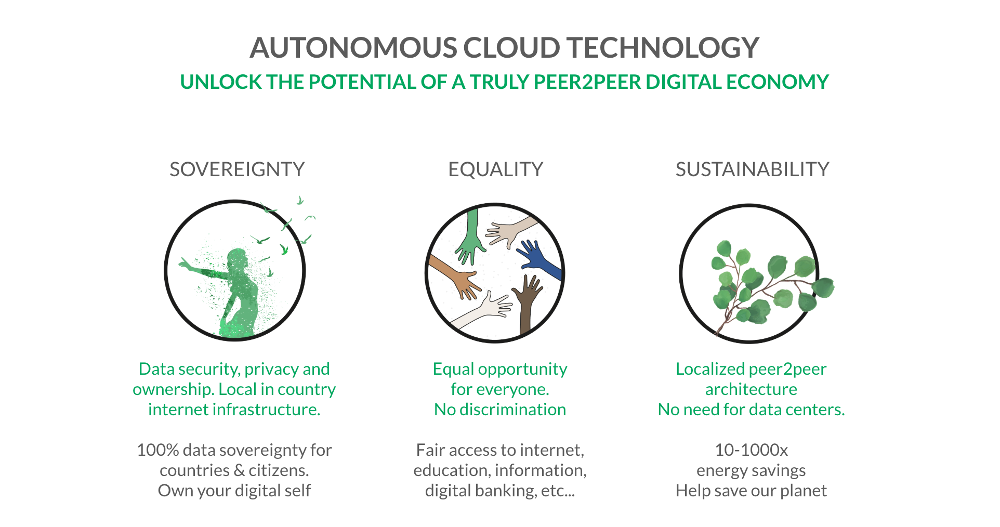

<!-- 
-->

## ThreeFold P2P Cloud
A new standard in peer2peer networking, storage and compute.
Running on the ThreeFold Grid.

* There is already capacity in over 21 countries like: United States, Canada, Austria, Belgium,...
* 100% Private: you own all your data running in your environment 
* Release your workloads to the World Wide Web through our web gateways
* Encrypted network connections between all your containers through overlay networks 

This Wiki is meant to provide you with all the information you need to get started on the P2P cloud.  There is an easy to use SDK that is being made available for this and it will provide you with a number of different ways to use and operate this P2P cloud.

It is meant fpr everyone, meaning that the SDK provides means for both highly technical skilled people and people taking their first steps in creating digital services.

### Why peer2peer? 
We believe the future of the Internet is to be created, owned and operated by many people, not by a happy few.  The current version of the Internet is not ready to move forward and create sovereignty, equality and sustainability.  A token economy that allows anyone to become a producer and consumer of digital services with the aim to reach 1 billion of people by 2030 is the vision of the ThreeFold foundation. Peer2peer is the only answer to reach this vision and not have the risk of it being hijacked for different (commercial) interests of a few.

The peer2peer cloud provides compute, storage and networking services as a world's first in one architecture creating a sovereign, equal and sustainable cloud by many for anyone. [cloud.threefold.io](https://cloud.threefold.io)

Want to know more?
- [Generic architecture](architecture.md)
- [P2P Network architecture](architecture_network.md)
- [P2P Webgateway architecture](architecture_webgateway.md)
- [P2P Storage architecture](architecture_storage.md)
- [P2P node boot](architecture_boot.md)
- [P2P container boot](architecture_flist.md)

### ThreeFold Foundation
<!-- insert general objectives for the TF Network (Grid, Token and 3bot) -->
The Threefold Foundation is realizing the vision to provide affordable, local digital services by many for anyone. 

For more information on the foundation, please check [threefold.io](https://threefold.io).

### ThreeFold Tech Website
Underpinning the two initiatives described above is TF Tech.  This is a regular technology company which is creating (and leading) the community to  build the required software.  All software used is open source and we welcome anyone to participate and help us improve.  For more information please see [threefold.tech](https://threefold.tech).
<!-- 
TODO #5 Check graphics(s) for updated version.
-->