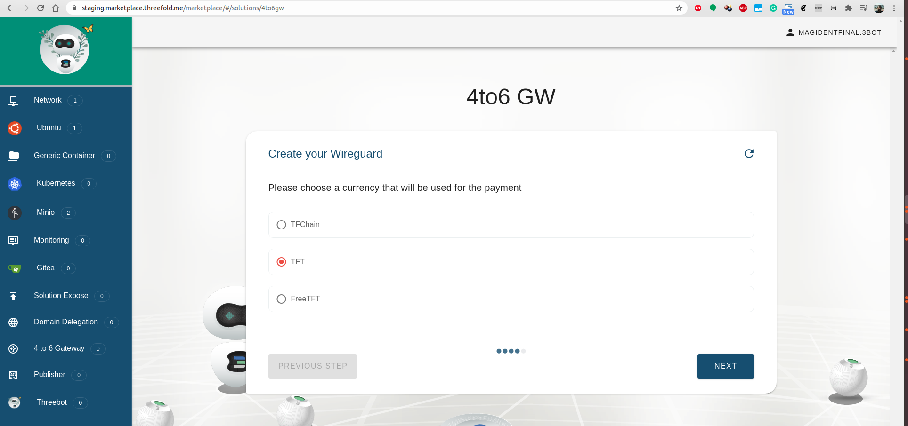

## 4to6GW deployment
4to6gw provides access ti IPv6 addresses for users with IPv4 networks only through a wireguard tunnel.

## Steps

#### Select Gateway

#### Set Public Key (Optional)
You can leave it empty in which case a keypair will be automatically generated.

#### Select Currency

#### Deployment

#### Download Configuration

#### Set up your Wireguard Connection

