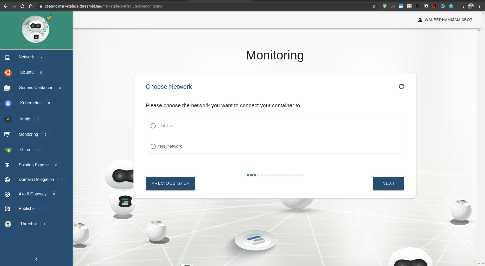
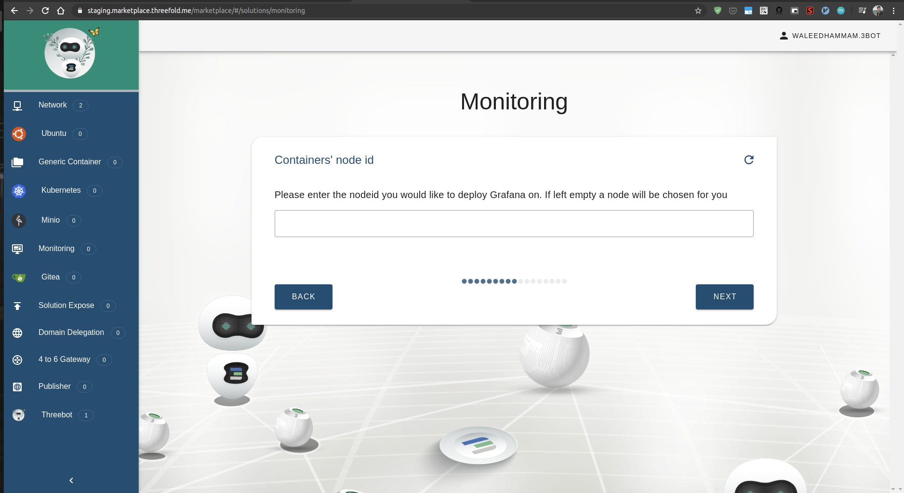
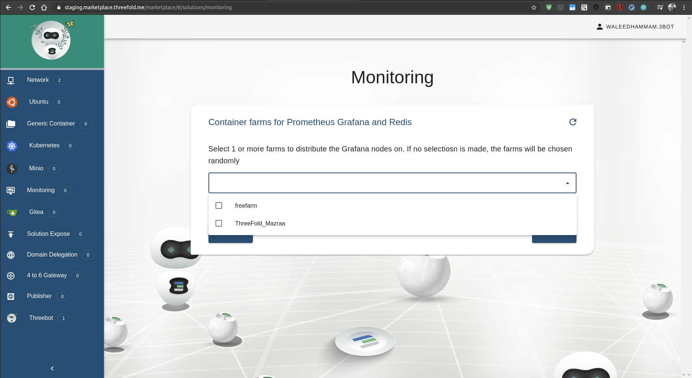
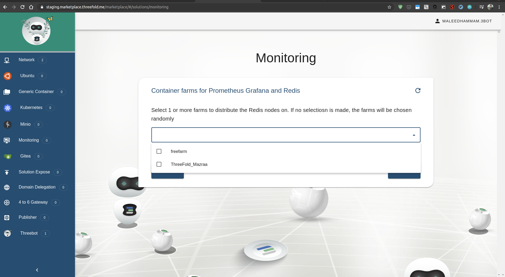
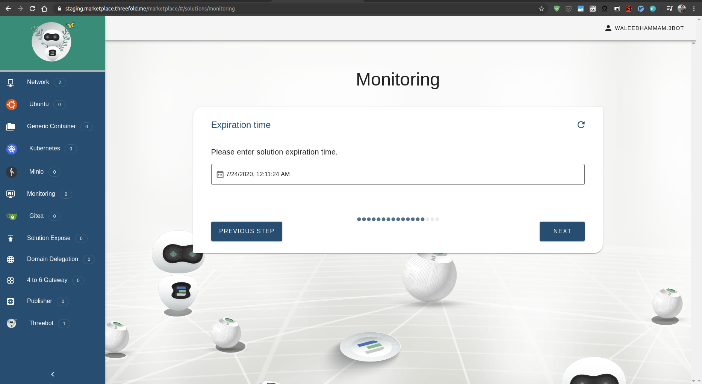
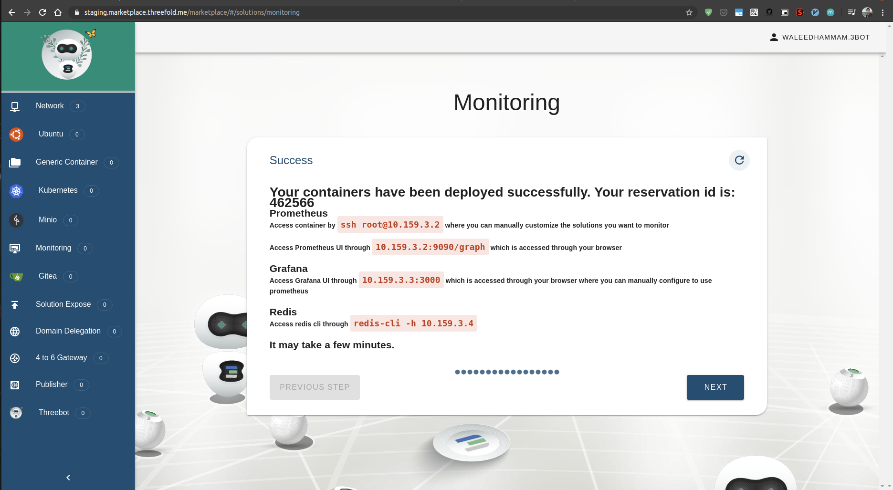

# Monitoring solution

Deploy monitoring solution with graphana and prometheus and redis

## Accessing the solution

Go to the marketplace https://marketplace.grid.tf/marketplace and click on Monitoring

## Steps

## Solution name

## Select the network to deploy the solution on

## Add your sshkey to be able to access the containers

## Select the solution resources

## Select prometheus volume size

## Select Graphana container resources

## Select the redis container resources

## Optional, select the node id you want to deploy prometheus on

## Optional, select the node id you want to deploy Graphana on

## Optional, select the node id you want to deploy Redis on

## Optional, select the farm you want to deploy promethus on

## Optional, select the farm you want to deploy graphana on

## Optional, select the farm you want to deploy Redis on

## Select prometheus container ip

## Select graphana container ip

## Select Redis container ip

## Select expiration time for the solution

## Summary for the solution values

## Deploy the solution

## Pay for the solution using threebot connect staging app wallet

## Wait for deployment

## Congratulations your solution has been deployed

## Acccess container via web or ssh

