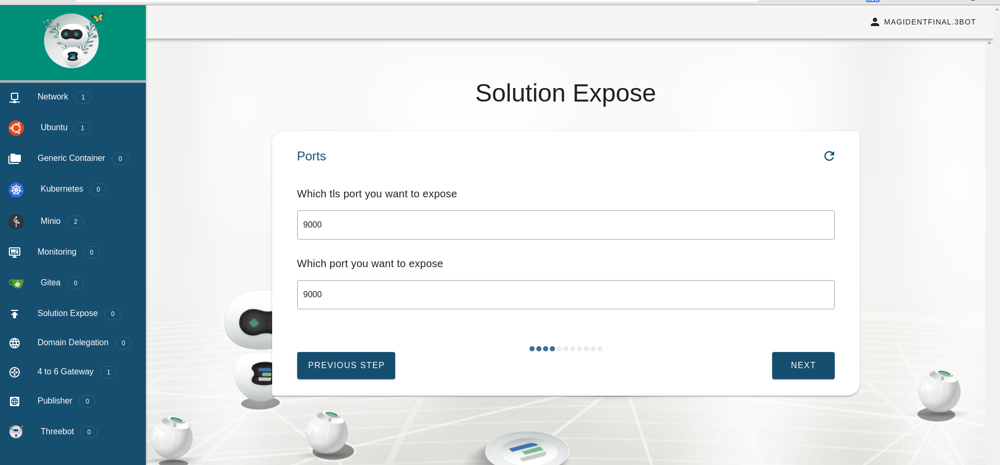
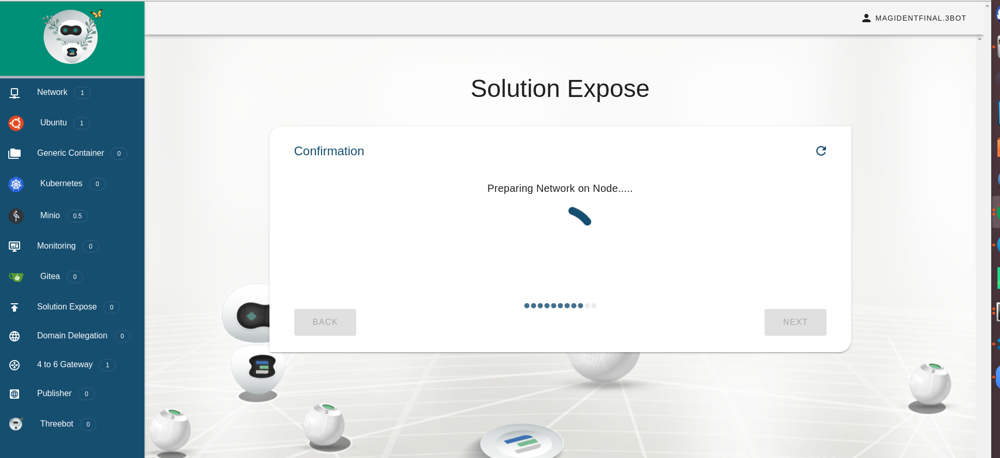

## Solution Expose
This wizard enables you to access your solutions running over HTTP/HTTPS using a public FQDN.

## Steps

#### Select Solution Type

#### Select you Container/Solution

#### Select the Ports of your Solution

#### Select the Domain you want to use
In this step you can choose one of three domain types:

1- Managed: these are domains managed by the gateway. when you use it to expose a solution, the gateway will create an `A` record for your solution you don't have to do anything.

2- Delegated: these are domains created by the `Domain Delegation` solution. The gateway will create an `A` record in this domain.

3- Custom: these domains are completely handled by the user. You have to create an `A` record in your for this domain name associated with the gateway IP address.

#### Create the Subomain

#### Confirmation

#### Payment

#### Access your Solution

#### Access your Solution

