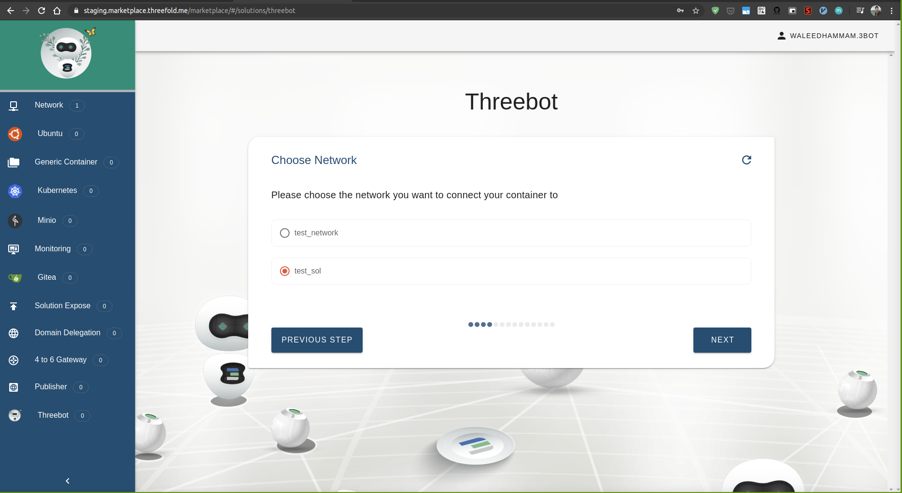
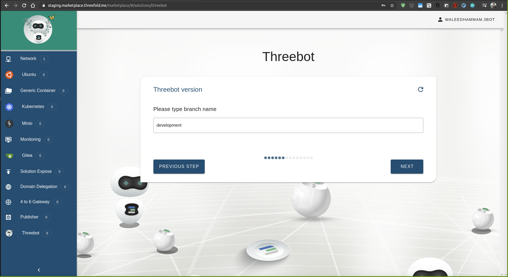
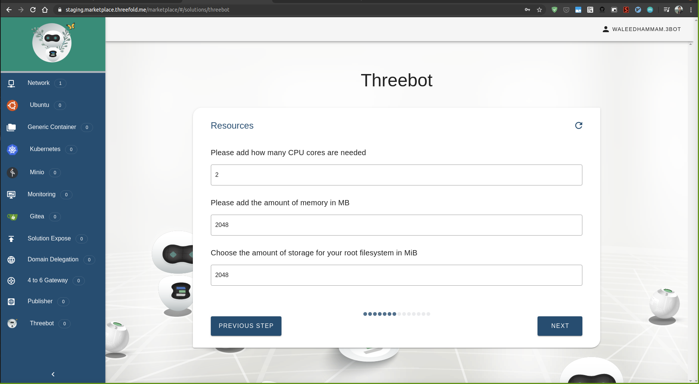
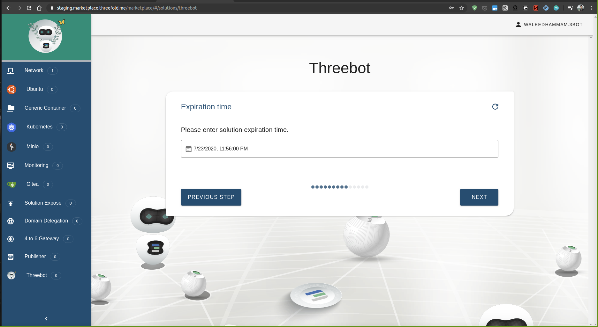
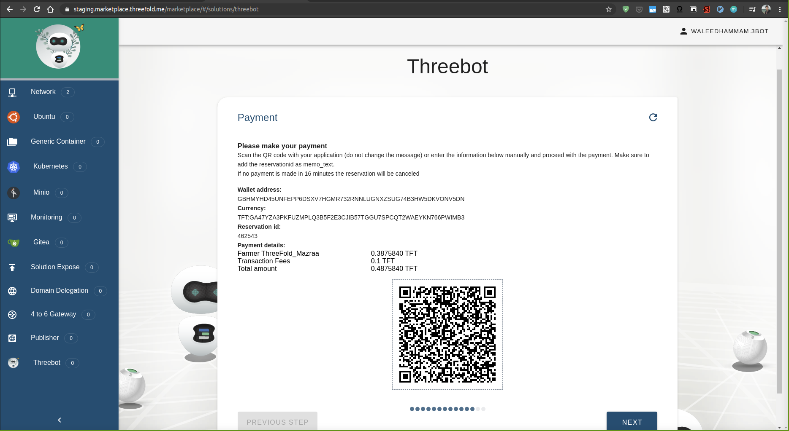
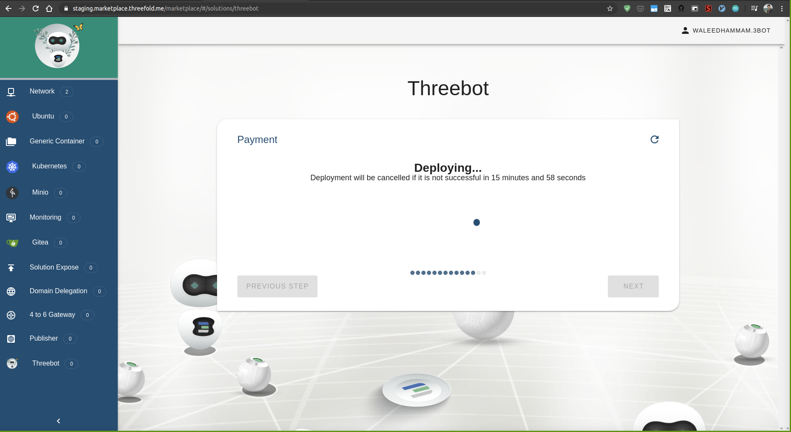

# Online threebot solution

Deploy your 3bot online

## Accessing the solution

Go to the marketplace https://marketplace.grid.tf/marketplace and click on Threebot

## Steps

## Add the solution name

Keep in mind it'll be the subdomain too

## Select the backup & restore password

your solution has backup and resotre you can access them through the dashboard

## Select the network you want to deploy the solution with

## Add your sshkey to be able to access the container later

## Select the domain you want to deploy your solution on from the available ones

## Select the branch of the sdk you need your solution with

## Select your solution container resources

## Select the container expiration time

## Select the farm you want to deploy your container on

## Summary of your choices for the solution

## Payment step for the container using threebot staging app

## Deploy your online solution

# This step will initalize your 3bot conatiner to be ready to use

# Deployment sucess, you can access your 3bot now using the domain or the ip

# Go to the domain and sign in using 3bot connect with the 3bot identity you deployed your solution with

# You will find your admin dashboard and inital backup has been already made

# You can now access codeserver, notebooks, farmmanagment or any package

