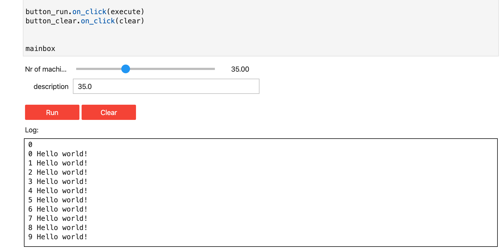

# how to create a simple user interface

The follwowing example shows you how easy it is to create a user interface in notebook.

```python
import ipywidgets as w
from Jumpscale import j
debounce= j.servers.notebook.debounce

#define some layout
items_layout = w.Layout( width='auto')
box_layout = w.Layout(display='flex',flex_flow='column',  
    align_items='stretch',width='50%')


box_layout_log = w.Layout(display='flex',border='1px solid black',
    height = "200px",width='100%')

# the input box
nr=w.FloatSlider(description="Nr of machines",layout=items_layout)
descr=w.Text(description="description",layout=items_layout)
box_layout_input = w.Layout(display='flex',flex_flow='column',
    align_items='stretch',width='50%',height = "80px",)

box_left=w.HBox(children=[nr,descr],layout=box_layout_input)
#still empty to be filled in (right side of the screen)
box_right=w.HBox(children=[],layout=box_layout)

#the 2 input boxes one left, one right, right is empty
inputbox = w.HBox(children=[box_left,box_right])

button_run=w.Button(description="Run", layout=w.Layout(width='100px'), 
    button_style='danger')
button_clear=w.Button(description="Clear", layout=w.Layout(width='100px'), 
    button_style='danger')
buttons = w.HBox(children=[button_run,button_clear])

log_header = w.Label("Log:",layout=items_layout)
out=w.Output()
box_log = w.VBox(children=[out],layout=box_layout_log)

#now add all under neith each other
mainbox= w.VBox(children=[inputbox,buttons,log_header,box_log])


#the debounce will make sure than only after 0.2 seconds when 
## moving slider the observe happens
@debounce(0.2)
def observe_test(change):
    print(change)
    descr.value=str(nr.value)
        
nr.observe(observe_test, names='value')     

def execute(*args):
    with out:
        print(int(nr.value))
        #now execute something, the stdout will get in the box
        #this is where e.g. a deployment of a workload would happen
        for i in range(10):
            print(i, 'Hello world!')  
            
def clear(*args):
    out.clear_output()

button_run.on_click(execute)
button_clear.on_click(clear)
        

mainbox
```

when running the above code in a notebook you should see something like:

