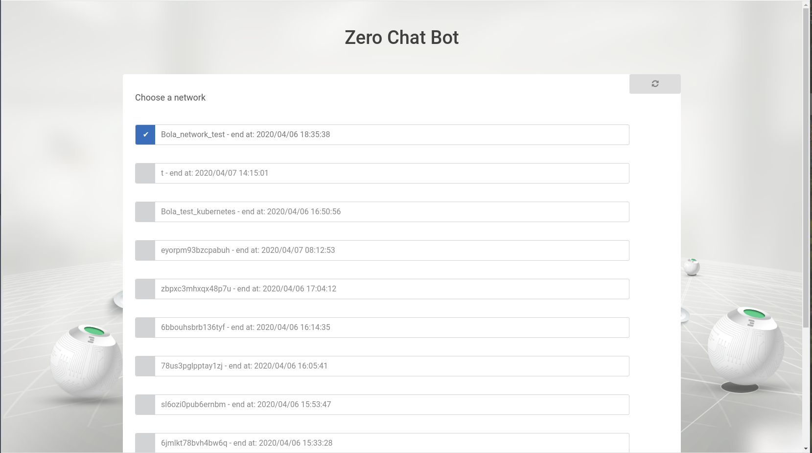
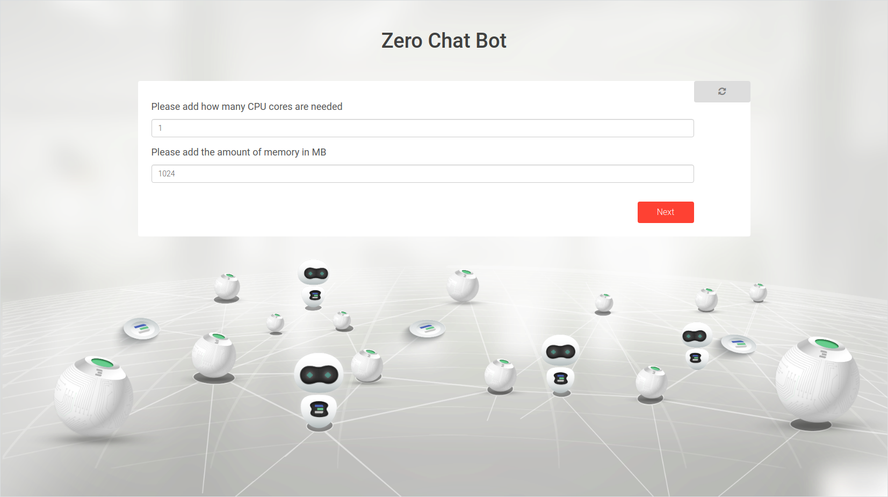
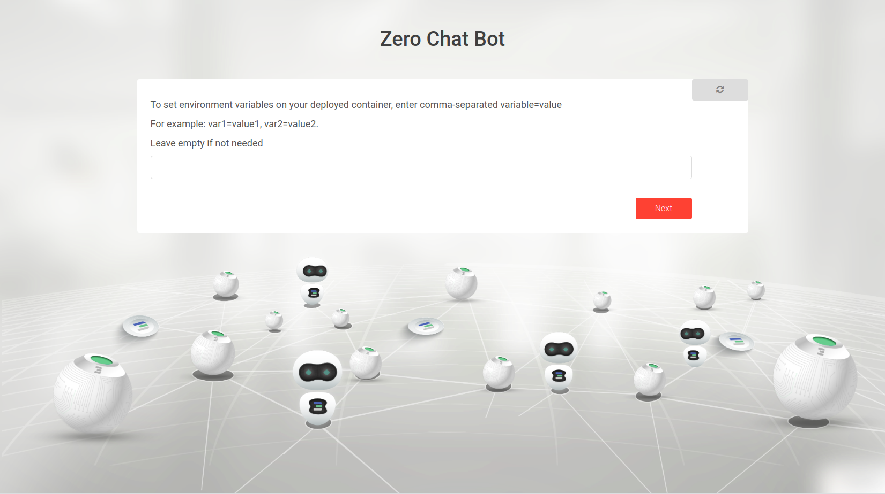

# Generic flist solution

This Solution helps to spawn a container using specific flist provided by the user in the chatflow.

## Accessing the solution

Go to your admin dashboard `https://localhost:4000/admin` and click on Network

## Inputs

The solution takes some configurations from the user, we will list them and explain their meaning

- `container name` : a name of your conatiner to help you to get it again with reservation id.
- `Flist link` : the link of your flist to be deployed. For example: https://hub.grid.tf/usr/example.flist
- `environment variables`: set environment variables on your deployed container, enter comma-separated variable=value For example: var1=value1, var2=value2. Leave empty if not needed
- `Expiration time`: a network expiration time (minutes=m ,hour=h, day=d, week=w, month=M)
- `Inetractive`: choose whether you prefer to access to your container through the web browser (coreX) or not.
- `ssh key` : add your public ssh key `~/.ssh/id_rsa.pub`, if your flist supports using the ssh key from the env variables provided to allow future ssh access
- `IP Address`: choose the ip address for your ubuntu machine.

After the deployment of the flist is complete, a url will be returned that can be used to access the container through web browser (corex) or by ssh if your flist support this after up your wireguard configuration.

## Deploying a Container with a custom flist

### Choosing the network name

Choosing the network to be used from a list of existing networks created by the user

### Choosing the solution name

Choosing the name of the solution to be deployed. This allows the user to view the solution's reservation info in the dashboard deployed solutions

### Flist link

The flist link added is used to create the container from it. The link is from the flist uploaded on the hub

### Choosing the number of CPU cores and memory size

Specify the number of CPU cores and the size of the memory to be used by the container deployed

### Using corex

The corex option allows the user to access the container through corex. If disable the user can access the container using ssh

### Uploading ssh key

This ssh key is used in case corex option is No, and the flist supports ssh on startup hence adding the ssh key in the env variables passed to it

### Choosing environment variables

If the container needs any env variables on startup, they are passed through this option where they are in the format `variable=value` seperated by commas.

### Choosing the expiration time for the solution

Choosing the expiration time for the solution on the grid

### Choosing the private IP address of the container

Choosing the private IP address that will be used to access or communicate with the deployed solution

## Accessing corex of the deployed container
Accessing a deployed solution using an flist with the link  `https://hub.grid.tf/tf-bootable/ubuntu:18.04` to have a container with ubuntu started.

