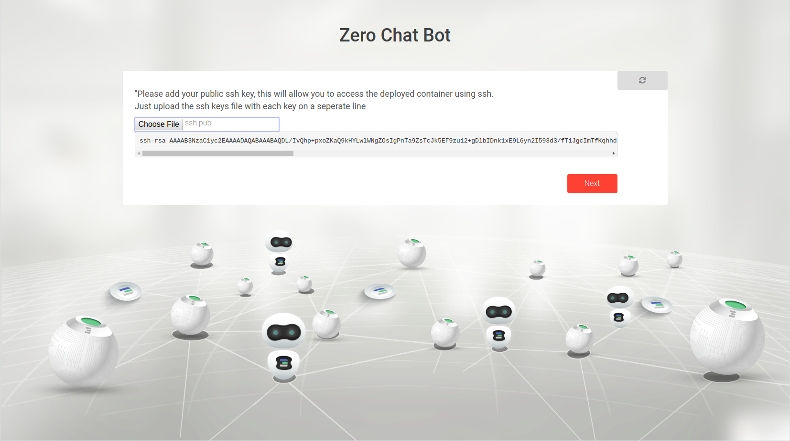
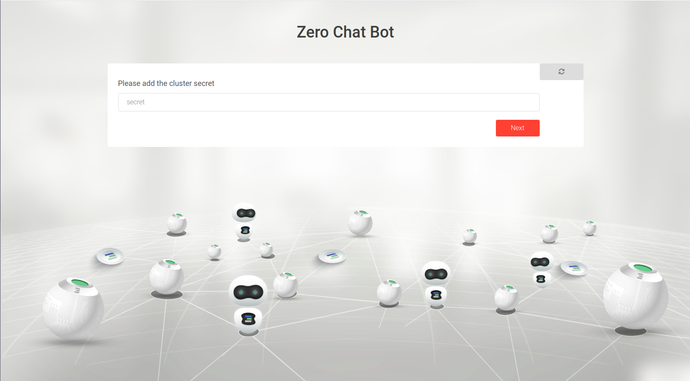
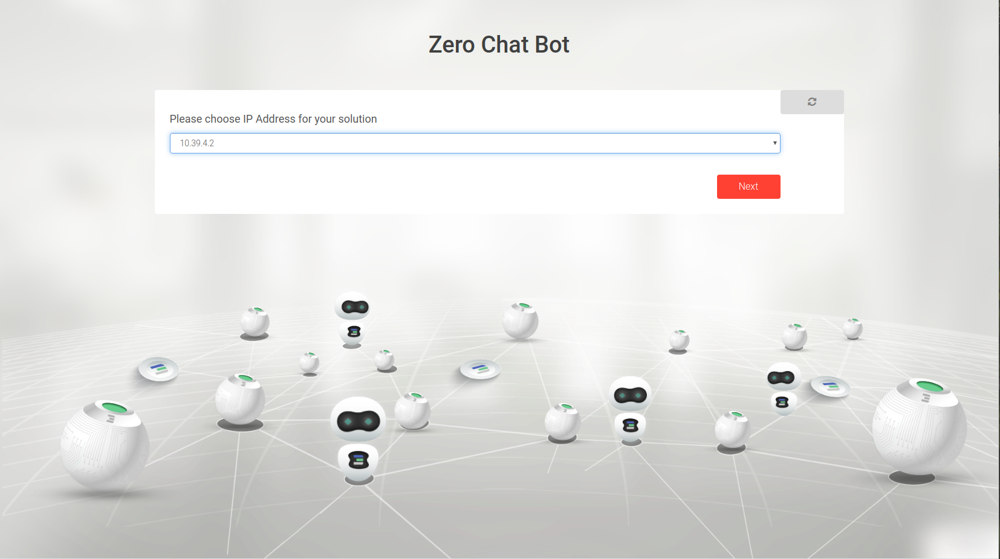
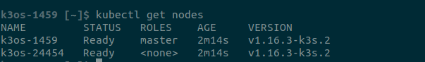

## Kubernetes cluster deployment

This solution is used to deploy a Kubernetes cluster with zdb using a chatflow.


## What is Kubernetes
A [Kubernetes](https://kubernetes.io) cluster is a set of node machines for running containerized applications. At a minimum, a cluster contains a worker node and a master node.

## Accessing the solution

Go to your admin dashboard `https://localhost:4000/admin` and click on Network


## Inputs

- `container name` a name of your container to help you to get it again with reservation id.
- `number of workers` : number of worker nodes to be deployed, the cluster size will then be the number of workers + 1(master node)
- `ssh keys` : ssh keys which will be used to allow access for the ssh key holders to the deployed cluster. They should be in a file where each ssh key is on a seperate line
- `Expiration time`: a network expiration time (minutes=m ,hour=h, day=d, week=w, month=M)
- `cluster secret` : the secret that will be used to access the cluster deployed. Please keep it safe.
- `IP range` : Configure network manually by choosing an IP range to use or the deployer can choose for you and generate an IP range automatically
- `Network name` : a name for the network to deploy on,  if left empty it will be a generated name


## Deploying Kubernetes:

### Choosing deployment name


Choosing the name of the solution to be deployed. This allows the user to view the solution's reservation info in the dashboard deployed solutions

### Choosing the network

Here we choose which network we connect our kubernetes cluster to

### Choosing number of worker nodes


Here, we specify the number of worker nodes used in the cluster.

### Uploading your public Key 

This step is necessary to access the kubernetes machine and authorize you to be able to SSH into it

### Expiration time

Here we specify for how long you want to reserve kubernetes cluster on our grid

### Choosing a secret for the cluster

Now it's time to choose the secret for your kubernetes cluster, make sure you don't forget it.

### Set the IP Address for the solution


After the deployment of the Kubernetes cluster is complete, the user with the ssh keys will have access to the deployed cluster.


Once the user added the wireguard configuration and made sure it is up and running on their machine, they can ssh to the machine using
```bash
ssh rancher@IP_OF_CONTAINER
```
To verify the nodes created on the machine after ssh
```bash
kubectl get nodes
```

