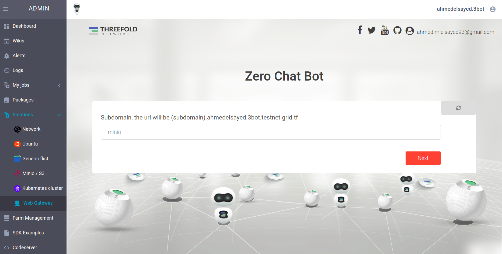
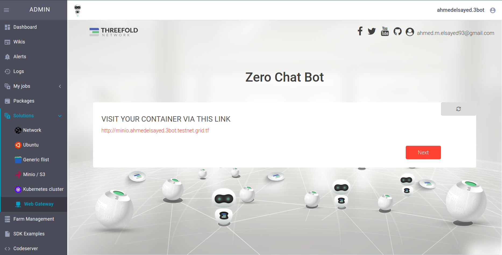

## Web Gateway

This solution allows you to expose your container solutions (ex: `Ubuntu`, `Minio`, `Kubernetes`, ..etc ) to the public using your custom threebot domain for example `http://minio.<threebot_name>.3bot.grid.tf`

## Accessing the solution

from the admin dashboard choose `Webgatway`

## Exposing a container throught the Webgateway 

### Select solution you want to expose

A solution you deployed before (e.g `Ubuntu`, `Minio`, `Kubernetes`, ..etc ) and want to expose to the public.

### Choosing a domain
Next we need to choose the domain we want the public to reach our solution on. In the format of a subdomain relative to your 3bot name e.g `http://minio.<threebot_name>.3bot.grid.tf`

## Accessing the exposed solution

You will see a message with the URL to reach the solution.
