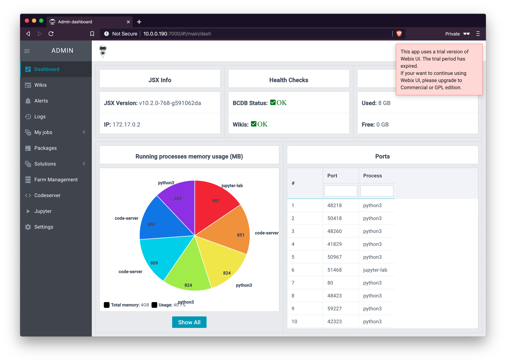

### How to get started with the SDK

#### Prerequisites
The prerequisites of getting started with the SDK are:
- you got yourself the 3bot Connect app in the apple or google play store
- you have installed the Jumpscale SDK on your laptop.  (installation instructions here: [linux](https://github.com/threefoldfoundation/info_threefold/blob/development/docs/wikieditors/installation_linux.md) or [macos](https://github.com/threefoldfoundation/info_threefold/blob/development/docs/wikieditors/installation_macos.md))

If you have not got these things done please go go the "Getting started session".

#### How to work with the SDK

There are numerous ways to use the SDK and use the TF Grid.  We will mention two ways which are the two ones we prefer.  Obviously you might find other methods that work better for you.

1. Chat
2. Code
3. Blockchain

The Jumpscale SDK is inclusive of everyone that has an interest to create and deploy on the TF Grid. It presents three ways of communicating one needs for novice, intermediate and experienced developers.  These 3 ways to create and innovate have different interfaces.

##### Use the graphical administration panel

After installing on a local system there should be a 3bot SDK start with a SDK admin panel.  To connect to it you should connect to the IP address on which the Docker container is operating.  
    1. For a local system install there is a port forwardwarding to the `localhost` allowing you to do this `[http://localhost:7000'](http://localhost:7000).  
    2. If you have installed in a virtual machine running ubuntu on your localhost you should be able to connect to the IP address of the VM.  Same format 'http://<< IP-address-of-the-VM >>:7000

The following screen should welcome you:


Use the 3bot Connect application to login.



Included in the SDK is a Visual Studio editor which allows you to edit and create scripts, packages and jumpscale code to get your IT architectures up and running.


##### Login the container and use the CLI interface
You can also login into the container and use the availabe CLI interface to manage code and execute code.

```
root@virbuntu:~# docker ps
CONTAINER ID        IMAGE                 COMMAND             CREATED             STATUS              PORTS                                                                                                                                                                                                               NAMES
dc8489006ed8        threefoldtech/3bot2   "/sbin/my_init"     4 hours ago         Up 4 hours          0.0.0.0:9001->9001/udp, 0.0.0.0:9000->22/tcp, 0.0.0.0:7000->80/tcp, 0.0.0.0:4000->443/tcp, 0.0.0.0:9005->8005/tcp, 0.0.0.0:9006->8006/tcp, 0.0.0.0:9007->8007/tcp, 0.0.0.0:9008->8008/tcp, 0.0.0.0:9009->8009/tcp   3bot
root@virbuntu:~# ssh localhost -p 9000 -A
OK
3BOTDEVEL:3bot:~: ipython
Python 3.7.5 (default, Nov 20 2019, 09:21:52)
Type 'copyright', 'credits' or 'license' for more information
IPython 7.13.0 -- An enhanced Interactive Python. Type '?' for help.

In [1]:
```
In this container you can do all the usual Git repository management, use the Jumpscale libraries to create TF Grid deployments, reservations and payments.