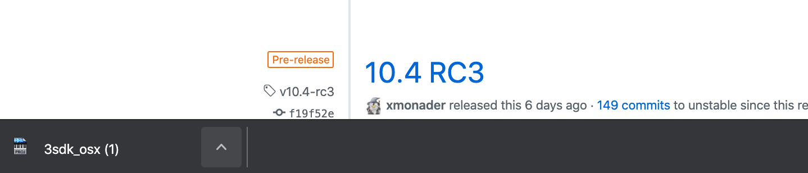
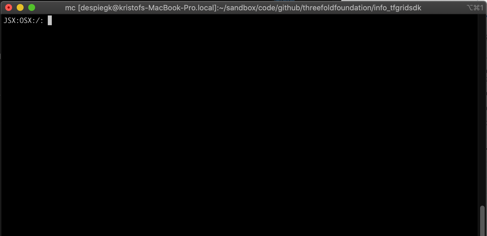
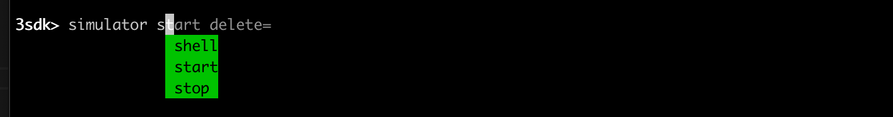
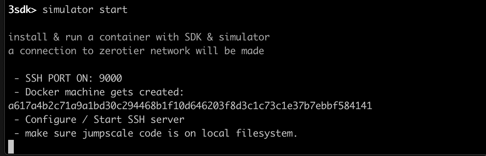

# prepare for running the simulator

## requirements

- docker desktop needs to be installed
- chrome browser needs to be installed

## supported platforms

today we stupport OSX & most linux flavors.
Windows should be ready soon, check the releases page.

## download your 3sdk tool

- go to https://github.com/threefoldtech/jumpscaleX_core/releases


download the 3sdk to your local folder.



you will see at botomn of your browser the download.

Now start a terminal:

- on OSX: command space terminal (search for terminal)

you will see a terminal like 



do the following in your terminal

```bash
cd ~/Downloads
#list the 3sdk, see its available in Download folder
ls 3sdk*
#give execution permissions to 3sdk
chmod 700 3sdk*
#execute the 3sdk
./3sdk_osx
```


when executing the 3sdk you will probably be warned by your operating system that this is an unknown file.

On OSX you will have to go to securyt

- on OSX: command space security  (select security & privacy)


you will then see the file you need to allow access for (don't see here because I already allowed the file to run.)

once succesful you will see the following (restart the command 3sdk... in the terminal)


now do 'info' to see the commands


## Install the simulator



```bash
#type
simulator start 
```



This will take 1-5 min depending download speed and performance computer.

a browser will open and you will see


what you see here is a python notebook visualizing the code of the simulator.

now to go:

- [open the simulator](simulator_open.md)