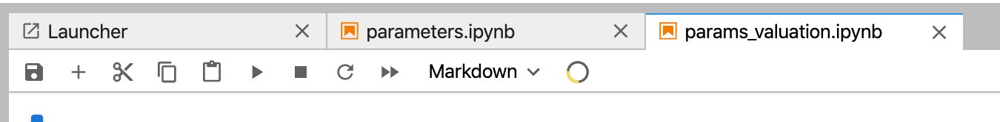

# Simulator Open

Open following files:

- params
- params_valuation...

you will see

click on the round symbol next to markdown for each of the params

you will now see following tabs.

close the left parameters tabs

drag drop (on top) the params next to each other, you should get to:

now open:

- threefold_simulator
- nodebatch_simulator
- hardware_roi

do same as above, click on the round symbol (the voila button)

and reorganize your screens till you have achieved the following

you will see the exection, this will take a while, its a serious simulator, millions of combinations are done.

this is what you should get to.

At the right side you can change the paramters for the simulation..At the left you need to click on the refresh button to calculate again using the new parameters.

