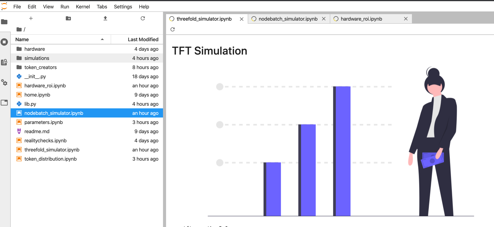
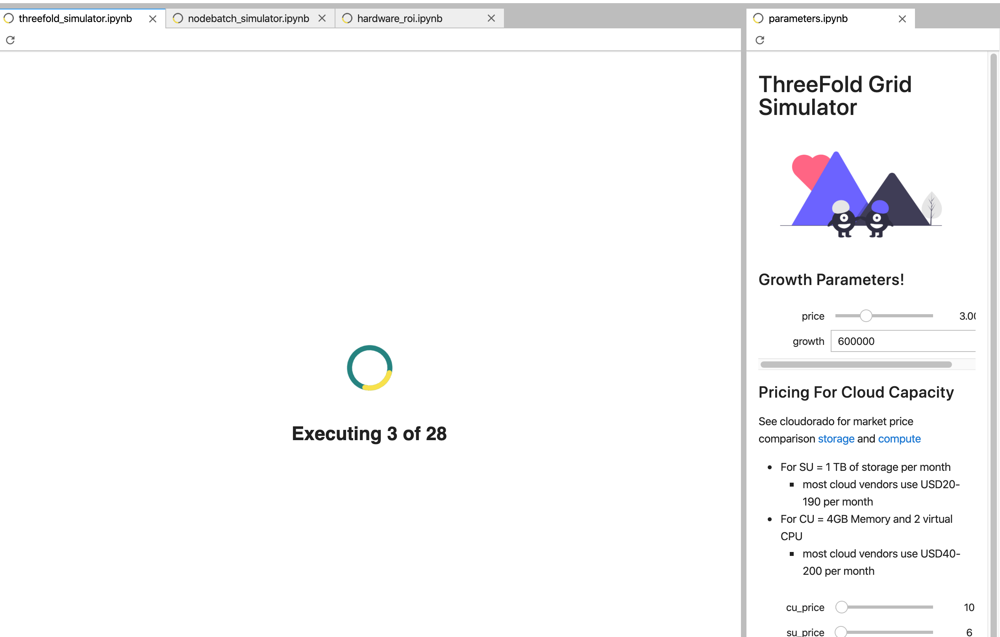
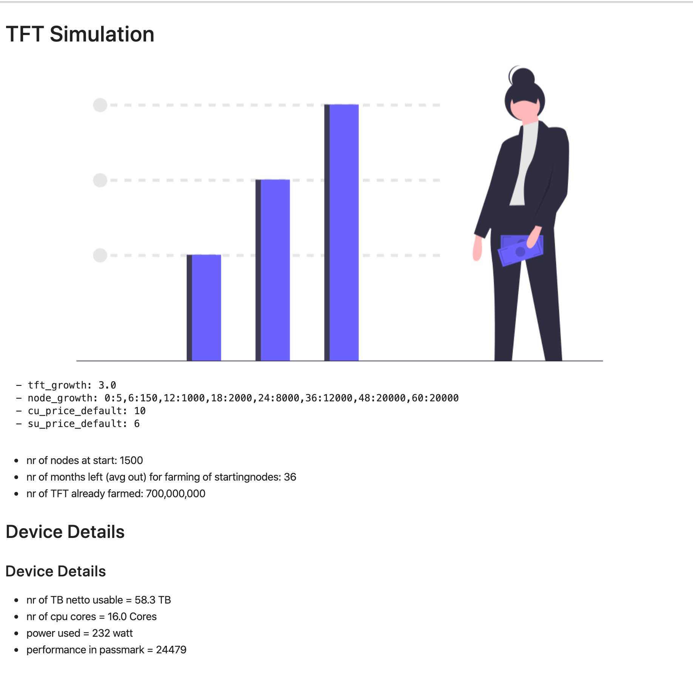
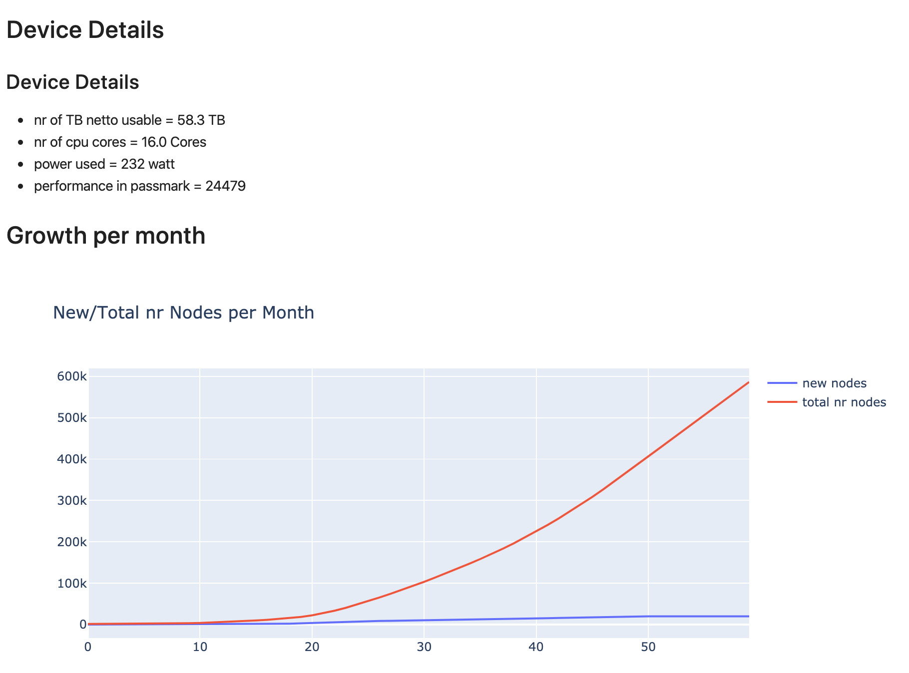
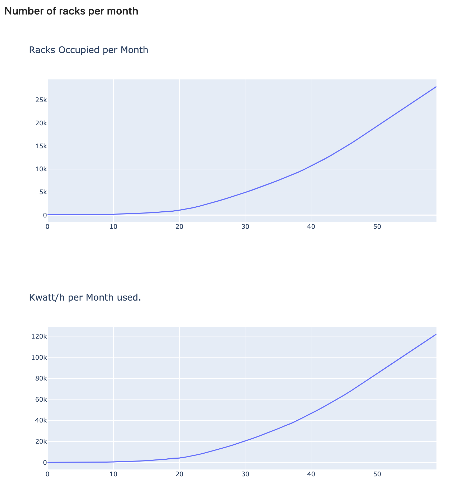
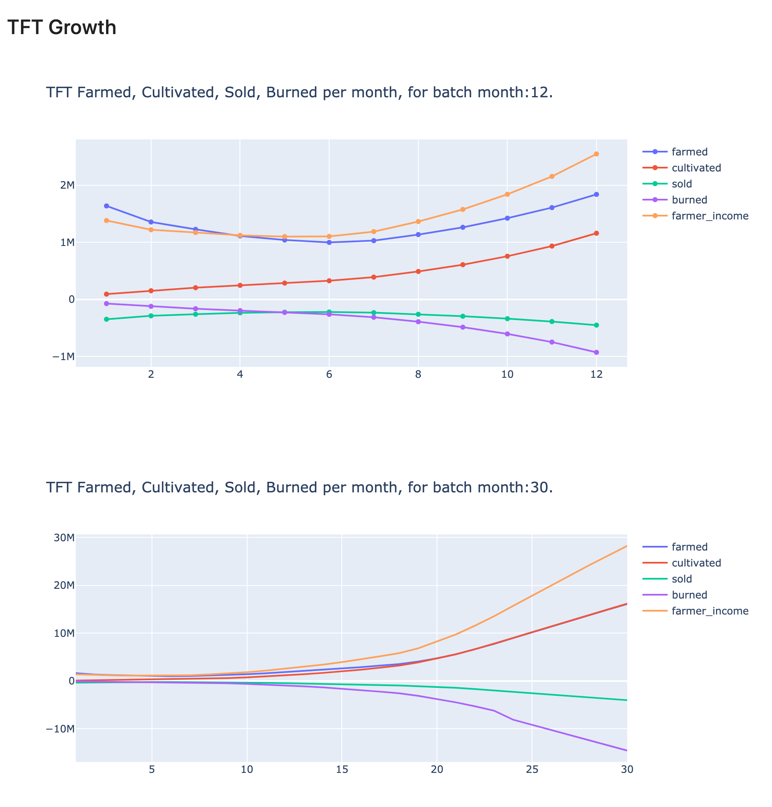
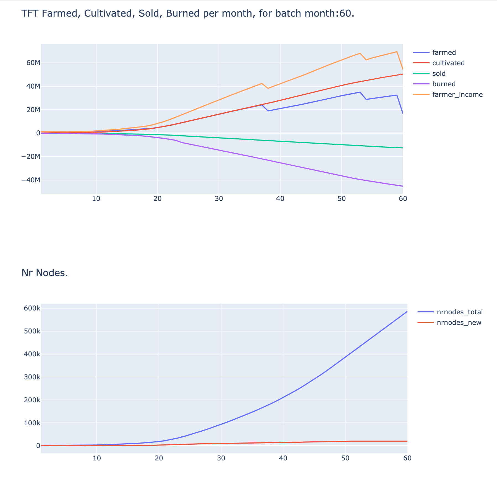
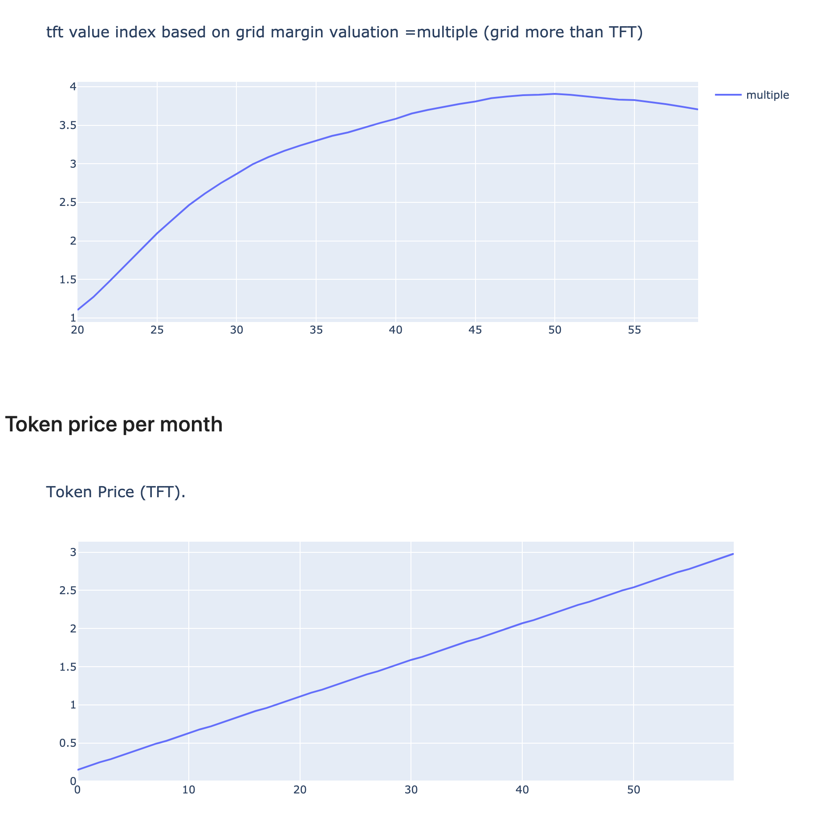

# ThreeFold Token Simulator Start

after installing the simulator you should see




this is the main simulator.

If not open yet look for ```threefold_simulator``` in the explorer part.
Click on it then click on the voila button.


- see the round symbol right from the "Markdown" text.
- +- middle top in this screen.

This will open up a generated screen where you don't see the code.

When its rendering you will see:



This can take a while, its a very serious simulator.
Many millions of calculations are being done.

Once done you will see something like.












it goes on for a while eventually we get to:



At the end screen you will see the evolution of the token price.

In this case the token price was fixed.

