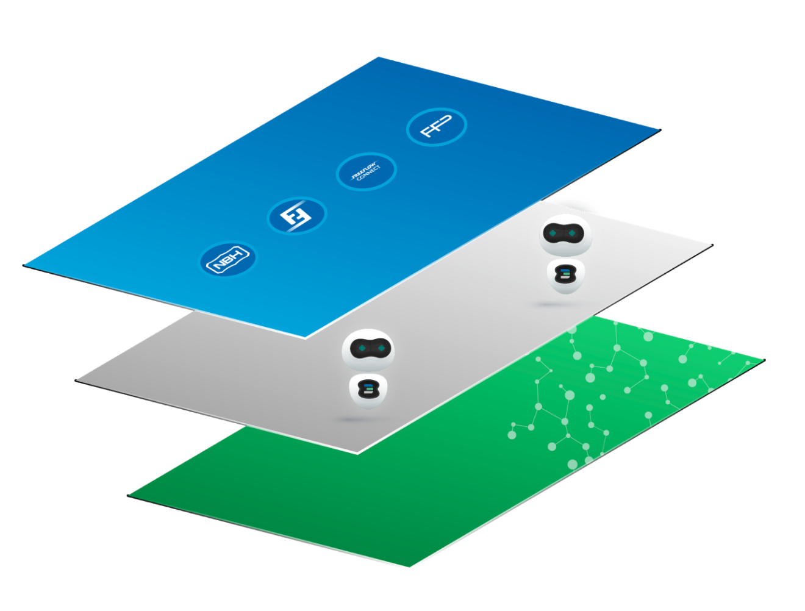

## Technology

This section will describe and link to specific sections of the ThreeFold technology.  The ThreeFold technology is built up from 3 layers.

### Experience layer
Any web technology can be used to create the most amazing applications. The applications are 100% decentralized and take 10x less time to develop. Any existing web app can be converted in no time.

### Autnomomous layer
Self-driving and self-healing technology allows for 100% decentralization. Includes super efficient blockchain database and object storage technology. More than 50x efficiency savings for blockchain-related workloads, and 10x for storage. And each user or legal entity has its own digital assistant.

### Capacity layer
Low level technology. Delivers the required capacity for your IT solution. Any applications which can run on Linux can run on the TF Grid and our systems provide more decentralization, security, and efficiency.

More information on the capacity layer is [here](./capacity_layer/README.md)
