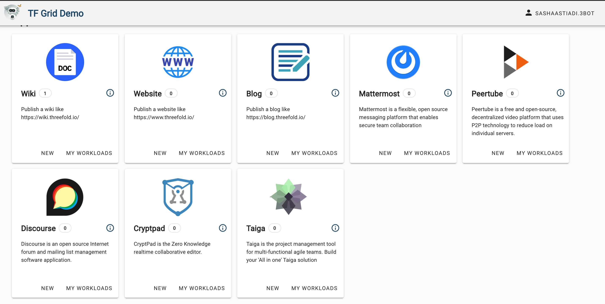

# Introducing: Threefold Grid Demo

The Threefold Grid Demo is an inventory platform (on a demo mode) of open source solutions that are built on top of Threefold Grid, accessible by connecting your 3Bot (virtual system administrator) to the platform. 

Its main goal is to enable a simplified solution-deployment on top of the TF Grid’s peer-to-peer cloud, without the necessity of knowledge on rails or Linux shell or any other advance development skills. Via TF Grid Demo, anyone should be able to deploy their solutions and projects on top of the TF Grid.

## TF Grid Demo Current State

Threefold Foundation is proud to announce that [TF Grid Demo 2.2](www.demo.grid.tf) is currently live on the testnet environment an alpha version (Aug 2020). 

On its alpha version on Testnet, there are already open-source solutions deployed on top of the Threefold Grid, covering various fields from P2P video platform, online publisher, and many more to come. 

## Application Solutions

Say goodbye to cloud-hosted applications. Of whether you need a P2P alternative to a website, a forum, or a video platform for your project; by connecting your 3Bot ID to the [TF Grid Demo 2.2](demo.grid.tf), you could now deploy these open-source solutions below, on top of the TF Grid within just a few clicks.

- [__3Bot__](3bot.md): a versatile tool to administrate and control processes and activities of your solutions on top of the TF Grid.
- [__Wiki__](wiki.md): an online encyclopedia accessible via an IP and a public domain.
- [__Website__](website.md): a P2P alternative to centralized cloud-hosted websites. Host your own website with access via an IP and a public domain.
- [__Peertube__](peertube.md): an open-source video platform that uses peer-to-peer tech to reduce load on individual servers when viewing videos. 
- [__Discourse__](discourse.md): an open source forum built to educate members about civil community engagement. 
- [__Mattermost__](mattermost.md): an open source Slack-alternative messaging platform that enables secure team collaboration
- [__Cryptpad__](cryptpad.md): a fully-secured, encrypted alternative to popular office tools and cloud services. 
- [Blog](blog.md) is a P2P alternative to Tumblr or Blogspot. 

With your help and with the help of our community, we aim to become the biggest reference for open source project directory. We are open for collaborations, and we are actively looking for early adopters and curious minds to contribute to the growth of the project by [developing your own solutions](getting_started_first_solution.md), or simply by becoming one of TF Grid Demo alpha testers! Join __TF Grid 2.2 Alpha Testers Group's__ [telegram channel](https://t.me/joinchat/BwOvOxxgK59GmRoZ2_sM0w)__ to find out about how you could participate and support the project.

> By using The TF Grid Demo or the 3Bot you agree with our [Terms and Conditions](terms_conditions). See our [Legals](legals.md) for more.