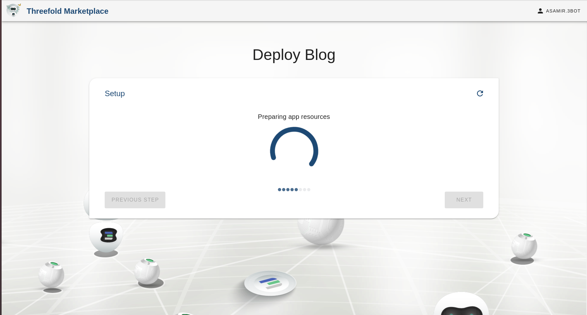

## Blog

### How to Publish a Blog

There are a few things you need to know when you want to publish a blog:

- Title: Is the title shown on your published content.
- Repository URL: is a valid git repository URL where your content lives.
- Branch: is the deployment branch that exists on your git repository to be used as the version of your content to publish.

Example of a Blog repository: [https://github.com/threefoldfoundation/www_tfblog](https://github.com/threefoldfoundation/www_tfblog)

This name will be used to identify this blog on your 'deployed blogs list' on the 3Bot Admin Panel Dashboard. Keep in mind that this name would also be used as your blog's subdomain (a part of your blog's address).

### Add a Website Title, Repo URL and Branch

### Preparing Your Blog's Resources

### Final Deployment of Your Blog

### Congratulations, Your Blog is Successfully Deployed!
You could now access your new blog by entering the website address mentioned below onto your web browser.

An example of a successfully deployed blog:

