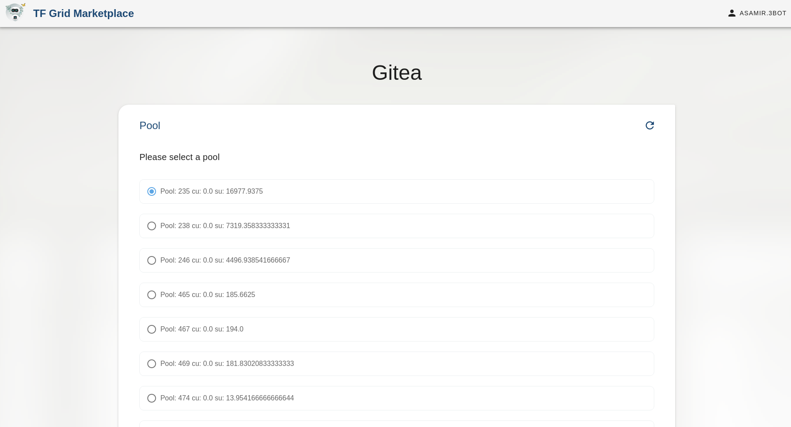
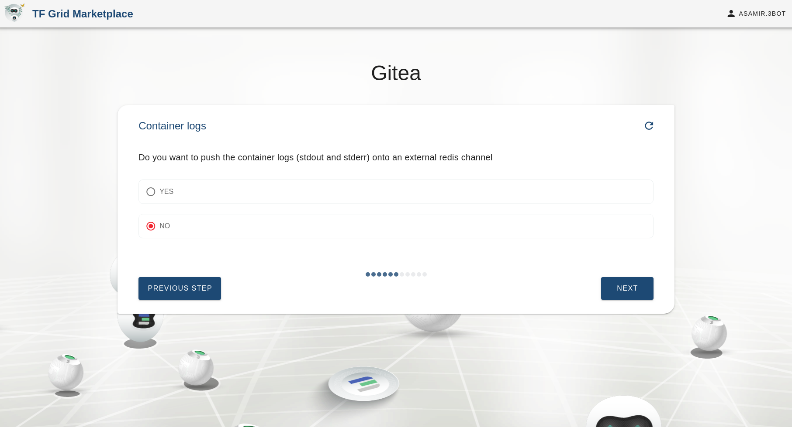
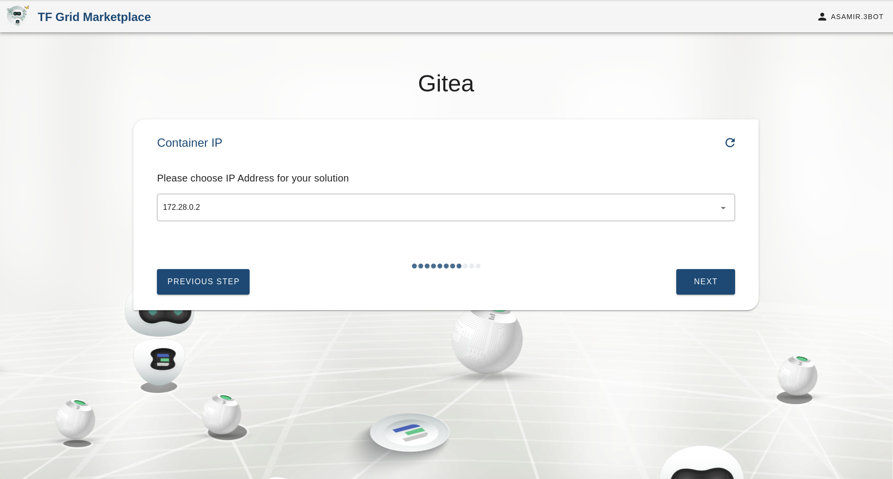
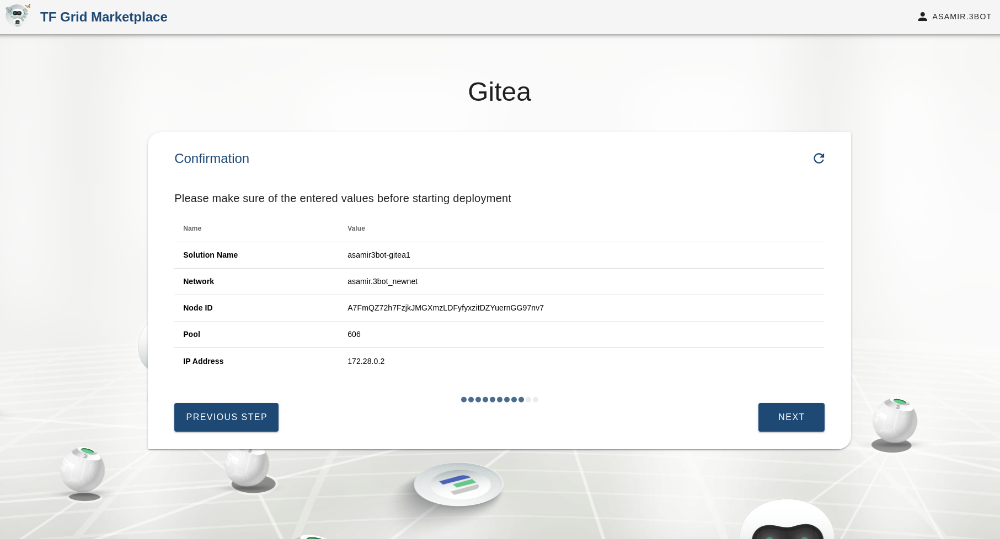
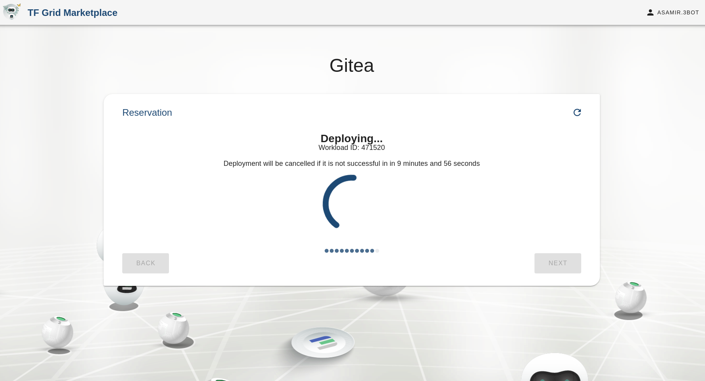

# Gitea

## Steps

### Solution name
Choosing the name of the solution to be deployed. This allows the user to view the solution's reservation info in the dashboard deployed solutions

### Select pool for your solution to be deployed on

### Choosing network
Choosing the network to be used from a list of existing networks created by the user

### Access keys
Uploading your public key for SSH access

### Database info
PostgreSQL instance information

### Choose whether you want to push the container logs onto an external redis channel or not

### Container node id
Here we could provide a node id corresponding to a current node on the grid to deploy the container on. If there is no specific node to be used then it is left empty.

### Selecting solution IP
Here we choose the IP to access the solution

### Confirmation

Here we confirm the specifications we entered in the chatflow

### Deploying your solution

### Successfully deployed

### Accessing the UI

