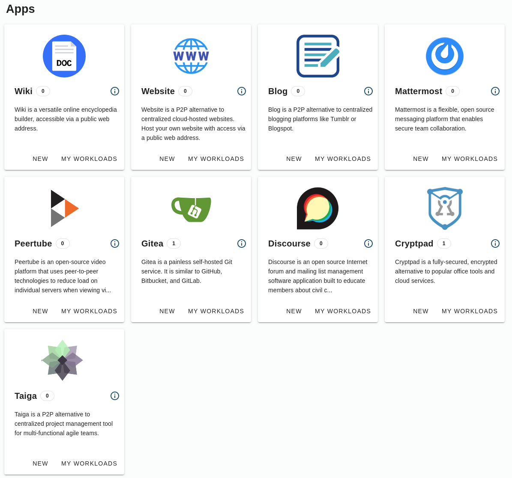

# Introducing: ThreeFold NOW (Demo)

[__The ThreeFold NOW Demo (https://marketplace.threefold.me/)](https://marketplace.threefold.me/) is a marketplace for (in demo mode) open source peer-to-peer solutions that are built on top of ThreeFold Grid.

Its main goal is to enable a simplified solution-deployment on top of the TF Grid without the necessity of technical system administration knowledge. 

<!-- > See [__Getting Started Manual__](threefold_now_getting_started.md). -->

On its alpha version on Testnet, there are already open-source solutions deployed on top of the TF Grid, covering various fields from a peer-to-peer video platform, online publisher and many more to come. 

For an overview of the apps which will come see https://now.threefold.io/#/. 

### Some examples:

<!-- - [__3Bot__](3bot.md): A versatile tool to administrate and control processes and activities of your solutions on top of the TF Grid. -->
- [__Wiki__](wiki.md): An online encyclopedia accessible via an IP and a public domain.
- [__Blog__](blog.md) Is a P2P alternative to Tumblr or Blogspot. 
- [__Website__](website.md): A P2P alternative to centralized cloud-hosted websites. Host your own website with access via an IP and a public domain.
- __Peertube__: An open-source video platform that uses peer-to-peer tech to reduce load on individual servers when viewing videos. 
- __Mattermost__: An open source Slack-alternative messaging platform that enables secure team collaboration.
- __Gitea__: Gitea is a painless self-hosted Git service. It is similar to GitHub, Bitbucket, and GitLab.
- __Discourse__: An open source forum built to educate members about civil community engagement. 
- __Cryptpad__: A fully-secured, encrypted alternative to popular office tools and cloud services. 
- __Taiga__: Taiga is a P2P alternative to centralized project management tool for multi-functional agile teams.

### Threefold NOW Tutorials

To get you started on Threefold NOW, please go to [Threefold NOW Tutorials](tfnow_tutorials.md) and learn how you could build some of your first solutions on top of the TF Grid.

> By using The ThreeFold Now Demo or the 3Bot you agree with our [Terms and Conditions](terms_conditions). See our [Legals](legals.md) for more.

