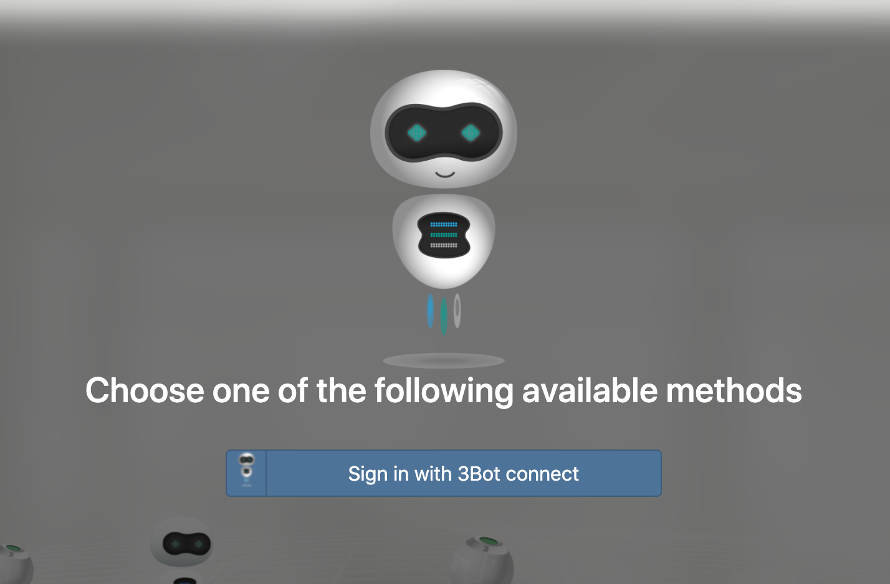
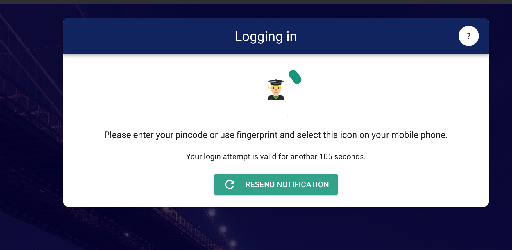

# ThreeFold Now Demo Getting Started

On this tutorial we will guide you on how to access the ThreeFold Now Demo  Platform by using your 3Bot ID as your username, and ThreeFold Connect App on your mobile phone as your authenticator.

## Go to the ThreeFold Now Demo Homepage

Go to [ThreeFold Now Demo](https://marketplace.threefold.me/) and click on __'Sign in with ThreeFold Connect'__ and follow further instruction below.

## Sign in using your 3Bot ID (Username)

Sign into the Marketplace by typing your 3Bot ID (Username) on the available form above and click on the __'Sign in'__ button.

## Verify your Identity

You will be asked to verify your identity via ThreeFold Connect App (mobile) by matching the emoji icon on both your desktop screen and your mobile as below:

Open ThreeFold Connect App on your mobile phone and click on the matching icon as shown on your desktop authenticator wizard.

## Login Successful

Once succeeded, you will be shown above notification on your mobile phone and you will be automatically redirected to the ThreeFold Now Demo Marketplace.

<!--  -->

> Go Back to [__ThreeFold Now Demo Introduction__](threefold_now)
