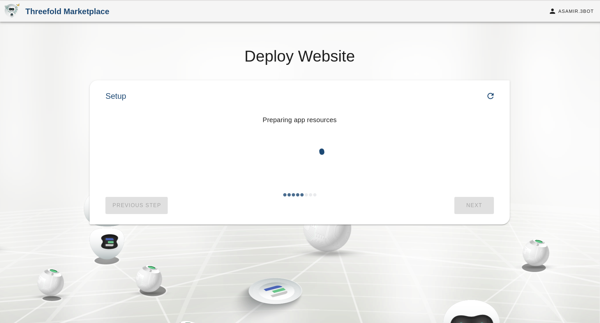
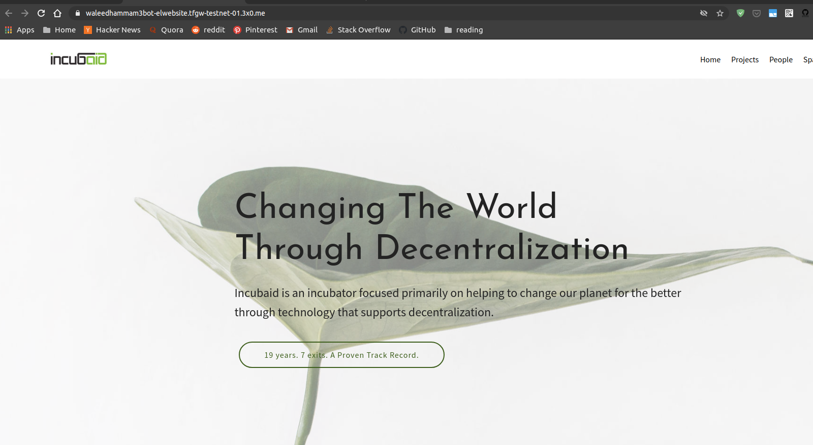

## Website

### How to Publish a Website

There are a few things to know when you want to publish a website:

- Title: Is the title shown up on your published content.
- Repository URL: is a valid git repository URL where your content lives
- Branch: is the deployment branch that exists on your git repository to be used as the version of your content to publish.

Example of a Website repository:

The folder file structure should look like this:

```
- src
    - index.html
    - css
        - somecssfile.css
    js
        - ..
    ..
```
Here's an example of a valid [website structure](https://github.com/xmonader/www_incubaid), please check [repository structure for more info](https://github.com/crystaluniverse/publishingtools/blob/development/docs/repo_layout.md)


### Add a Website Title, Repo URL and Branch


### Preparing Your Website's Resources



### Summary of Your Deployment


### Final Deployment of Your Website

### Congratulations, Your Website is Successfully Deployed!
You could now access your new website by entering the website address mentioned below onto your web browser.


An example of a successfully deployed website:


