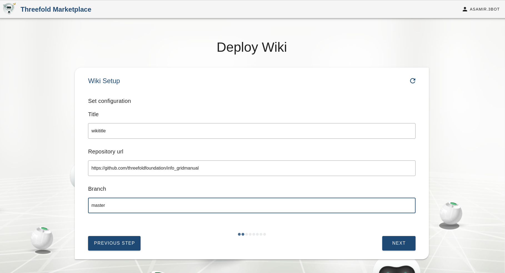
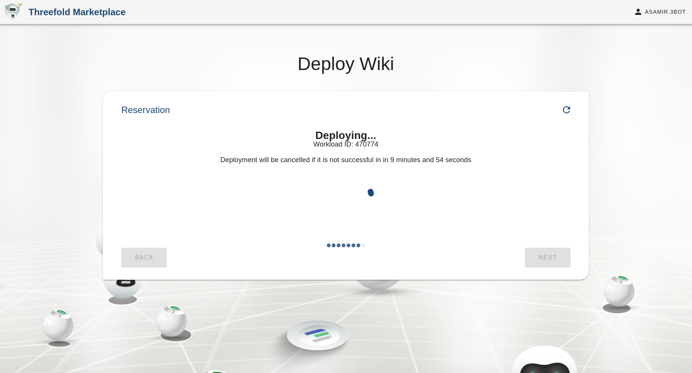

## Wiki Publisher

Publisher is a web [publishing platform](https://github.com/Threefoldfoundation/publishingtools) than aims to host an online encyclopedia-like platform on a P2P network environment. With a wiki, everyone can be their own publisher on top of the ThreeFold Grid and build a censor-free knowledge base platform for topics they are passionated about.

### How to Publish a Wiki

#### Choose a Name for Your New Wiki
Choose a name for your new Wiki. This will allow you to later on view and access your Wiki information on your 3Bot dashboard'S deployed solutions lists.

#### Enter your wiki Title, Repo, URL, and Branch

> to do, explain why users need this?

### Preparing Your Wiki...

### Deploying Your Wiki...

### Deployment Succeeded!

### How to Access Your New Wiki

You can access your new wiki by typinh your wiki's 'domain name' onto your web browser.

