# Get a Hosted 3Bot

3Bot is your virtual system administrator which helps you to deploy solutions on top of the ThreeFold_Grid.

## How to Deploy your 3Bot

- For **Mainnet** Go to 3Bot [Deployer Website](https://deploy3bot.grid.tf)
- For **Testnet** Go to 3Bot [Testnet Deployer Website](https://deploy3bot.testnet.grid.tf)

## Create a 3Bot

In the welcome step you can either recover a previously created 3Bot or create a new one.

If you choose to create a new 3Bot, please go through following steps:

### Name Your 3Bot

This name will be used to identify this 3Bot. Keep in mind that this name will also be used as your 3Bot's subdomain (a part of your 3Bot's web address).

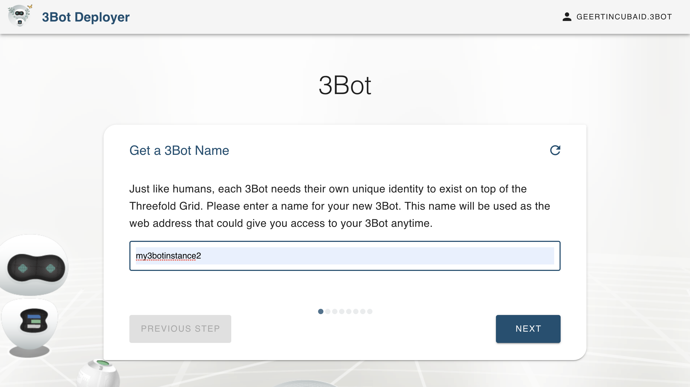

### Choose the 3Bot Configuration

The 3Bot comes in 3 sizes. Depending on the intensity you intend to use this hosted 3Bot, choose the flavor that best fits your needs. For example, if you intend to use the hosted development features, you might need more resources available. The flavor can be changed after deployment.

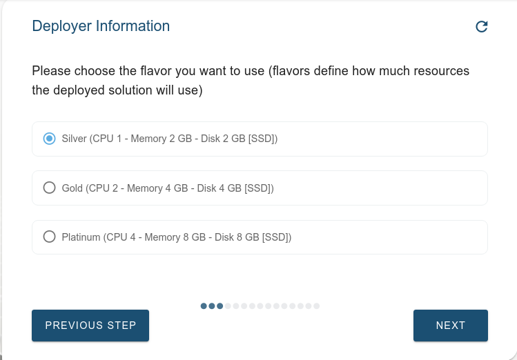

### Upload an SSH key (optional)

If you intend to ssh into your 3Bot container, you can provide an ssh key in the next step. It is also possible to add and remove ssh keys later through the 3Bot's Settings page.

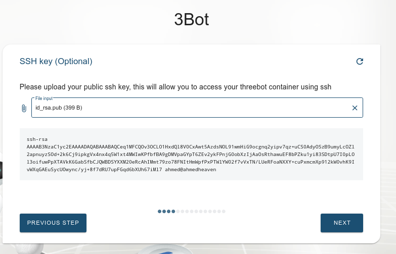

### Select the Back Up & Restore Password

Your 3Bot has a backup and restore feature accessible on the dashboard. A password protects these capabilities, please store it safely or remember it well.

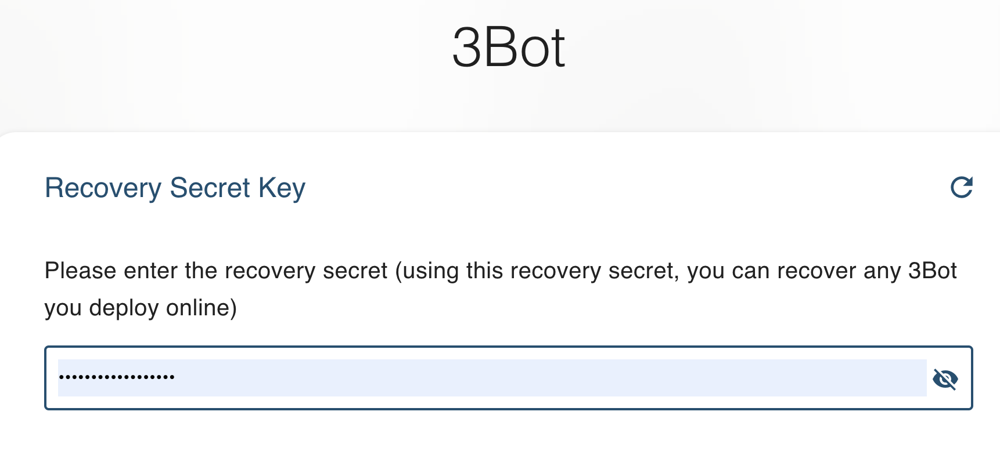

### Choose How You Wish to Select the Deployment Location

The deployer is able to choose a deployment location for you automatically. If you have a specific farm or node in mind, choose the appropriate option and you'll have a chance to select it in the next step. Otherwise, just pick "Automatic" to have a farm and node chosen for you.

For now, deployments are limited to a certain set of farms and nodes. In the future, more farms will be available, allowing for greater choice in where your 3Bot lives for reasons of network performance or data sovereignty.

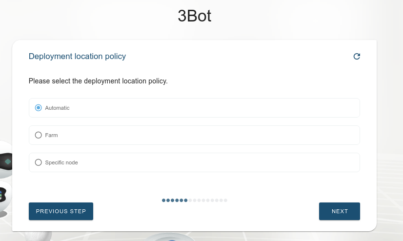

### Choose the Deployment Location

If you opt for a specific farm or node, you have the option now to choose from available farms or nodes.

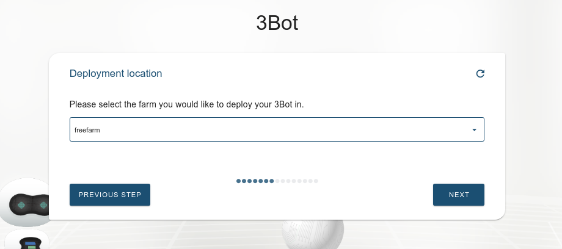

### Choose e-mail Settings

Your 3Bot can send alerts via email for certain events. To enable this feature, email server settings and credentials are required. Enter them on this page, or later from the Settings menu.

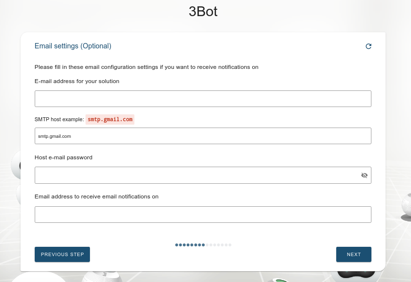

### Setup and Initialization

Once all info is know, the deployment of your 3Bot can start.
Multiple steps happen now behind the scene:

- The infrastructure is prepared for a 3Bot deployment.
- A pre-funding of this capacity is done
- The right hardware capacity is selected, according to your choice.
- The network is generated.
- Gateways are being prepared.
- The 3Bot is deployed.
- The 3Bot is initialized so you can start working with it as soon as you have done the payment.

This process can take a while.

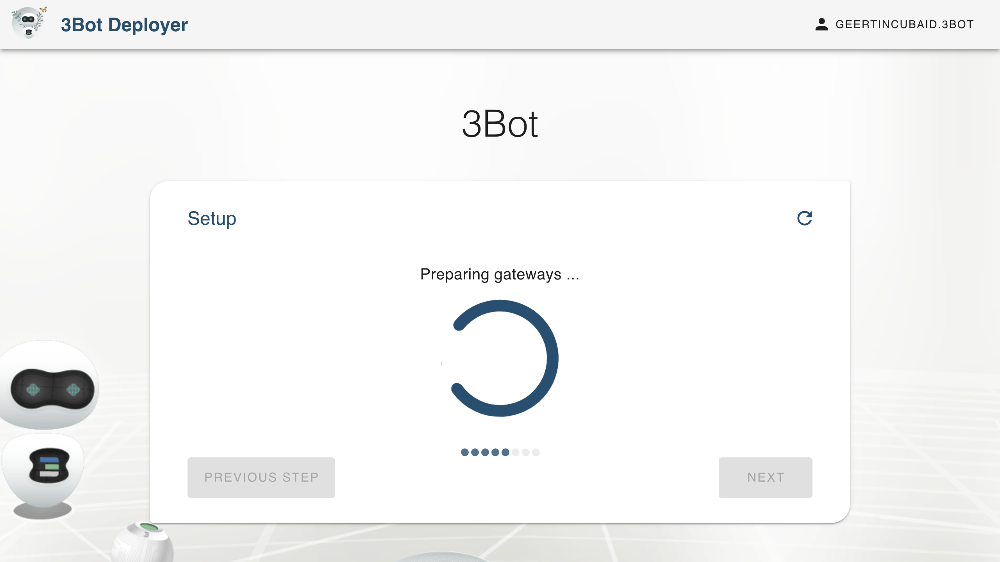
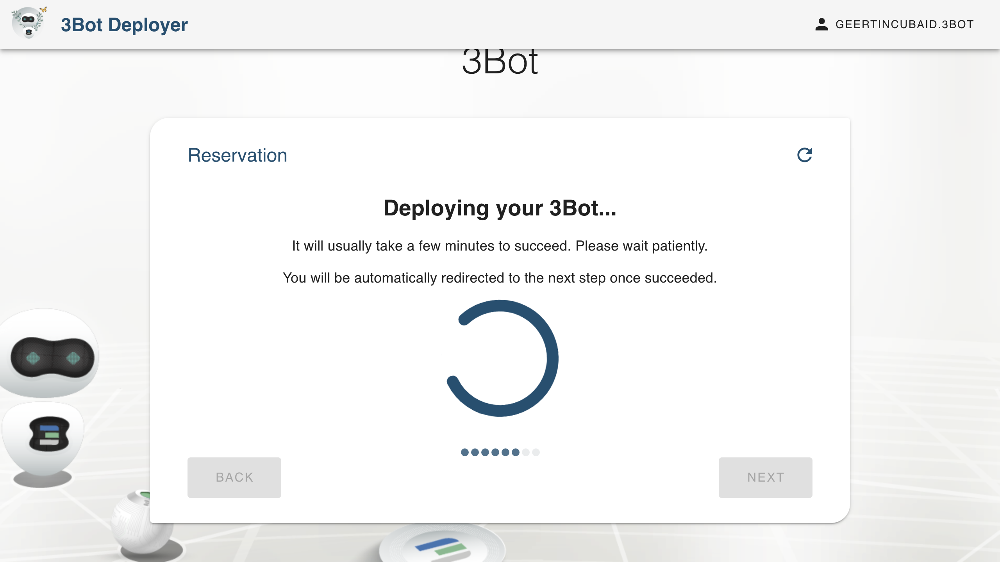
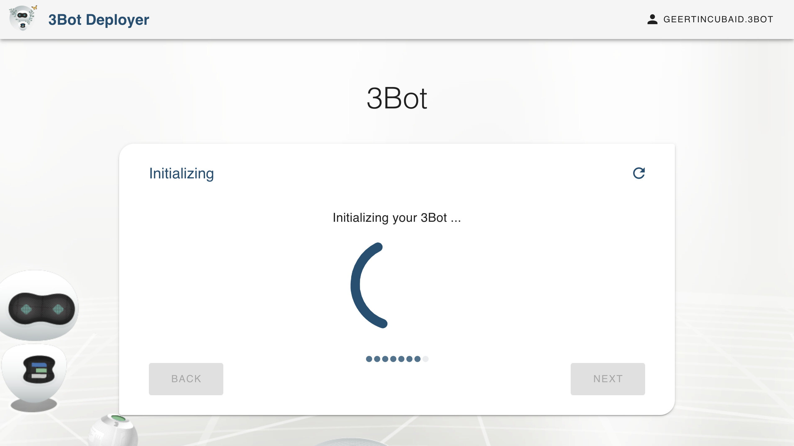

### Choose the 3Bot's Expiration Time

The expiration time determines your preference for how long you want to keep this 3Bot alive. This will calculate the amount of grid capacity you need to purchase in order to keep the 3Bot online. You can always extend your 3Bot's life span by extending your capacity reservation, or restart your 3Bot later if it's funding has run out.

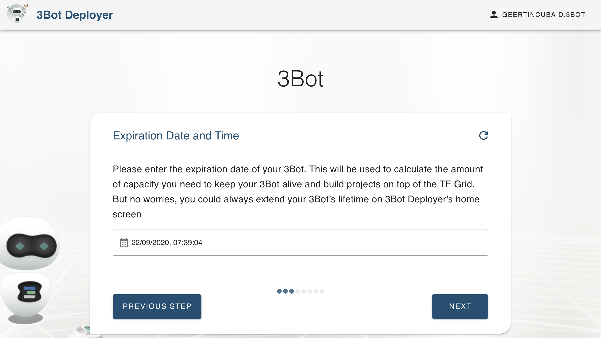

### Pay for Your Capacity by using a Stellar Wallet

You will be shown payment details as below. Send the required amount to the address shown, using a Stellar wallet. This can be done simply by scanning the QR code using your Threefold Connect app.

If you're entering the transaction manually without scanning the QR code, please do not forget to include the reservation ID as the memo text for the transaction. This is needed to link the payment to the specific reservation, and the payment will fail without it.

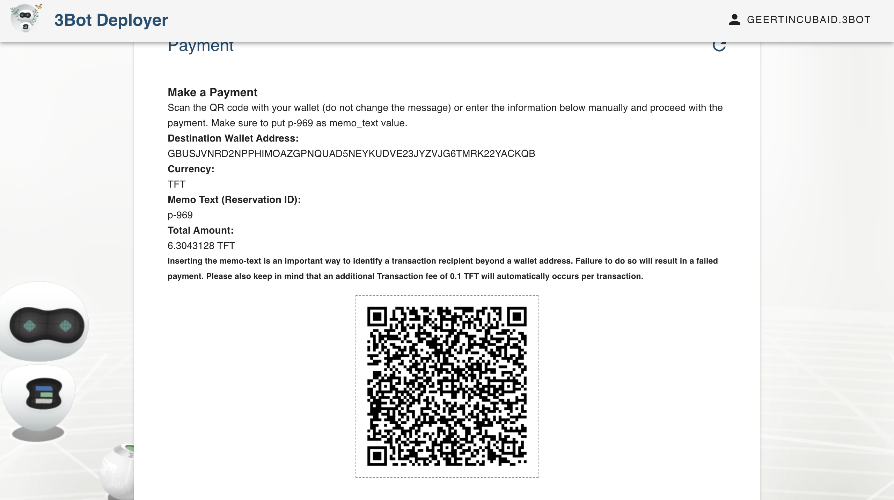

### Wait Until Your Payment Has Succeeded

Payment can take some time. The screen gives an overview of the amount, currency, destination wallet and reservation ID. Once processing the payment is detected, it goes to the next step.
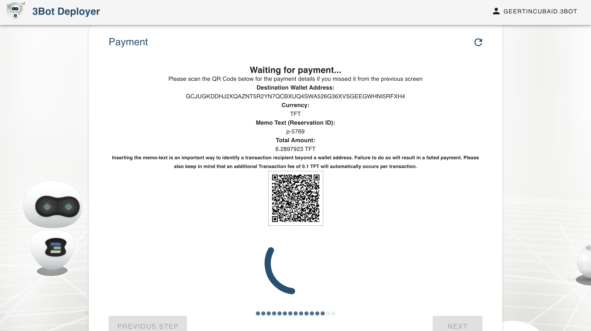

### Set up Wireguard (optional)

Hosted 3Bots provide a web gateway for access to the browser based interface from any internet connected device.

If you want to access the 3Bot container directly or use ssh, you need to set up a Wireguard connection on your local computer. Download the configuration file and follow the instructions to do this.

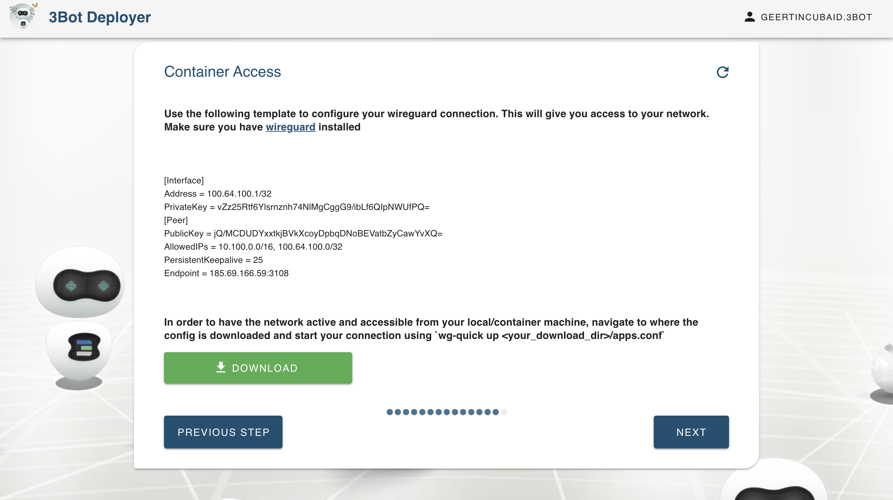

### Congratulations, Your Hosted 3Bot is Now Live!

Congratulations, your 3Bot has been successfully deployed.

You can access your 3Bot by following the link provided, or using the IP address if you've set up Wireguard.

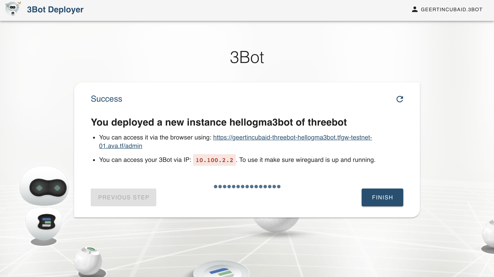

Log in here using your ThreeFold Connect app.

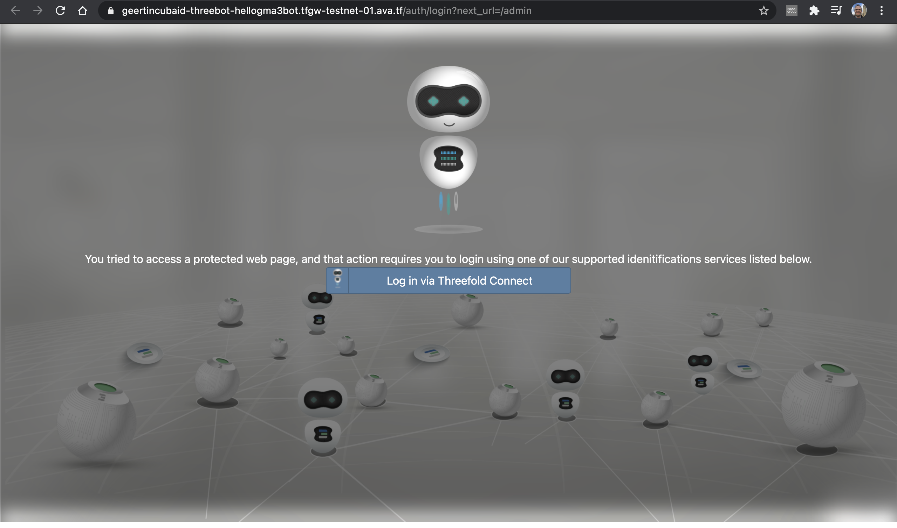

### Access Your Dashboard

After signing in and agreeing to terms and conditions, you'll see the 3Bot dashboard with some information about resource usage and currently running processes. Please note that the memory and disk usage refer to the whole node that your 3Bot is running on, not necessarily all resources available to the 3Bot.

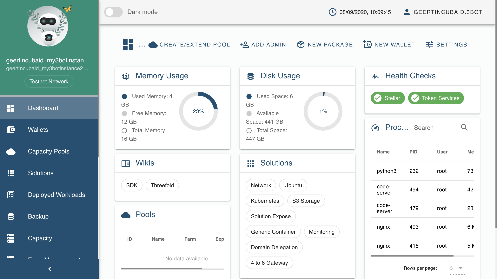

### Explore the 3Bot Admin Panel's Features

You can now access all the features of your 3Bot, such as the Code Server, Python Notebooks, Farm Management, and many more. Feel free to click on [the Dashboard](3bot_admin) section to learn more about your hosted 3Bot features.
