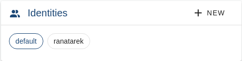
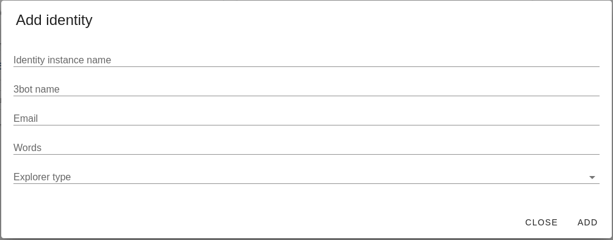

# Identities

New identities could be added through the admin dashboard once 3Bot server is started.

- Access settings of `https://<host>/admin` and click on the `ADD` button on the identities

- Add the 3Bot name, email, words and explorer type in the window prompted then click on `Add` to create and register the identity instance

## Change default identity

 When clicking on the identity instance then the `SET DEFAULT` button, that instance will be the current default instance used

