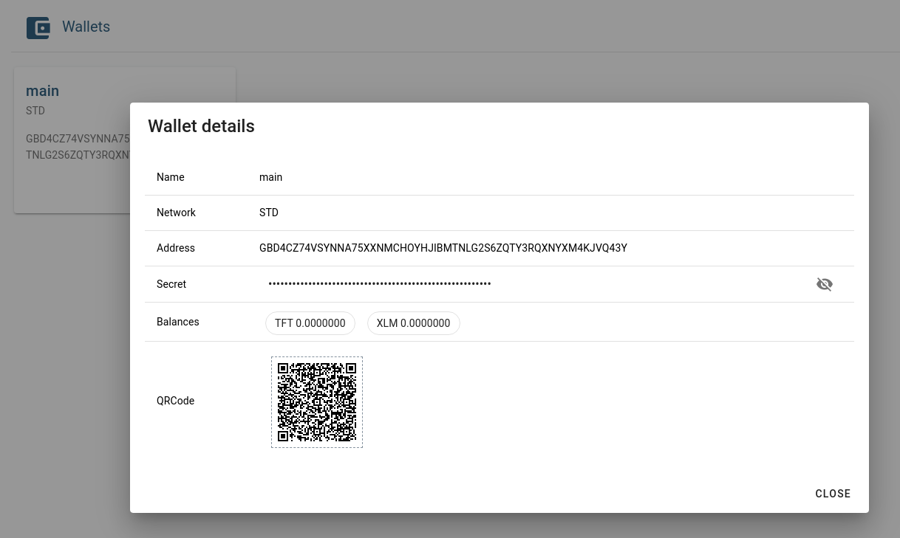

# 3Bot Wallets

Your 3Bot manages Stellar wallets, in order to store ThreeFold Tokens and pay for capacity on the Grid. Any wallets with adequate funds will be available as payment options when creating or extending [capacity pools](3bot_capacity_pools). If you want to transfer tokens out of a 3Bot wallet, you can import the wallet into the ThreeFold Connect app or another Stellar wallet provider.

By default, 3Bots automatically extend any capacity pools which are nearing expiration. This includes the pool used to provide capacity for the 3Bot itself, in the case of hosted 3Bots. A default wallet is provided when 3Bots are initialized, which you can fund with TFT to keep your 3Bot and other workloads online.

The auto extend pools feature can be toggled from the 3Bot settings page, under *Developer options*. With this option disabled, you'll need to extend capacity pools manually for all deployments.

## Creating and Importing Wallets

To create a new wallet, just hit the create button and choose a name for the wallet.

In order to import a wallet, you'll need the Stellar secret. This is a string of characters, starting with 'S' (unlike the public address which starts with 'G'). Enter the secret when prompted along with a name to identify the imported wallet.

## Wallet Details

Click on an existing wallet see the details of the wallet. Along with the name of the wallet, you'll see the following information:

**Network:** refers to which Stellar network, mainnet or testnet, the wallet belongs to. We are no longer using Stellar testnet tokens for the ThreeFold testnet, so this field should always show "STD", which means mainnet.

**Address:** the public address which can be used to send tokens to this wallet.

**Secret:** can be used to import this wallet elsewhere or sign transactions using tools like Stellar Laboratory. Anyone with this secret can send funds from the wallet, so it should be kept secure.

**Balances:** shows which tokens and how many are held in the wallet. It is important to note that the assets shown here are the only assets that this wallet can receive, due to a Stellar concept called trustlines. A trustline for TFT is automatically created for all 3Bot wallets. If you have TFTA, please [convert it](threefold:tfta_to_tft) to TFT for use with your 3Bot.

**QRCode:** scan this code with a QR enabled wallet, like the ThreeFold Connect app, to add funds to the 3Bot wallet.