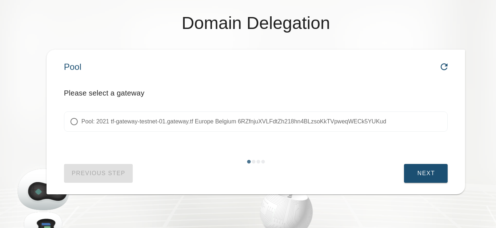
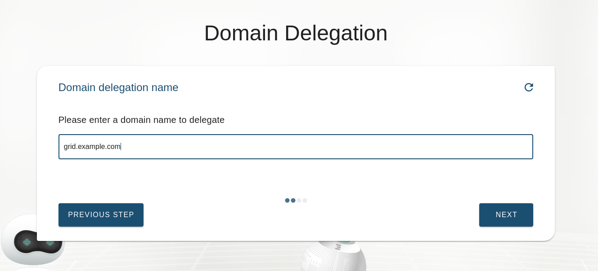
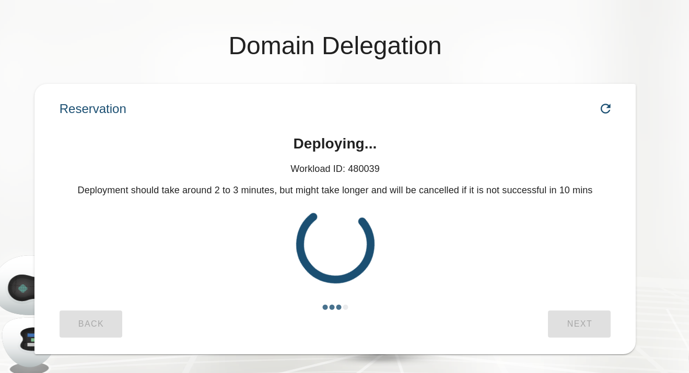
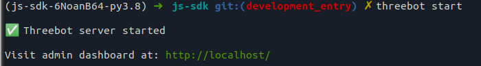

# Delegate Domain

Our grid provides functionality to delegate subdomains of your domains allowing us to create subdomain for your solutions [see](exposed).
To do this you will need to configure your dns manager. In your dns manager you will need to add a `ns` record pointing to the dns_server of the chosen gateway.
The chatflow will also instruct you to do so.

First you will be instructed to choose the gateway you wish to delegate your domain to

Next you will be asked to provide your domain

Then it will start the reservation of your domain

Finally you will be shown a message that your domain was delegated successfully and will show you which domain to use in the `ns` record you have to create

<!--- to be deleted once all url links from sdk are moved to solution_delegate_domain --->