# Monitoring solution

Deploy monitoring solution with Grafana and prometheus and redis

## Steps

### Solution name
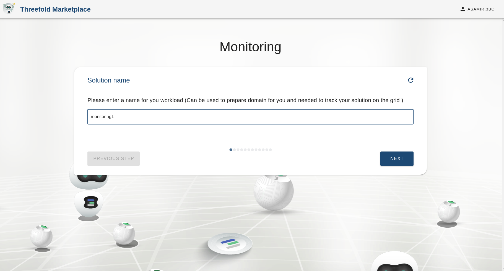

### Add your sshkey to be able to access the containers
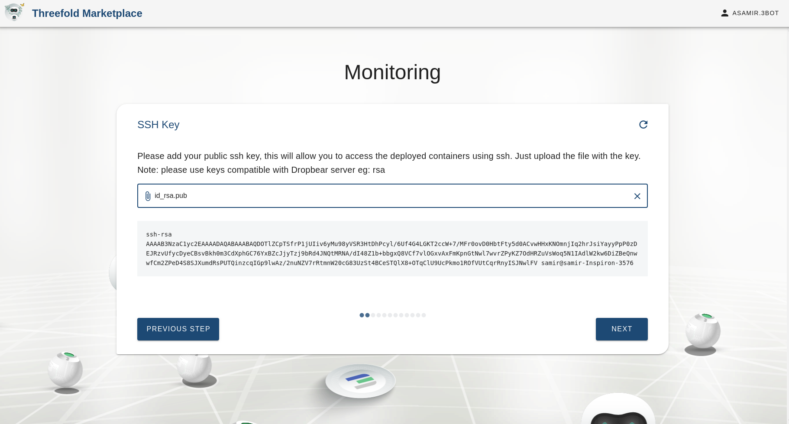

### Select Prometheus container resources
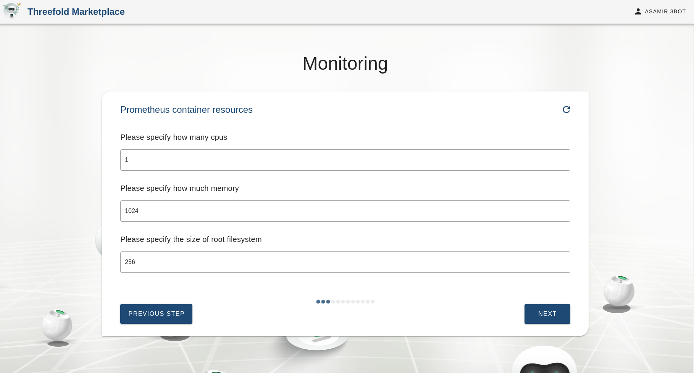

### Select Prometheus volume size
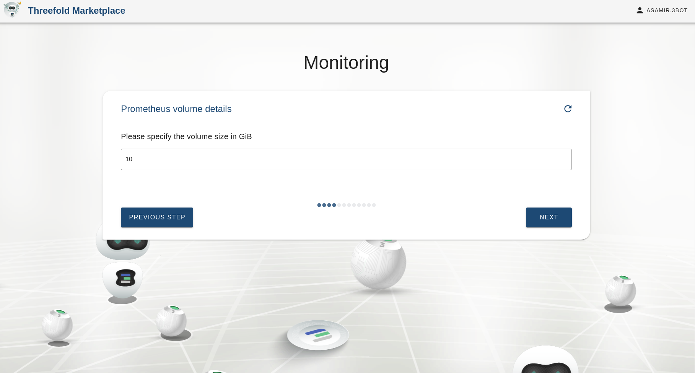

### Select Grafana container resources
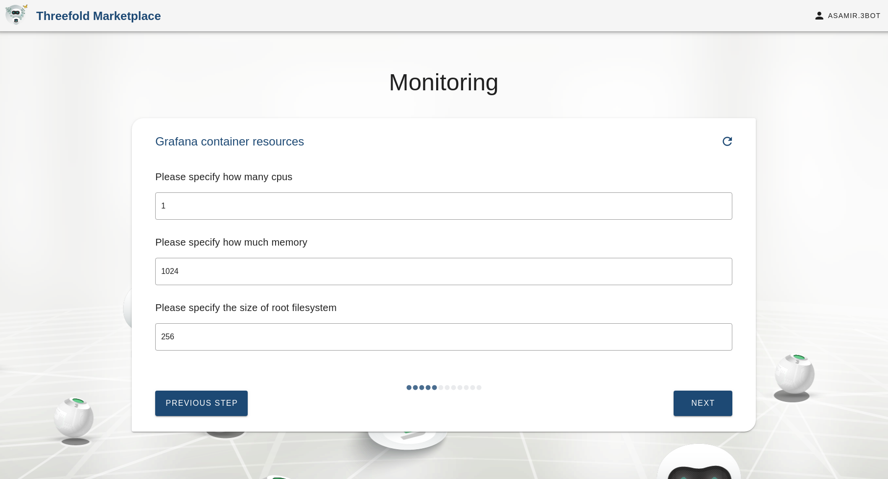

### Select Redis container resources
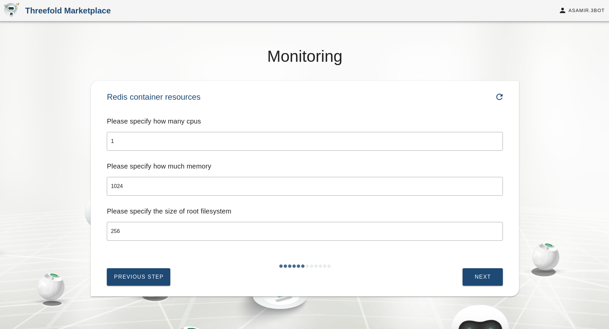

### Select a pool for Redis container
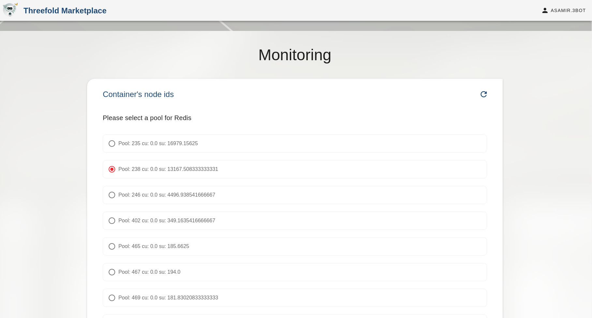

### Optional, select the node id you want to deploy Redis on

### Select a pool for Prometheus container

### Optional, select the node id you want to deploy prometheus on
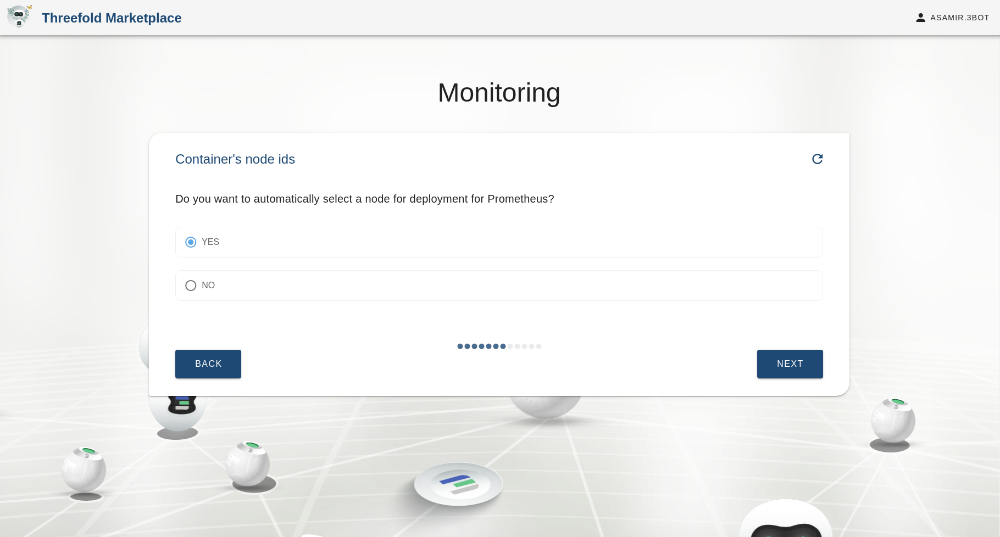

### Select a pool for Grafana container
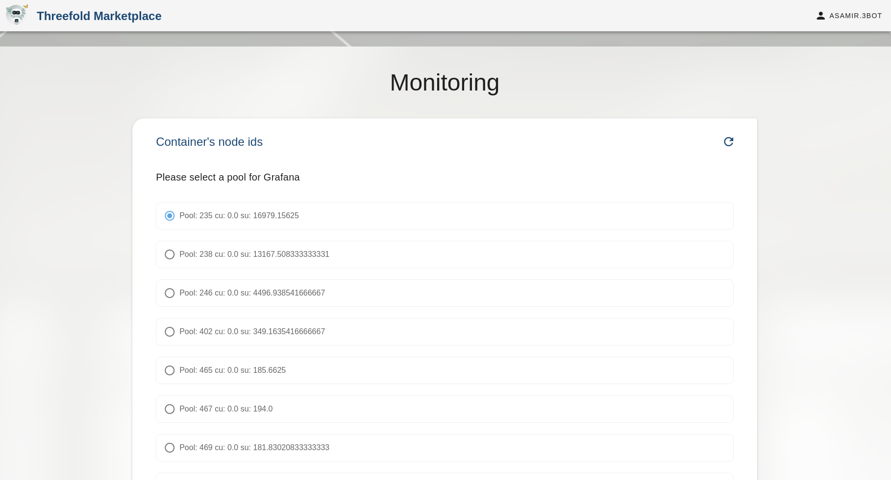

### Optional, select the node id you want to deploy Grafana on
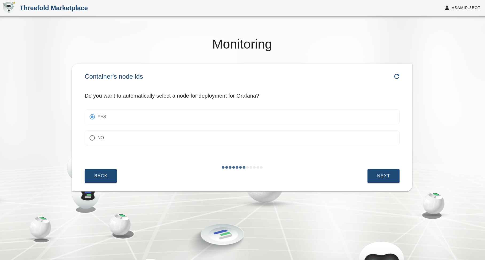

### Select the network to deploy the solution on
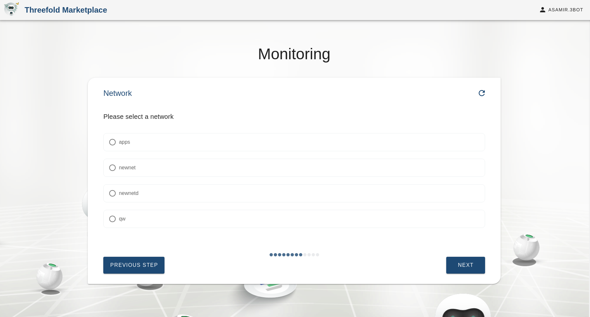

### Select Redis container ip
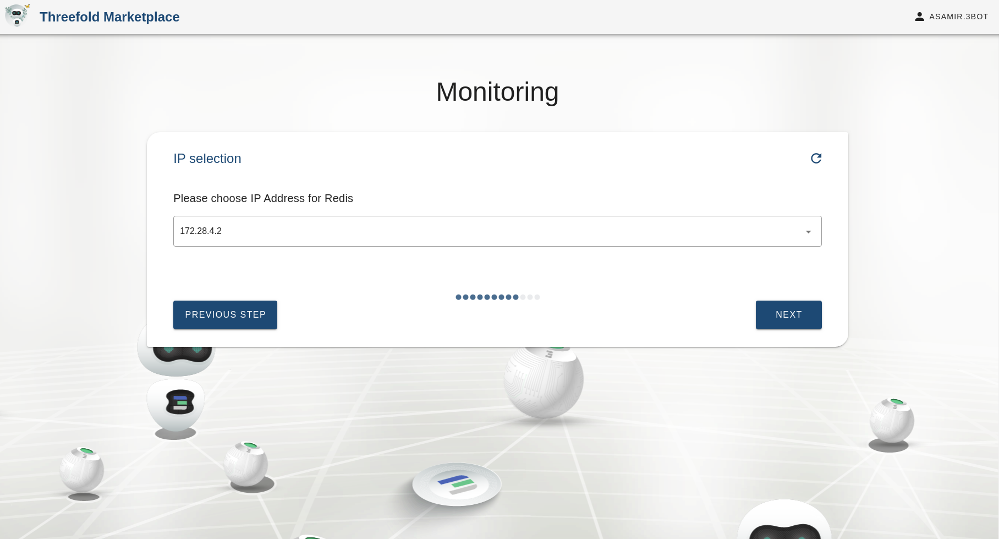

### Select Prometheus container ip
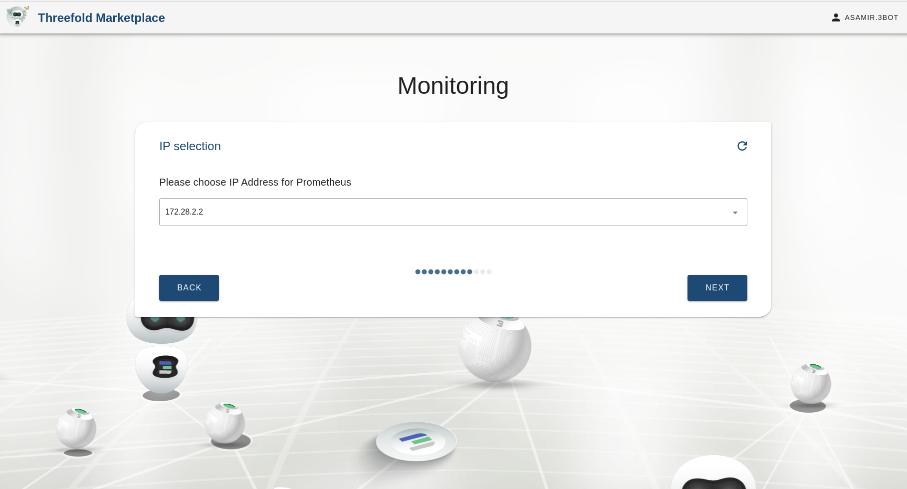

### Select Grafana container ip
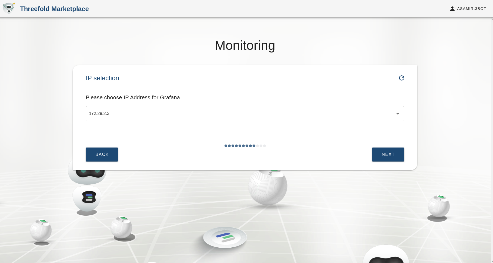

### Summary for the solution information
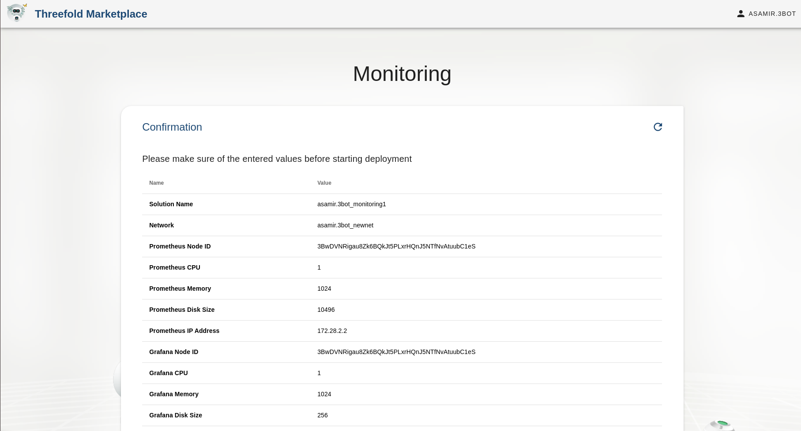

### Deploying the solution
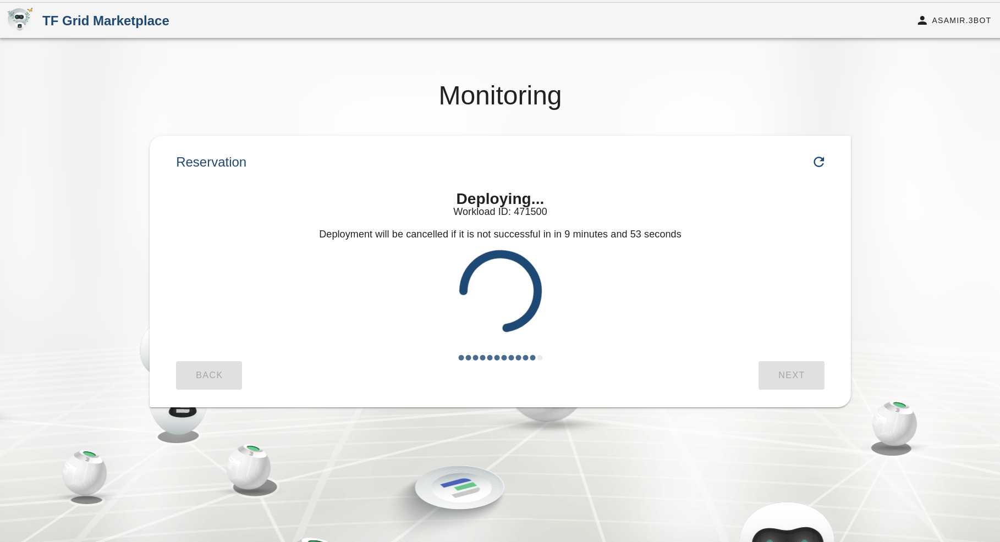

### Congratulations your solution has been deployed
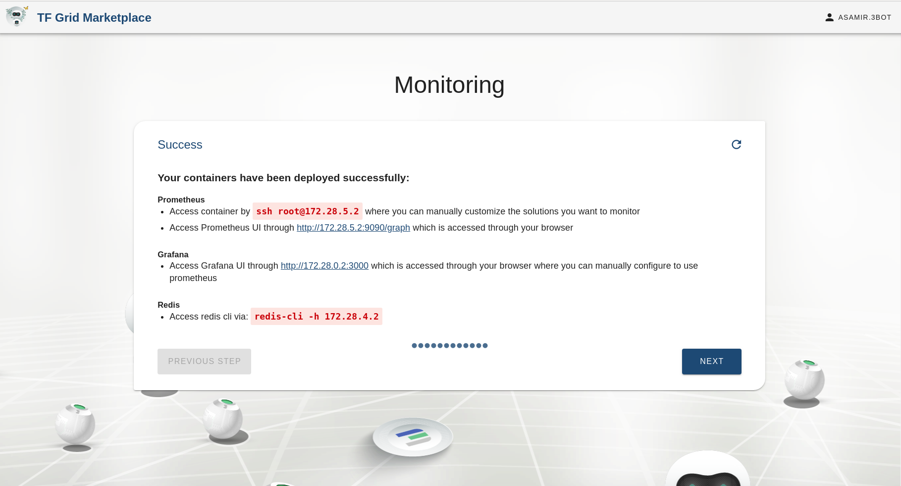

### Access container via web or ssh
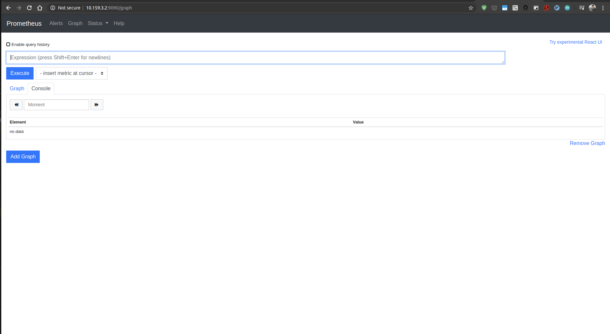

<!--- to be deleted once link from sdk moved to solution_monitoring.md --->