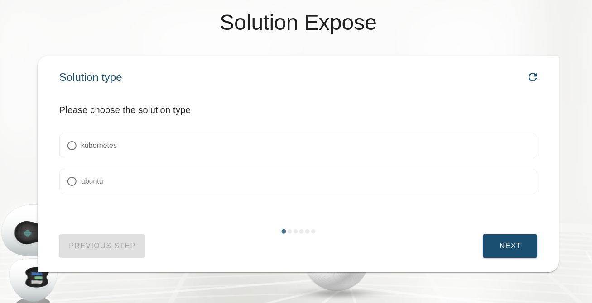
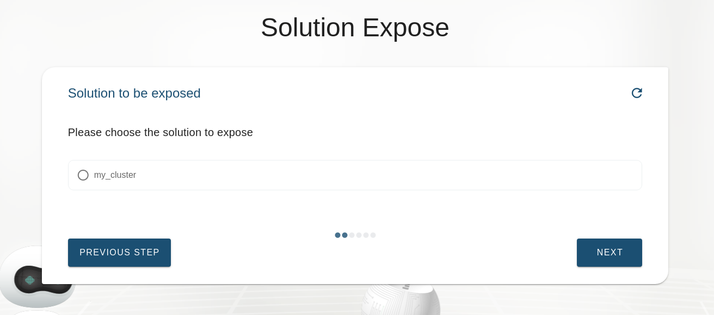
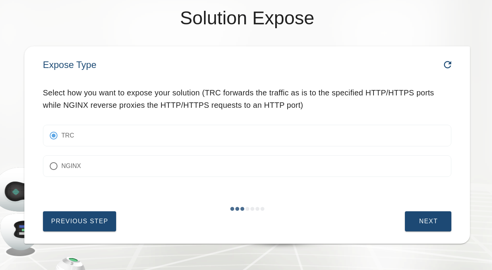
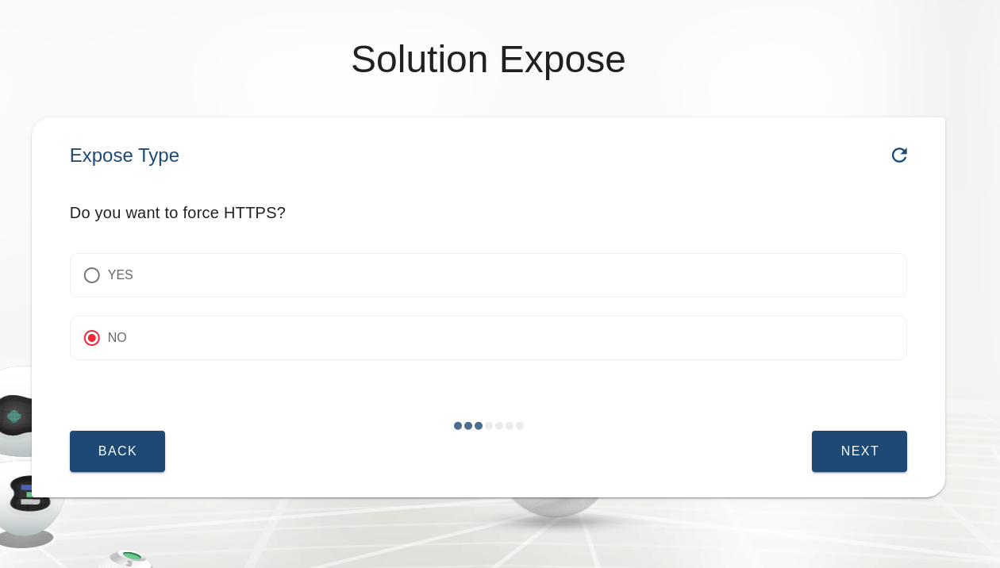
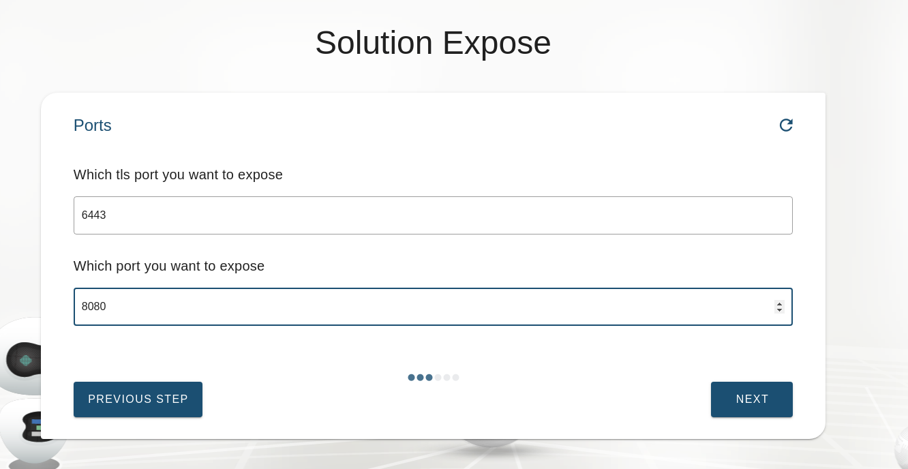
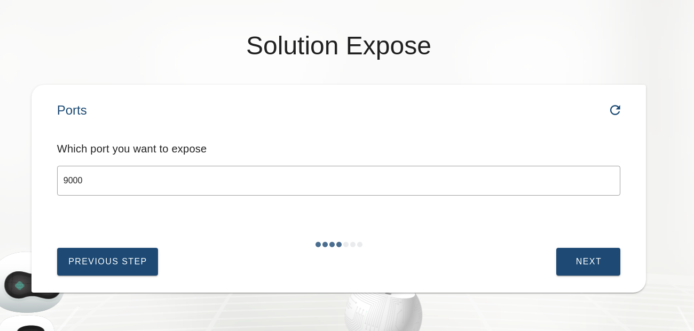
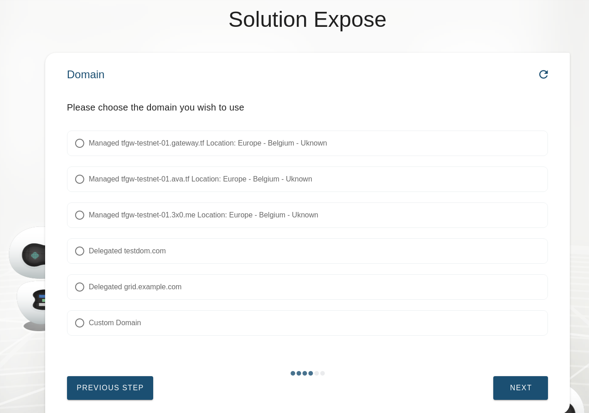
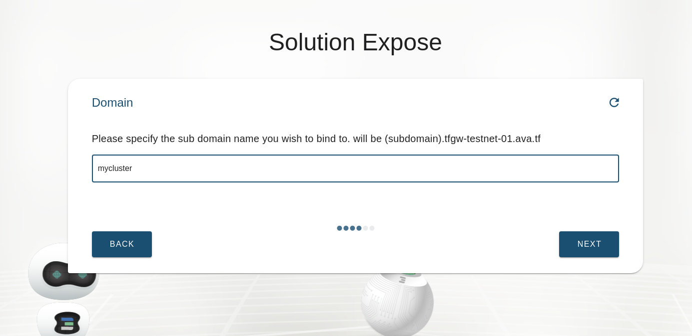
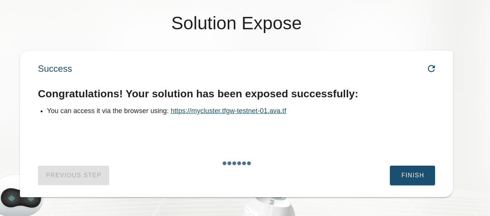

# Solution Expose

To make your solution available to the internet we provide an option to expose your solution.

This will create a container inside your network which will connect to one of your gateways using [tcprouter](https://github.com/Threefoldtech/tcprouter/) 

Depending on which kind of solution you are trying to expose you might be offered to choose which http port to expose.

1. The chatflow will ask for the kind of solution you want to expose.

2. Pick the solution you want to expose

3. Choose how you want to expose your solution. `TRC` incoming traffic to the specified HTTP/HTTPS ports so in this case your solution should support HTTPS if you need to use while `NGINX` reverse proxies HTTP/HTTPS traffic to one specified port (HTTP) which means it is ideal to use for solutions that don't support HTTPS on its own like `minio`

In case you selected `NGINX`, you will be asked if you want to force HTTPS which means it will always redirect HTTP connections to HTTPS

4. Pick the ports you would like to expose for your solution typically this will be your https and http ports (443, 80) if you are using `TRC` to expose your solution

In case you selected `NGINX`, you will specify one port on which your solution listens for HTTP

5. Next you can choose on which domain you would like to expose your solution. This can be a subdomain of either one of your own delegated domains or a subdomain of a gateway provider. It is also possible to enter a custom domain which will required you to make a `cname` dns record towards the nameserver of the gateway.

6. Choose subdomain or custom domain
Note: currently only direct subdomains are supported no nested domains

7. Solution expose result

