# Ubuntu
A free and open-source Linux distribution based on Debian.
Ubuntu is officially released in three editions: Desktop, Server, and Core(for internet of things devices and robots). This package is used to deploy a Ubuntu container from an official Flist on the grid using a chatflow.

### You need to create a pool and a network first before deploying your ubuntu container

# Steps to deploy solution

### Add the solution name. Keep in mind it will also be the subdomain.
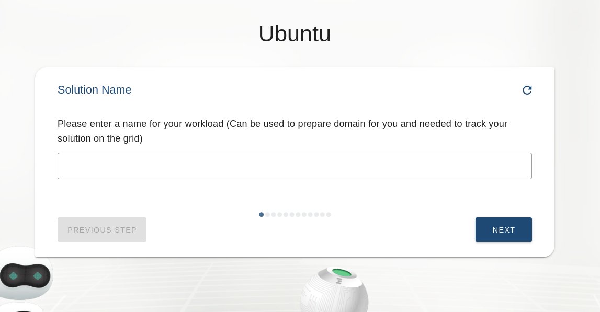

### Choose your ubuntu version
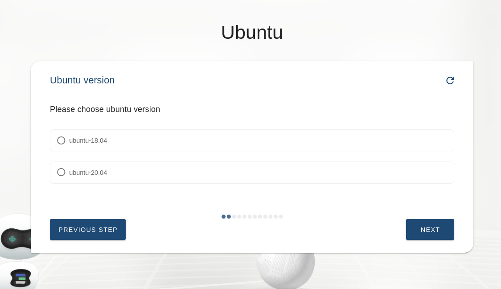

### Choose container resources
Here we specify the CPU and Memory resources allocated for the container
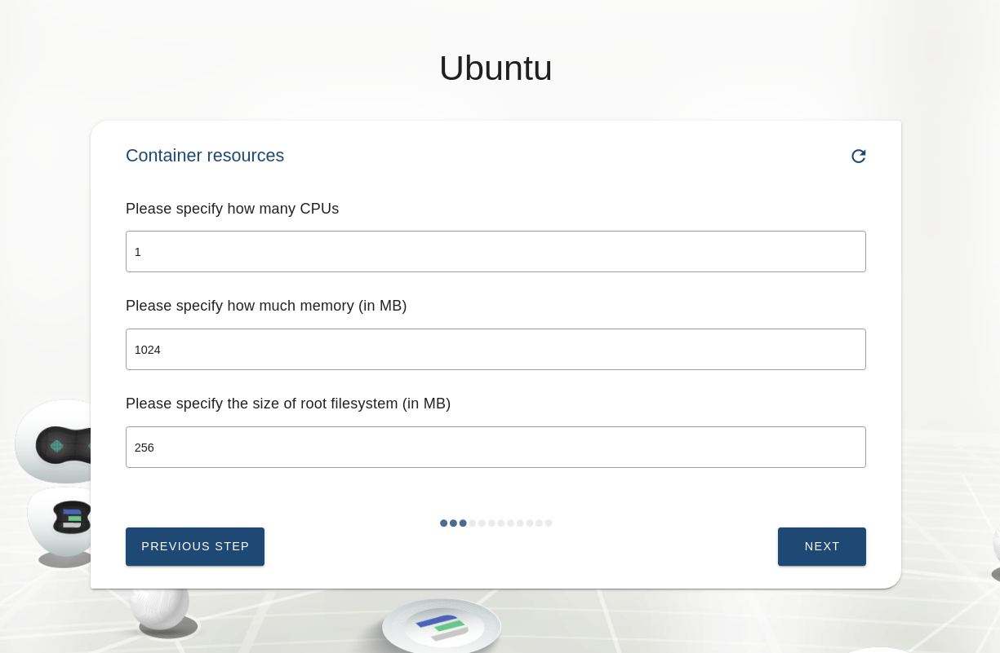

### Select a pool for your solution
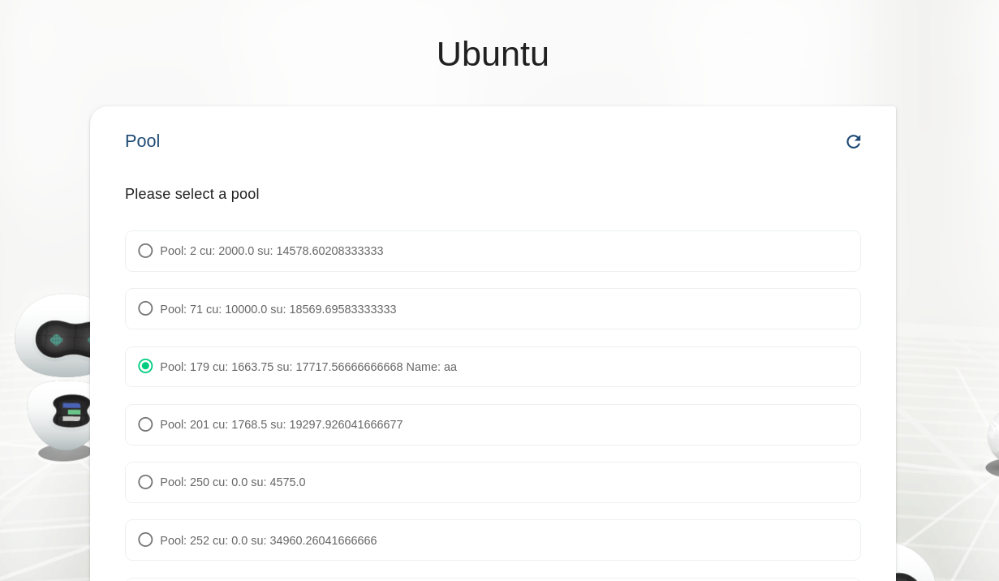

### Choose a network
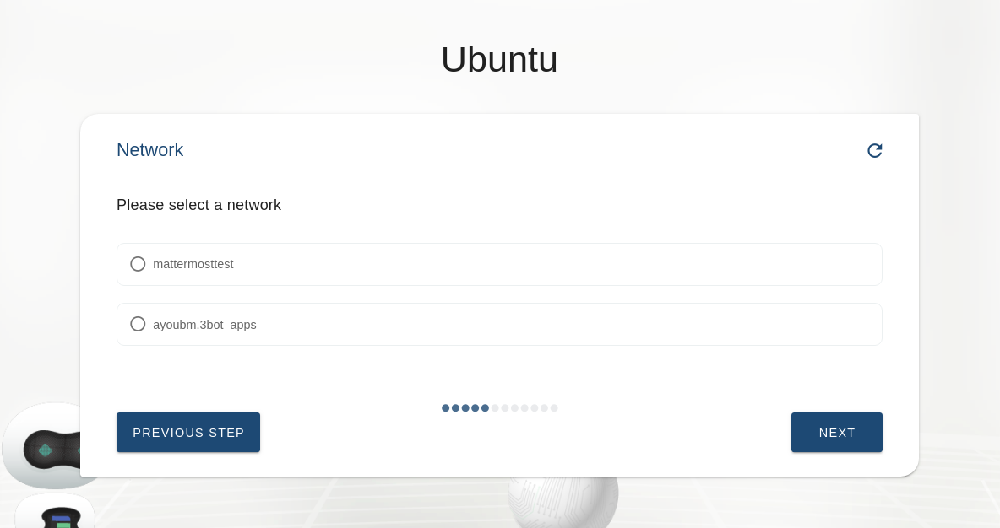

### Choose whether you want to push the container logs onto an external redis channel or not
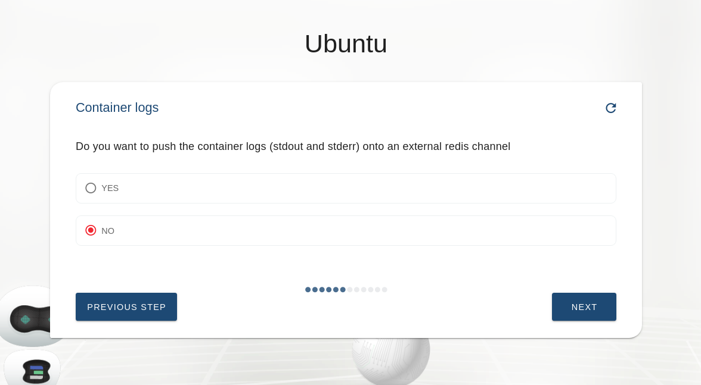

### Access keys
Uploading your public key for SSH access
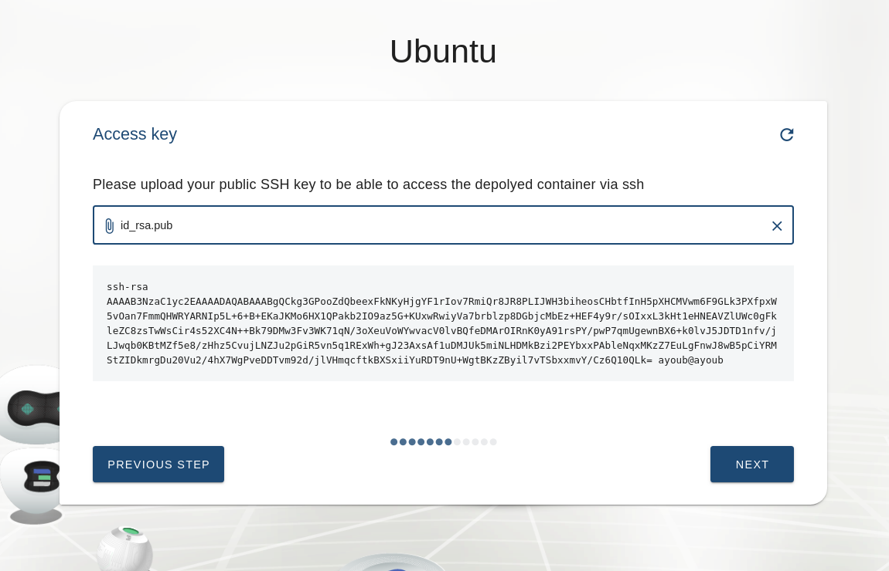

### Ask for automatically select node
Here we could provide a node id corresponding to a current node on the grid to deploy the container on. If there is no specific node to be used then it is choose `Yes`.
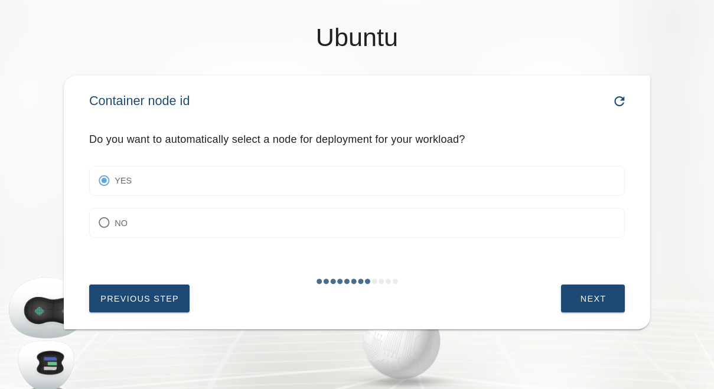

### Choosing private IP
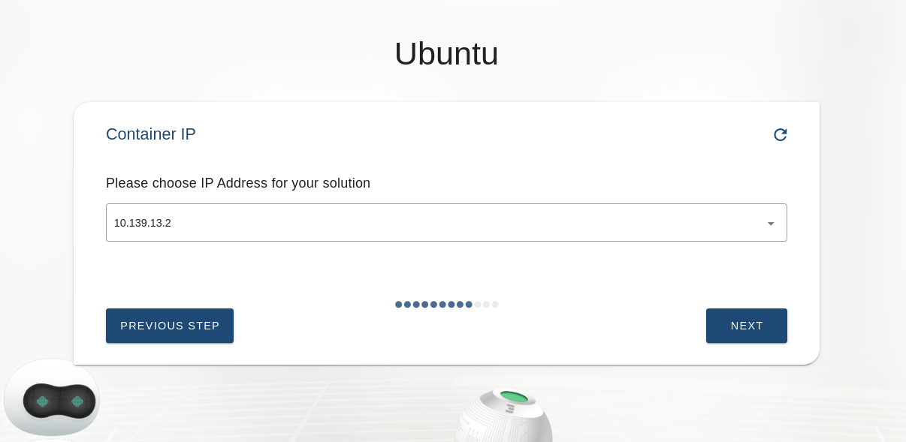

### Choose whether you want to assign a global Ipv6 address for your container or not
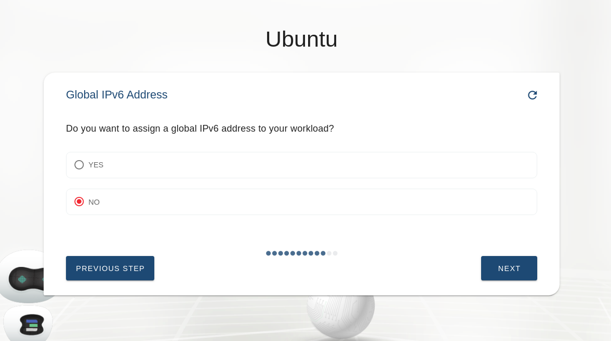

### Deploying your solution
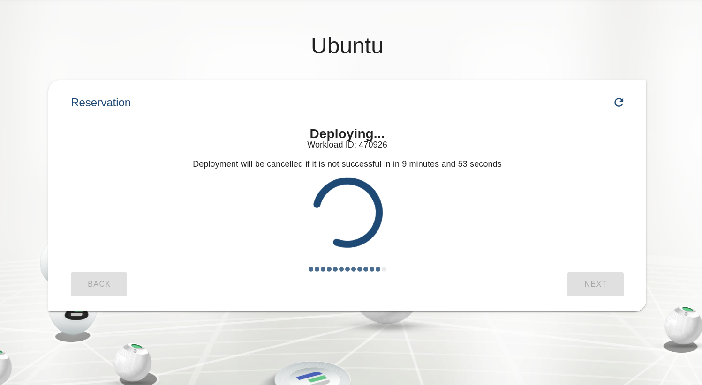

### Deployment successful, you could ssh into your container now using ip address.
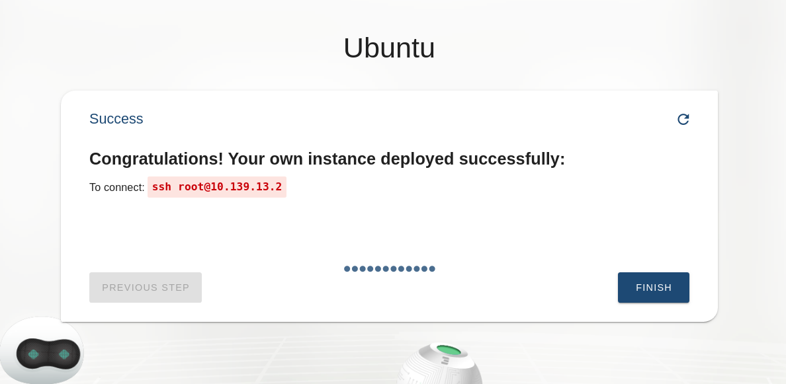

## Access solution info from the ubuntu page
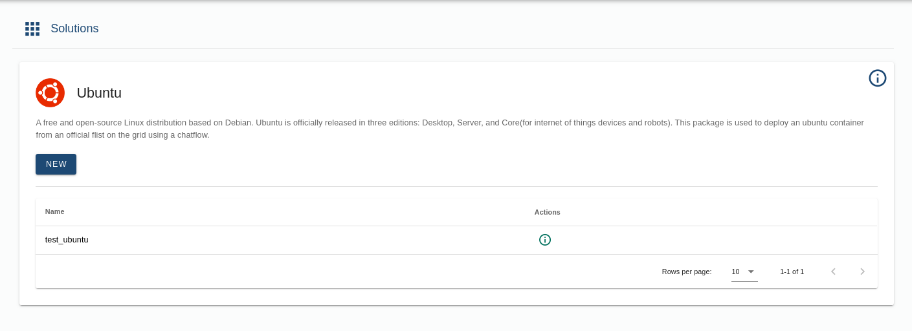
