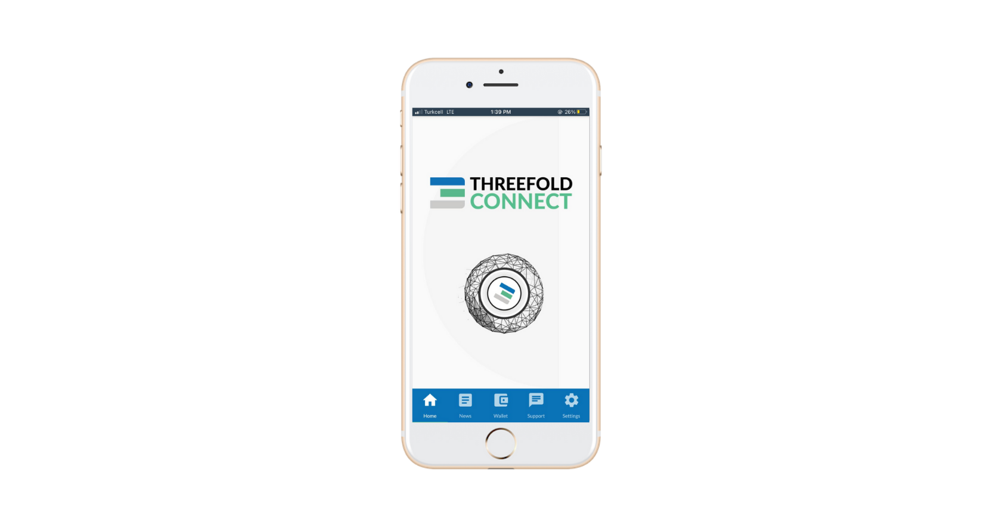
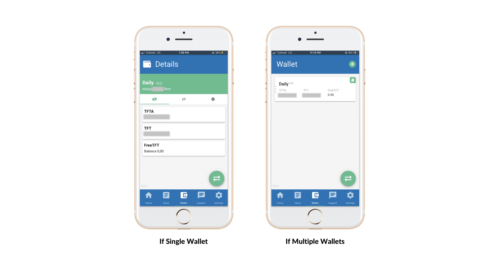
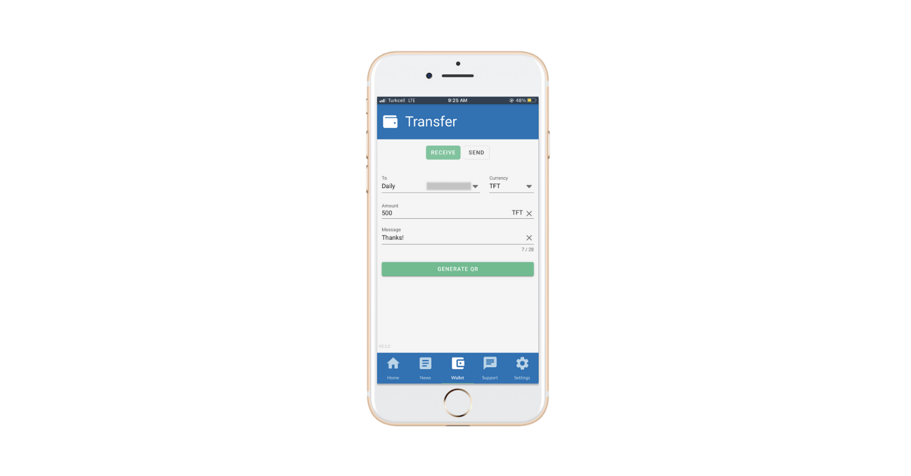
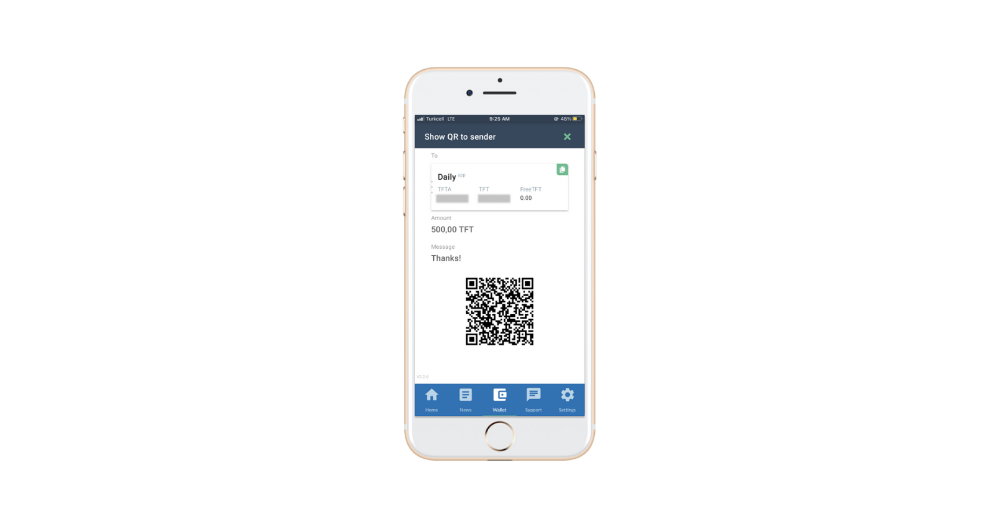
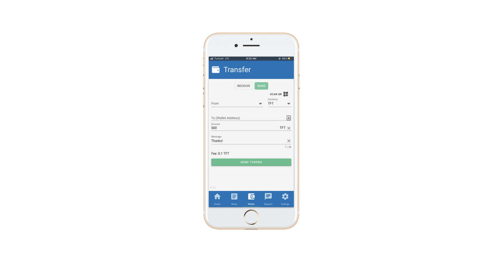

<!--- original content: https://github.com/Threefoldfoundation/info_Threefold/tree/development/src/docs/token/apps_wallets --->

# ThreeFold Connect App

## Home Page

This is the Home Page of your ThreeFold Connect App. It offers a gateway to your digital life.

## Wallet

In this tab you can check your ThreeFold wallets and balances. If you have multiple wallets, you can copy your wallet address using the green "Copy" button for each specific wallet. In single wallet view (wallet details), you can view your address by clicking on the tab with the "i" icon and copying from there. Using the button on the bottom right side you can send or receive ThreeFold_Tokens.

### Generate QR Code to receive ThreeFold_Tokens

To receive your ThreeFold_Tokens you should fill in the following fields:

1. `To` : choose the wallet that receives the transaction
2. `Amount` : amount of TFT to receive
3. `Message` : message to transaction
4. `Generate QR` : this button generates a QR code that holds all info, allowing an easy way to exchange the payment information.

### Send

1. `From` : choose your wallet with TFT to make transaction
2. `To` : paste the receiver wallet address
3. `Amount` : amount of TFT to send
4. `Message` : message to transaction
5. `Scan QR` : easy way to scan the QR code generated by the receiving party. Scanning the QR automatically fills the fields introduced by the tokens receiver.

## Settings

You can check your Secret Phrase here, change your pin code, activate access through biometric (fingerprint) or remove your account in `Advanced Settings` tab.
