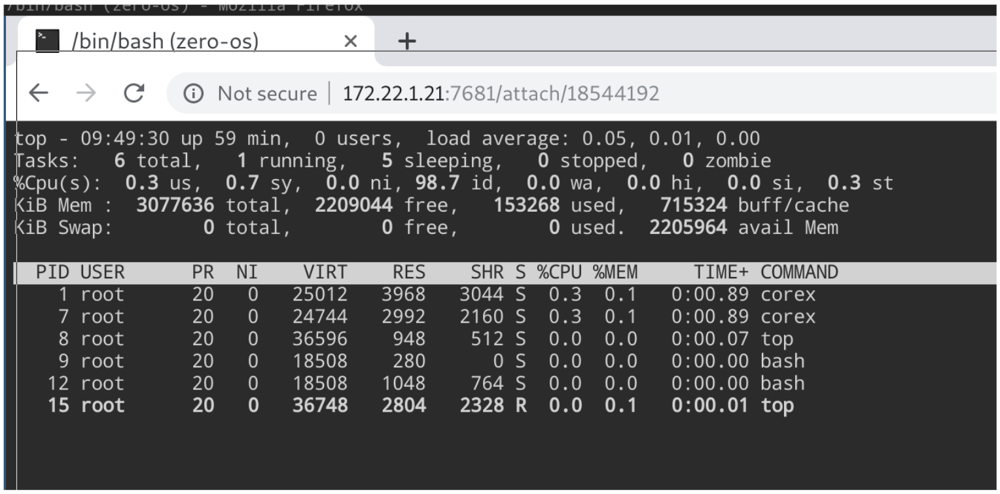
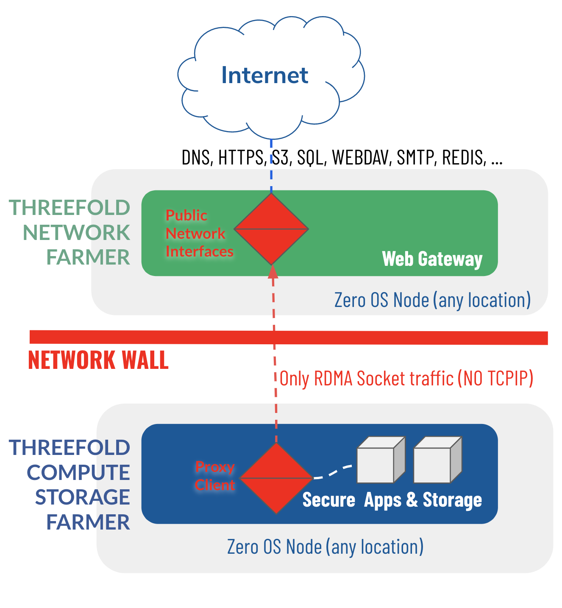
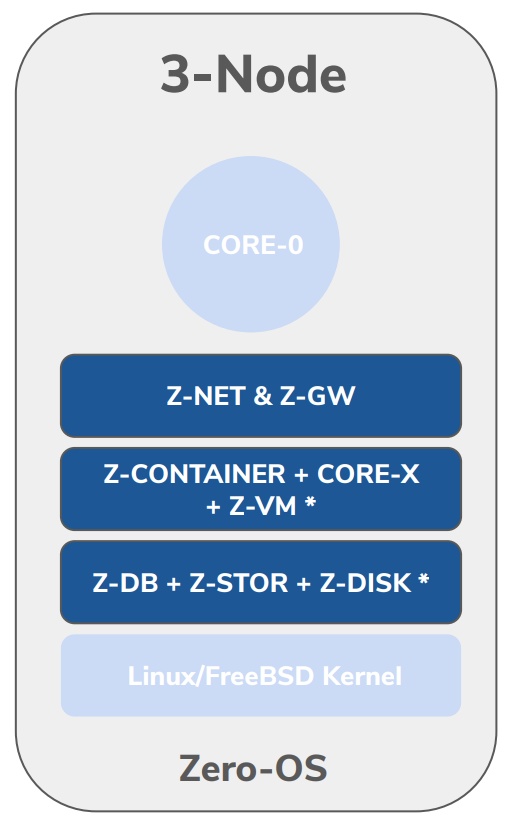
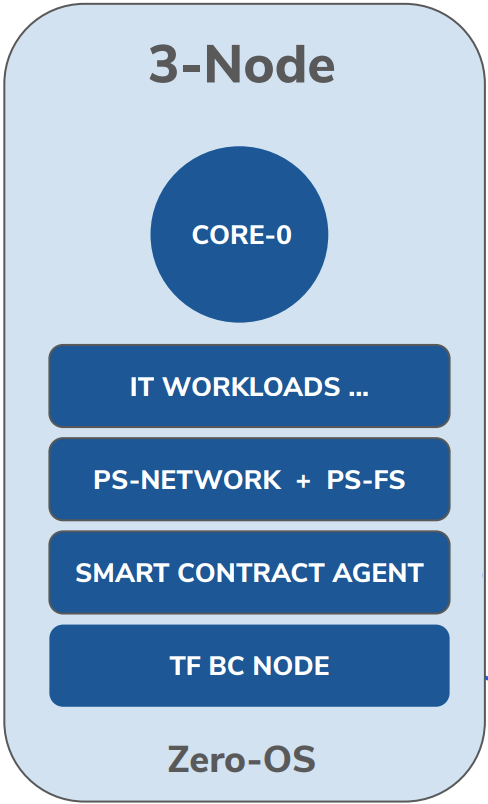

# Quantum Safe Compute System

The Quantum-Safe Compute System is delivered by Zero-OS, the peer-to-peer operating system.
It is the most efficient & safe utilization of hardware resources.
A network wall makes that no tcp-ip travels from internet to compute (apps),
isolate processes 100% from the internet
smart contract for IT layer, super controlled way how to deploy apps
ZeroOS filesystem (ZOS-FS): 
only boot signed/fingerprinted files, not possible for hacker to change any content & insert backdoors

## Zero-OS

### Core Components

#### Core-0

Core-0 is the first process launched on the Zero-OS.  This process kicks off all activities on the node and allows the full OS to be booted over the network maintaining full integrity and hacking surfaces.

#### Hardware Node 

All nodes are based on Intel, AMD or ARM (coming soon) based CPU’s. The peripheral hardware requires an amount of CPU cores, GB’s of memory and physical storage devices, ideally a mix of SSD and HDD storage.

#### Kernel

Zero-OS uses the well known Linux kernel because it has device drivers for almost any hardware that exists (Intel / AMD processor types. TFTech customized the kernel: make it smaller and added secure boot elements.

### Base Functions 

#### Z-Container

Container technology. 
Compatible with Docker.  
Much more efficient  storage layers.

#### Core-X

Secure process manager which can be accessed by sysadmin 3Bot if required. Web & SSH interface if required (optional).

#### Z-Kube

Kubernetes Node. Integrates with Planetary Secure NET & FS.

#### Smart Contract for IT Agent

Deploy IT workloads based on blockchain & peer2peer requests. Enforces multisignature & strong verification of workloads.

#### Planetary Secure Network (PSN)

Overlay network.
Allows all containers to talk to each other in all privacy & security.

#### Network Wall

No TCP/IP travels from internet to the compute infrastructure (apps),
processes are 100% isolated from the internet.

#### Zero-OS File System (ZOS-FS)

!include:architecture_flist
- Signed & Fingerprinted File Parts
- Deduped, Cache per ZOS
- Hacker Safe, cannot modify files.

#### Z-DB

Optimized storage engine technology. Knows how to write most efficient to a specific medium like SSD or HD. 

- Backend Storage Engine
- Can do +50.000 transactions per/sec
- Can work on SSD & HD
- Optimized for easy (soft/green) operation on HD
- Works with reservations
- Always append store (can keep unlimited history)
- Primary-Secodary replication

#### Z-Container and Z-VM

- Runs any workload inside
  - Docker -> ZOS Containers, …
- Super efficient container storage engine
  - Does not need Images
  - Dedupe Storage
  - Thin Provisioning
- Virtual Disk support  (OEM only)
  - Block Storage
  - Replication Support
  - Thin Provisioning
- Core-X support
  - Flexible process manager
  - Web & SSH support

#### Z-Disk and Z-VM 
(OEM only)

High performance Block Device & Virtual Machine Technology. Run any operating system at the edge.

----

