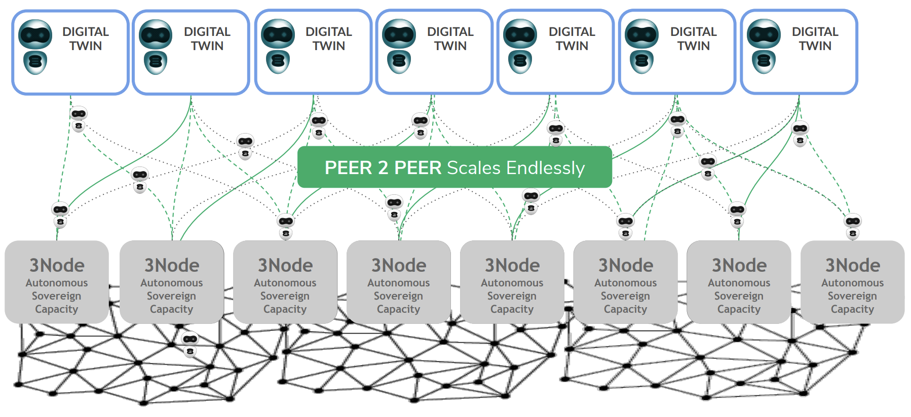
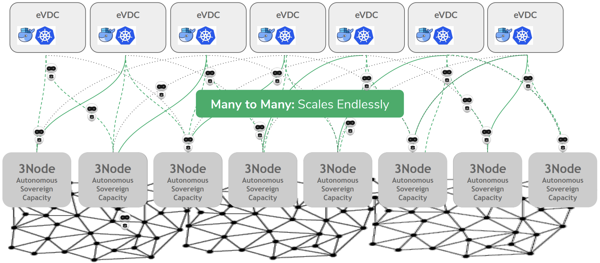
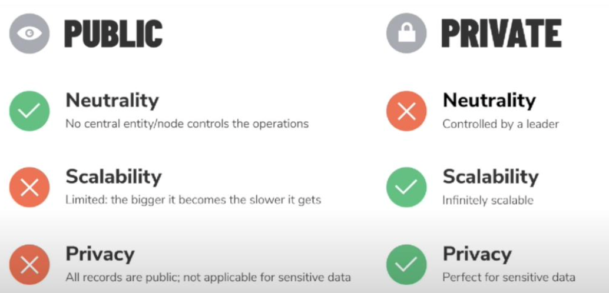
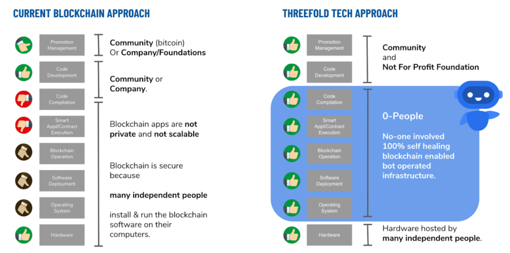

# Unlimited Scalability

## Horizontal Scaling 

The developed technology scales horizontally and is therefore endlessly scalable: Adding new hardware infrastructure grows the grid. However, this extension is not at the expense of previously existing workloads, which can continue to operate with the hardware that was previously chosen. So scaling is no issue: the current state of the TF Grid can be followed on the [Grid Explorer](https://explorer.grid.tf). Expansion of it does not influence the performance of the workloads running on the infrastructure.

## Scaling up to the Edge

Scalability is also achieved by Zero-OS being lightweight and stateless. Running a Zero-OS node becomes feasible on a very small hardware configuration, without the need for local intervention to update and maintain the node. Therefore, it enables cloud infrastructure at the edge and the ability to run it on ARM infrastructure and IoT devices. Extending with new nodes anywhere, even in a highly distributed setup, while remaining secure, is no issue.

## Solving the Blockchain Dilemma

By automating and building the autonomy within the OS, we claim to resolve the so-called blockchain dilemma. This dilemma states that a choice needs to be made between a public blockchain and a private one, but the choice limits the characteristics of the blockchain: public blockchains allow for a neutral setup, as everyone can control a node, however it suffers from major scalability and privacy issues. Private blockchains don't have the same scalability issues and private data can be more easily isolated, however it reduces the number of participants, only trustworthy' ones are allowed. 

Threefold starts from a public blockchain concept, but the Smart Contract for IT removes the human factor in the equation, which is the source of the mentioned drawbacks of public blockchain, turning the data and runtime environment into a black box.

## Vertical scaling

Vertical scaling is achieved as any IT container can run on top of Zero-OS. Being compatible with IT standards opens the infrastructure to be used for any purpose.
Containerizing workloads brings agility as offered by cloud services and reduces substantially the development of applications, dApps etc, and facilitates reuse.
