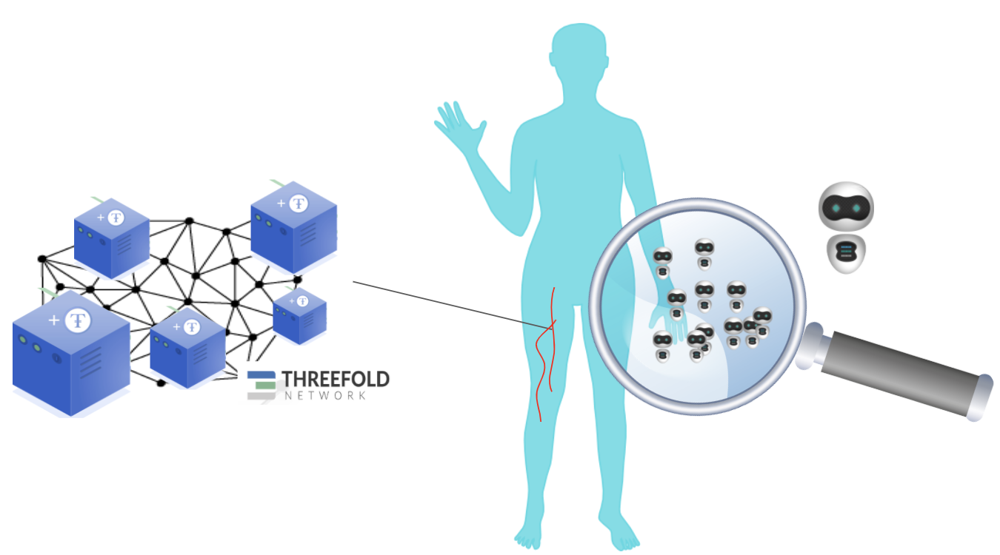
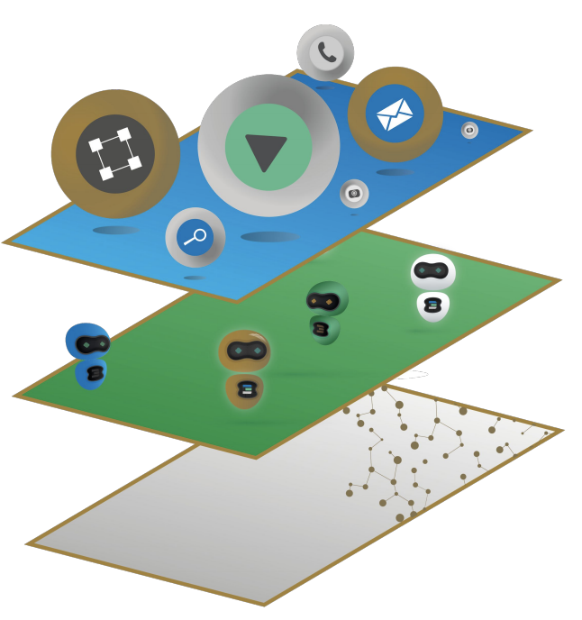
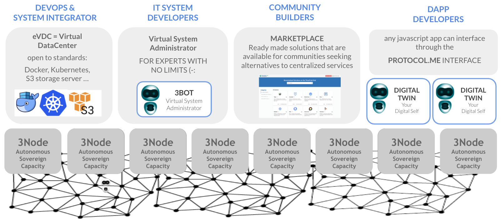
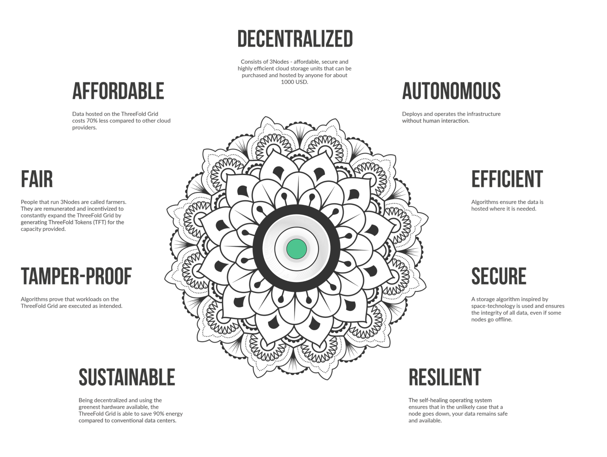

# Architecture 

## Inspired by Nature

A decentralized architecture is exactly how nature is organized. Each of the cells has and an individual role, contributing to an overarching goal, but they are not instructed by a central system.
These cells can operate in a decentralized infrastructure of capacity and transportation.

We believe a digital ecosystem should behave the same way, creating a symbiosis of infrastructure and operators. Without a central command center, without a hierarchy.

The ThreeFold Grid represents this infrastructure, the 3Bot Virtual System Administrators (VSAs) are the cells to make the ecosysteml operational. 

## Three Layers

Three layers interact to make the ThreeFold Grid operational: 
- the **capacity layer** delivers the storage, compute and network capacity that any IT solution can run on. 
- the **autonomous layer** brings in the self-driving/self-healing into the system, and, with it, resilience.
- the **experience layer** is where any IT workload or user facing web technology can be plugged in.

More info:
- [Capacity Layer](architecture_layers_capacity)
  - [Zero-OS](internet4:zos)
- [Autonomous Layer](architecture_layers_autonomous)
  - [Smart Contract for IT](archi_smartcontract4it)  
- [Experience Layer](architecture_layers_experience)

## Functional Breakdown

Functionally, the ThreeFold technology brings a groundbreaking leap forward to the IT world by incorporating by design security, privacy and quantum resistance. Below you can find an short overview of each of these components. 

- [Quantum Safe Compute](archi_qscompute)
- [Zero-OS Filesystem](architecture_flist)
- flist_fs
- [Quantum Safe Storage](archi_qsstorage)
- [Planetary Secure File System](archi_psfs)
- [Quantum Safe Network](archi_qsnetwork)
- [Planetary Secure Network](archi_psnw)
- [Web 3.0 Interface](archi_interface)
- [Web Gateway](archi_webgateway)
- [Zero-OS Network](capacity_network)
- [3Node](threefold:3node)
- [3Bot](threefold:3bot)

## Benefits

The ThreeFold technology brings a big improvement to the overall internet architecture :

- [Simple](archi_usp_simple)
- [Energy Efficient](archi_usp_energy_efficient)
- [Privacy by Design](archi_usp_private)
- [Secure](archi_usp_secure)
- [Scalable](archi_usp_scalable)
- [Self-healing](archi_usp_selfhealing)
- [Low Redundancy](archi_usp_redundant)
- [Energy Efficient](archi_usp_energy_efficient)

while keeping the barrier for adoption by the current IT industry very low : 
- [Compatibility with IT standards](archi_usp_compatible_fs)

# Foundational layer for the digital world

- [Foundational](archi_foundational)

**More info:**

- TFGrid
  - [ThreeFold Connect](threefold:tfconnect)
- Payments
  - [AutoPay](twin:autopay)
  - [TFGrid Wallet](cloud:cloud_wallet)

> TODO: webgateway
> TODO: zos_network
