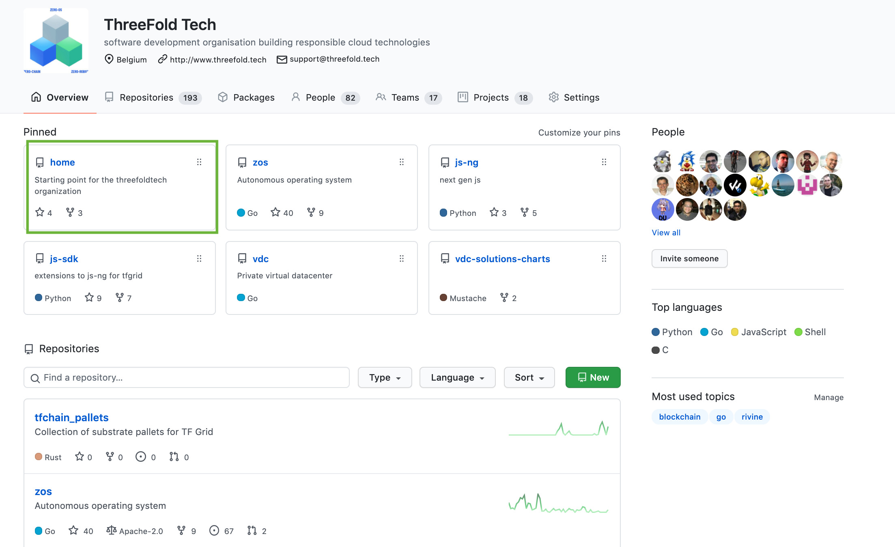

# Open Source Collaboration

## Reporting Issue and Feedback on Github 

As an organization, Threefold upholds open source collaboration as one of our core values. We thrive from our community members' feedback and participation. Therefore, we would like to invite you to become a part of our project by testing out, using our product components, documenting processes, giving feedback and reporting issues or problems faced during the usage and deployment of our product components.

If you have advices, suggestions on our product components or our manual, or if you are having an issue while using our product component deployments; deploying the 3Bot, installing ThreeFold Connect, using the features of TF Grid Demo, and others... Simply go to [__Threefold Tech Github__](https://github.com/threefoldtech/home/issues) and __create an issue__ as shown above for the tech team. Our team will get back to your issue and resolve your problem as soon as possible. 

# Learn How to Create an Issue on Github

On this article we are going to show you how to collaborate with ThreeFold by creating Github issues for giving feedback and receiving support from the team in few easy steps.

## Prerequisites

In order to create a Github issue, you would need to first create a Github account.
Feel free to read [Github's tutorials on Account Sign up](https://docs.github.com/en/get-started/signing-up-for-github/signing-up-for-a-new-github-account) to learn more about it.

After signing up on Github, with the issue that you would like to report in mind, go to [ThreeFold Tech's official Github homepage](https://github.com/threefoldtech) and go to ThreeFold Tech's [**'Home' **](https://github.com/threefoldtech/home/) repository. **'Home'** is a repository that serves as a starting point for ThreeFold where both external and internal collaborations take place.

On the Home repository page, click on the [**'Issues'**](https://github.com/threefoldtech/home/issues) tab in order to start creating an issue. The 'Issues' page is where we collaborate and gathers all different feedbacks and improvement ideas from the community.

Click on the **'New issue'** button to start creating a new issue.

On your issue page, Add the issue title and try to explain your issue in a detailed manner on the issue description box.
Tag 'ThreeFoldteam' on your issue and submit your issue by clicking the **'Submit New Issue'** button.

Congratulations! Your new issue has been submitted successfully, the ThreeFold team will process your issue immediately and comment on its resolution progress on your issue. You can always go to your issue URL to track the resolution progress of the issue you submitted.