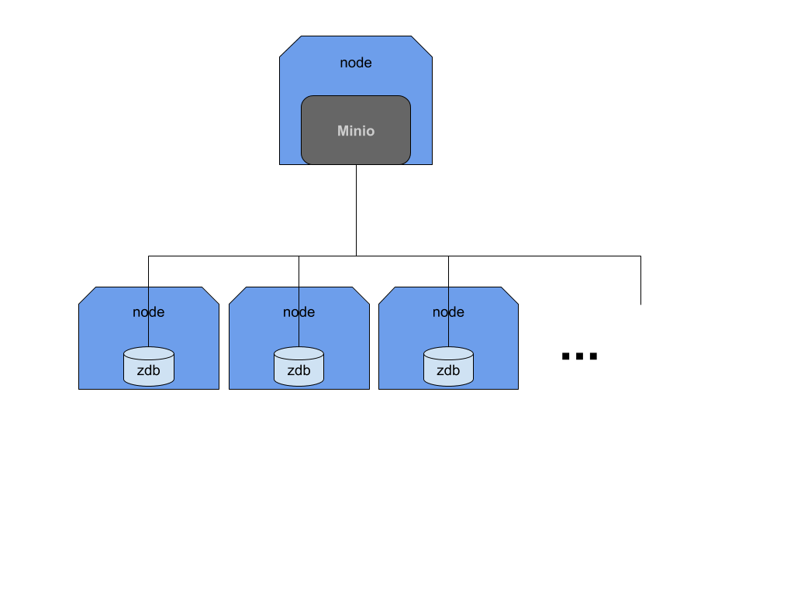
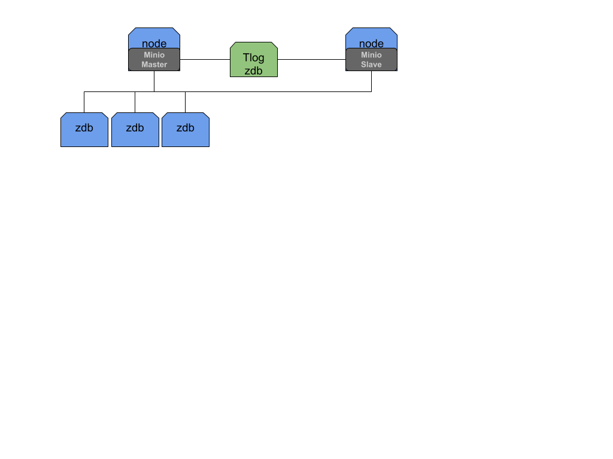

# Introduction
Please check [specifications](https://docs.google.com/document/d/1HzyElPiy3NTELSiYvAaJ47tMAr0-smBjbdJNcASJ5KU/edit#heading=h.ktkmsaklxsca)

The basic idea is to provide a reliable storage solution that leverage on the current grid functionality.

> NOTE: We are discussing a modified version of minio that has be officially released by ThreeFold to have all the feature that is used, and explained in this document. So when we say `minio` we always mean the `Threefold` version. You could find the source code [here](https://github.com/Threefoldtech/minio)

## Installation tutorial
Please check a full installation tutorial [here](cloud:minio)

# Diagrams


## Primary/Secondary setup


This is a `primart/readonly` setup where metadata is replicated to a secondary (readonly) node where users can use to read/download objects. Upload is only possible via the primary node.

# Data flow
We have a modified version of minio so it could work against our zdb instances. It has been modified to use [0-stor](https://github.com/Threefoldtech/0-stor). `0-stor` could do `replication or distribution` out of the box. Hence files uploaded to this version of minio are split into separate smaller chunks, and distributed across separate instances of `0-DB`. The distribution is done according to the configuration (discussed later).

Once files are uploaded, we could afford losing multiple `0-DB` instances (below certain threshold) and still able to retrieve the files un-intact. (later we could heal the setup to make sure files are distributed again in an optimal manner)

# Deployment

## Capacity requirements

### CPU and Memory

2 virtual CPU and 4 GiB of memory are recommended for the minio container. These values could very depending on the block sizes chosen and if encryption and or compression is enabled.

### Storage shards

Each minio container instance requires a `Volume` to store the metadata for the files. So if the disk is limited, this could limit the number/and total size of the files that could be stored, even if the zdb backend still has more space.

We coined this formula to give a rough `estimate` of the disk size (per minio container) that you need to support your archive.

```
Assume:
D = number of data shards
P = number of parity shards
N = expected number of files in the archive
S = expected archive total size
B = block size
M = required metadata volume size

Then:
C = D + P
M = (((26 * C) + 40) * S/B) + N * 2560
```

Example for a 10TB archive with block size of 1M:

```
D = 16
P = 4
N = 150000
B = 1024*1024
S = 1024*1024*1024*1024 * 10
B = 1024*1024
M = (((26 * C) + 40) * S/B) + N * 2560 = 6256025600
```

`6256025600 bytes = 5.82 GiB required of metadata storage`


## Graphical
Please refer to the [tutorial](tutorials) for a full walk through to deploy a fully working minio with primary/secondary setup and monitoring enabled.

## Programmatically
Please make sure you understand the graphical method first. Since it explains the generic main steps that you need to build a solution from scratch.

In [this document](https://github.com/Threefoldtech/jumpscaleX_libs/blob/development/JumpscaleLibs/sal/zosv2/readme.md) it explains building "simple" solutions using the API (jumpscale API), including a single node `minio` setup.

For a more complex flow (primary/secondary) setup please check the [chat flow](https://github.com/Threefoldtech/jumpscaleX_threebot/blob/development/ThreeBotPackages/TF Grid_solutions/TF Grid_solutions/chatflows/minio_deploy.py) code, where it uses the jumpscale API to build a complete minio setup from scratch.

# Disaster recovery
## Monitoring
Minio provides metrics for prometheus, so you could monitor the health of the instance and also the zdb shards. By checking the rate of the errors owner of the instance could decide to start a heal process.

## Healing
## Reinstalling minio.
Minio keep some state (metadata) in the container that is pretty important to be able to actually list and download your files back from zdb. Without this meta even if the data is not lost, there is no way to reconstruct your files back. Hence a primary/secondary setup is recommended. In a primary/secondary setup you could even lose BOTH your instances (the primary and the secondary) and still recover your files because minio keep also a transaction log `tlog`. The tlog is another (extra) zdb namespace that is used mainly to synchronize the primary and the secondaries nodes.

Reinstalling any of the minio instances (the primary or the secondary) with exactly same setup (data shards and tlog shard) will make minio rebuild its local metadata store. It doesn't matter if it's a primary or secondary instance, they will rerun the tlog to catchup to all the changes in the tlog. Then after they are synched, only the master minio could actually add new transactions to the log, hence the master node is the only node you could upload files to, while all the secondaries could be used for "read-only" access.

## Healing routines
This healing routines make sure that the data distribution is ideal on all the configured zdb nodes. Based on your setup, make sure to run the healer jobs regularly.

Minio provides a `healer` api where you could kick start healing jobs.
The API could be used to run a full check on all the objects, or a full bucket, or a single object.
The API provide options so you could do a check without fixing, or check and fix (default). The check or check and fix jobs could either run in the foreground
or in the background

### Foreground jobs
A foreground job will stream back a full detailed report of each check, fix or error that happens on the system while doing the healing. It's up for the client to read this report and process, or aggregate it the way they see fit. A disconnection of the client will stop the job.
### Background jobs
A background job could run in the background, with no detailed report. instead it will keep a summary status of the process. The client could later check on the job status once in a while until it's completely done. Then they could read the summary and drop the job report later on.

### API
```
POST /repair
POST /repair/{bucket}
POST /repair/{bucket}/{object}

GET /jobs
DELETE /jobs/{id}

POST /config
```

> All `repair` endpoints accepts optional query `dry-run` and `bg`

#### Query options
- `dry-run` runs a check with no attempt to fix. This flag will make minio report the current status of the zerostore gateway.
- `bg` short for `background` as explained before, this will not produce a report instead only keep a summary of number of objects.

### Example report
running the following curl command in your shell
```
curl -XPOST "localhost:9010/repair/large"
```

Will produce some output like this

```
blob: 18dcb41b-b998-4d8f-ac61-85e02497c0f8 (status: optimal, repaired: false)
object: large/how_to_get_tft.mp4 (blobs: 1, optimal: 1, valid: 0, invalid: 0, errors: 0, repaired: 0)
blob: <empty> (status: optimal, repaired: false)
object: large/subdir/ (blobs: 1, optimal: 1, valid: 0, invalid: 0, errors: 0, repaired: 0)
blob: 1f8168e7-12e0-4824-abcf-b6060db8b06d (status: optimal, repaired: false)
blob: b3f81564-13d7-40ed-9378-d5551a3ece49 (status: optimal, repaired: false)
blob: ff84d290-79ab-49e7-b5a7-6a952979d02a (status: optimal, repaired: false)
blob: 72988083-fc81-4654-8795-32f6377e942f (status: optimal, repaired: false)
blob: dcf03c3d-0c50-4d43-8d35-5cabd8546510 (status: optimal, repaired: false)
blob: 0d2ab8cb-1aee-477a-9c38-9a0596d09df3 (status: optimal, repaired: false)
blob: 3759d5eb-9bc0-4365-a406-6369eab360b9 (status: optimal, repaired: false)
blob: bb4f72c0-fe0a-4016-81f9-e56b66da5e58 (status: optimal, repaired: false)
object: large/subdir/movie.mp4 (blobs: 8, optimal: 8, valid: 0, invalid: 0, errors: 0, repaired: 0)
bucket: large
```

#### How to read the report
Due to the streaming nature of the report, reports makes more sense if they are reading down up. Because we need to check all blobs of a single object before we could give statistics about the object. So blobs of an object comes before the object stats itself.

Also directories are "fake" entries in minio. So they are also checked, while they have one blob that actually doesn't container any data. Hence directories blobs always have `blob: <empty>` and they are always `optimal`. so you could always skip these ones. Again notice that the blob also comes before the directory object.

# Extending the zdb capacity
An extra **data** capacity can be added to minio by simply reconfiguring it to use more zdb namespaces. After deploying the extra namespaces you can change minio config as follows:

- You need access to minio private network (usually over wireguard)
- You need to understand minio configuration as described [here](https://github.com/threefoldtech/minio/blob/master/cmd/gateway/zerostor/README.md#example-configuration)
- First method:
  - You ssh to minio container, and open the /data/minio.yaml file. edit as you see appropriate
  - signal minio to reload its config by running the command `zinit kill minio SIGHUP`.
- Second method:
  - You still need to get a full copy of the current minio config.
  - Edit the config file locally
  - Send the config back to minio via the management (healer) API.
  - the API exposes a `/config` endpoint where you can POST a full copy of your config
  - minio will auto-reload config this way.

> Its possible we add more endpoints to list, add, and remove. but so far was not needed.

# Minio Life cycle.
## Creation
- Choose your data/parity ratio
 - This represents the number of blocks created for each blob of data. A ratio 4/1 for example means that each chunk is split over 5 different zdb nodes. in a way that losing max of 1 node (any node) and we will still be able to retrieve the blob. losing more than 1 node and we will not be able to retrieve it back.
 - Usually we try to minimize the total number of nodes (to avoid slowing down write operations) but also have a proper parity number to avoid losing data. So we usually go for something like 6/4
 - A 6/4 setup requires then 10 zdb nodes to be configured in minio. But this doesn't mean we need exact 10, it's recommended we add even more lets say 15. a blob being written will be still only to 10 (randomly selected for each blob) nodes. This means a failure of one node will not affect all blobs.
 - This also mean that, if a node fails we wills till be able to write objects to minio. since a write operation is only successful if the entire 10 chunks are being distributed. so if we have only 10 zdbs nodes in a 6/4 setup, and we lose one, all write operations will fail (but we will still be able to do read operation)
## Healing
- We assume we have a 15 nodes in a 6/4 setup.
- If we lost one (or up to 4 nodes) we then can star start a healing process. the Healing process will then make sure affected blob are redistributed to only the working nodes. hence having 15 nodes actually is helpful because we already have 5 "spare" ones. Once the healing process is finished we sure that all blobs are distributed optimally over our nodes.
- It's recommended then to replace the broken nodes (can be done even before start the healing job which is actually recommended)
## Extending capacity
- If our zdbs are start to run out of space we can just add ore zdb nodes to our configuration file, lets say 10 more nodes. A healing job is not required since older nodes are still reachable, and healing does not actually redistribute the blobs, only if they are not optimal.
