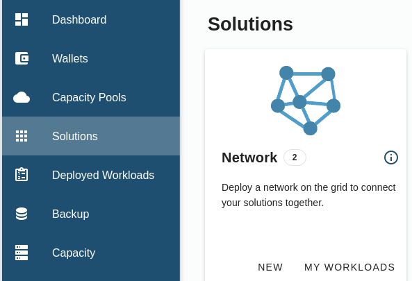
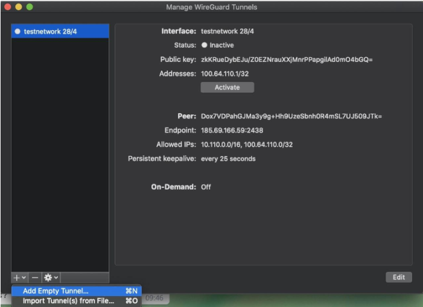
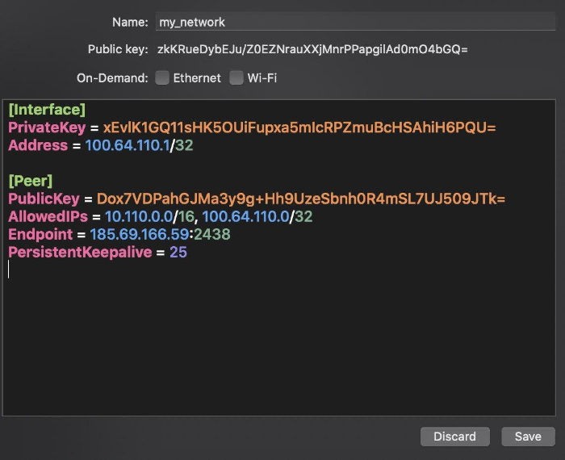
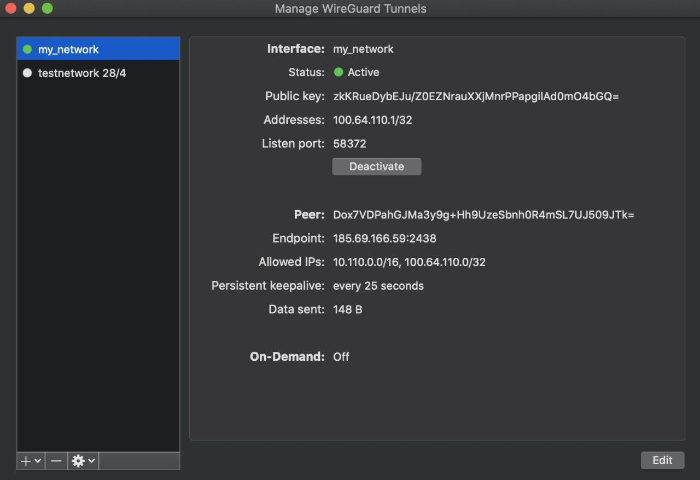
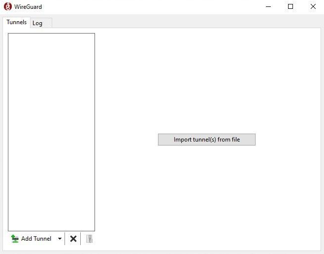
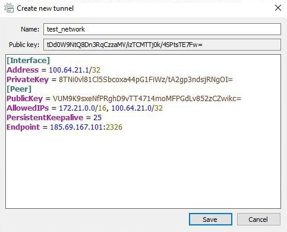
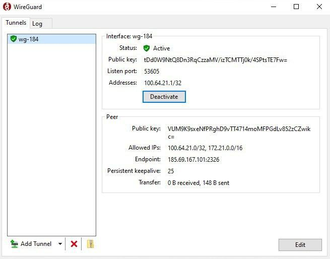

# Getting Started With Networking

Any solution you choose to deploy will need the prior provisioning of an overlay network in order to reach the deployment.
We support both IPv4 and IPv6. 

If you are curious of how the overlay network works, some documentation is available at [Overlay network](@capacity_network)

The technology used to implement the network overlay is [Wireguard](https://www.Wireguard.com/). Make sure you have installed Wireguard on your device to be able to access your deployments from your local machine: [Wireguard installation](https://www.wireguard.com/install/).


## Network Solution

### Accessing the Solution

Go to your deployed hosted 3Bot admin panel, and click on __Solutions__ -> __Network__ -> __New__.



Follow this detailed guide: [Create a network](@solution_network)

### Setting up wireguard

#### On Linux System

You can use the `wg-quick` command directly with the file sent from the chatflow, like so:

```
wg-quick up my_first_network.conf
```

#### On MacOS

Open the wireguard application and click on the plus icon on the lower left corner. Add a new empty tunnel and copy the configuration or import the file if you have downloaded it from the chat flow.





#### On Windows

The process is very similar. Open the wireguard application and click on the plus icon or on `Add Tunnel` on the lower left corner. Add a new empty tunnel and copy the configuration or import the file if you have downloaded it from the chat flow.




