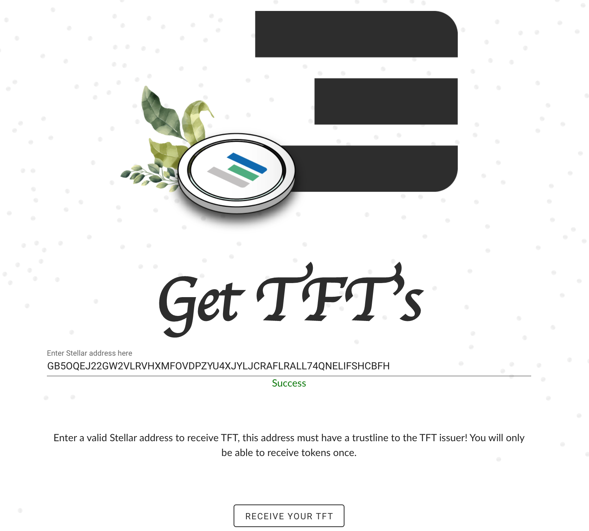
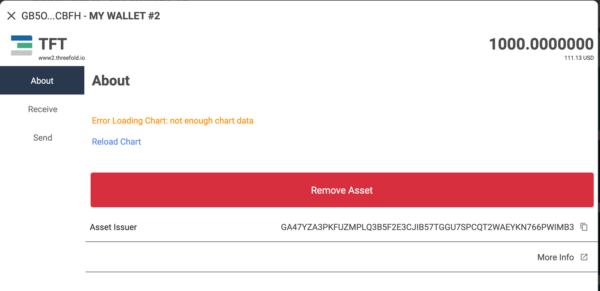

# Get and Store TFT 

On Testnet Hosted 3Bot environment, there are a few options on how to get and store Testnet TFT to reserve IT Capacity for your workload deployment test.  

You can use a __pre-configured hosted 3Bot wallet__, __3Bot wallet on your ThreeFold Connect App__, or a __third-party Stellar wallet__ to store your TFT. 

You can purchase TFT by __buying or trading other stellar into TFT__ via Stellar-supported exchangers like Liquid or BTC-Alpha. You can also purchase TFT Directly from the farms. Please check this [__tutorial__ on how to buy and sell TFT](threefold:how_to_buy_and_sell)

## Store your Testnet TFT

There are a few __testnet Stellar Wallet__ options you can use to store your Testnet TFT:
- Store your Testnet TFT on __Hosted 3Bot Wallet on your hosted 3Bot__
- Store your Testnet TFT on a third party testnet Stellar Wallet: __testnet Interstellar Wallet__

### Store your TFT on your hosted 3Bot Wallet

You can use a pre-configured hosted 3Bot Wallet to store your Testnet TFT. 3Bot admin dashboard comes with a hosted wallet feature to make it easier and faster for you to store your Testnet TFT and to reserve IT Capacity. 

Simply click on __'Wallet'__ menu on your hosted 3Bot sidebar to access your wallet list. Click on a wallet to see the details, including the wallet address and the amount of TFT balance you have in that wallet.

> Please go to [__Hosted 3Bot Wallet__](3bot_sdk_wallet) to read more about the 3Bot Wallet feature on your hosted 3Bot.

### Store TFT on a Third-party Testnet Stellar Wallet

You can use a __third-party testnet Stellar Wallet__ to store your Testnet TFT. There are a lot of testnet Stellar Wallets out there. __Interstellar wallet__ is one of the many Testnet Stellar Wallets we recommend to use to store your Testnet TFT due to its user-friendliness. Please follow this tutorial below to __configure a new testnet Interstellar wallet__ and store your Testnet TFT on your wallet.

> [Get and Store Testnet TFT on __Testnet Interstellar Wallet__](delete_testnet_wallet_interstellar)

## Get Testnet TFT

### Automatically via hosted 3Bot Wallet

Once you're logged in to your hosted 3Bot for the first time, a __pre-configured 3Bot wallet__ will be created for you on your hosted 3bot. This wallet has an initial balance of __1000 TFT Testnet__.

## Request for 1000 Testnet TFT 

You can also request for Testnet TFT only once on the TFT faucet: [__Request Testnet TFT faucet__](https://gettft.testnet.grid.tf). Simply fill in your __Stellar Wallet testnet address__ in the provided box and request for 1000 TFT to be sent to your wallet.

> Please keep in mind that you can request for Testnet TFT only once. In order for a transaction to be successful, you need the wallet's [__trustline__](https://medium.com/stellar-community/a-guide-to-trustlines-on-stellar-8bc46091a86f) to be configured to the TFT issuer. 
