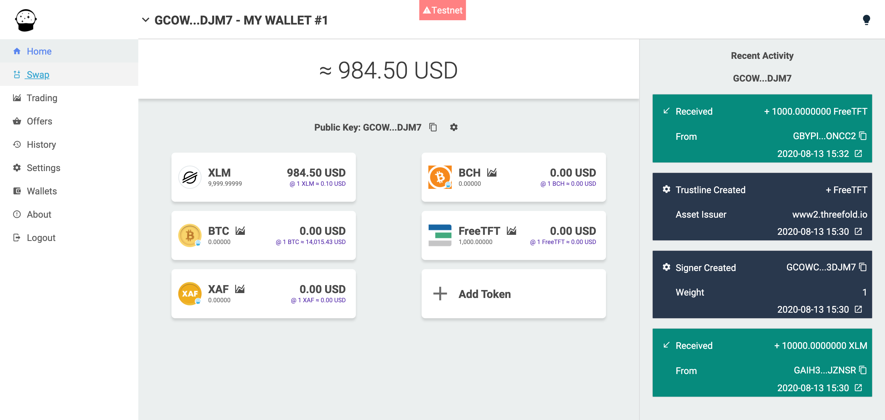
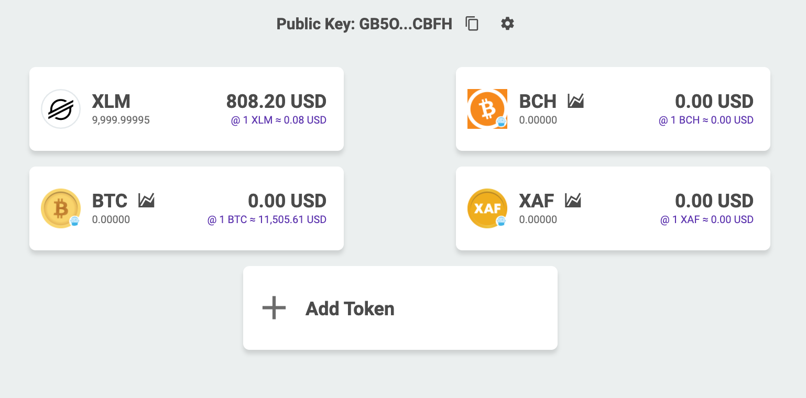
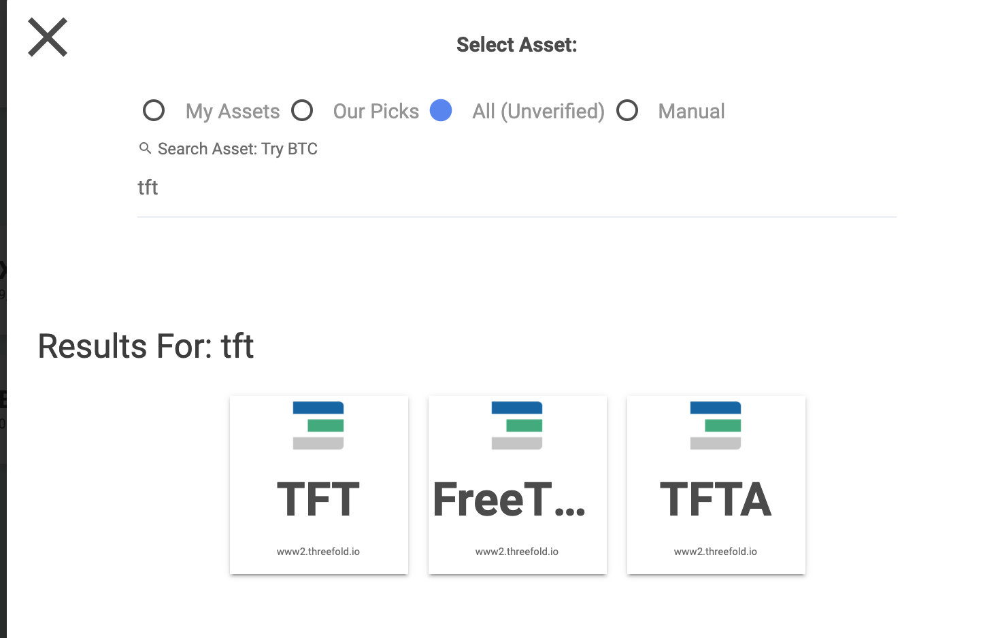
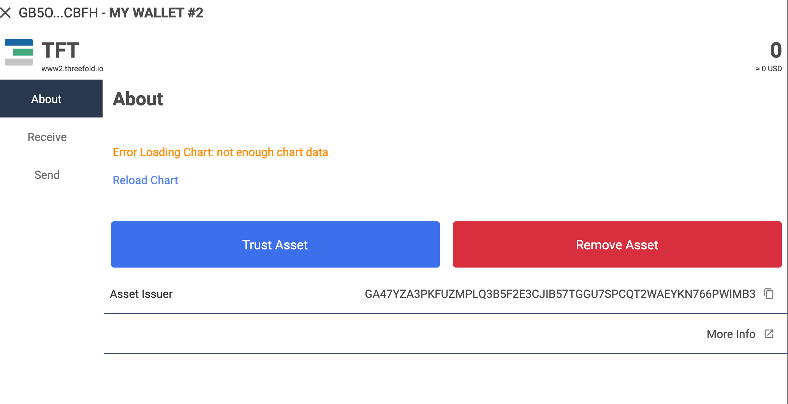

# How to Set up a Testnet Interstellar Wallet 

### Get an Interstellar Wallet (testnet) 

Click [__here__]( https://testnet.interstellar.exchange/app) to go to the Interstellar Wallet website and set up a testnet Interstellar Wallet.

### Add TFT to your Currency List

Click on __+Add token__ on your home screen, and look for 'TFT'. 

Click on the TFT icon, and click __'Trust Asset'__.

Testnet TFT will be successfully added to your token list and a TFT Trustline will be automatically added for your wallet.

> Please keep in mind that the testnet and mainnet networks are completely separated, and thus every activity done on testnet cannot be applied to the mainnet, and vice versa. For example, You would not be able to purchase capacity on TF Grid mainnet by using the testnet TFT you have on your testnet wallet.

### Claim Testnet TFT on Your Wallet Address

If you are using a third-party stellar wallet like interstellar, you could manually add 1000 Testnet TFT for free by copying your wallet address. And now go to this website: [__Claim your Testnet TFT!__](https://gettft.testnet.grid.tf). Verify your 3Bot ID via ThreeFold Connect App to log in and access the website. Paste your testnet Interstellar Wallet address on the given form shown as above on the website's landing page, click enter, and the Testnet TFT will be sent to your Stellar Wallet within a few minutes.

__Go back to your Interstellar Testnet Wallet account__ and see if 1000 Testnet TFT is added automatically. If yes, then, congratulations, you have successfuly claimed your TFT to get started with testing the deployment of your solutions via [__3Bot__](testnet_3bot). Please keep in mind that each 3Bot ID can request the Testnet TFT only once.

> [__Claim your Testnet TFT!__](https://gettft.testnet.grid.tf)

> go back to [__Get and Store TFT on Testnet__](delete_testnet_gettft)
