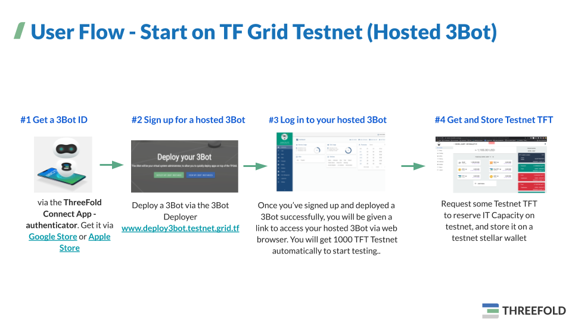

# Getting Started on TF Grid Testnet

## Get ThreeFold Connect App and 3Bot ID

As the first step, you need to get yourself a **ThreeFold Connect** and **3Bot ID**. This can be done by downloading the app on your smartphone and creating your own 3Bot Identity.

Please be aware that this ID will be used as your main digital identity on the ThreeFold_Grid and holds the keys to access every service on the grid. Therefore, it's very important to remember the login data and the seed phrase of your ID. The ThreeFold Connect App will also provide you with an access to your 3Bot Wallet where you can store your ThreeFold_Tokens.

> [Get **ThreeFold Connect App**](threefold:threefold_connect)

## Get a 3Bot on Testnet

[**3Bot**](testnet_3bot) is your virtual system administrator.

> Easy Set Up (recommended): [Get a **Testnet Hosted 3Bot** using **3bot Deployer**](3bot_deployer)  
> Advanced Set Up: [Create a **Testnet Local 3Bot** on your local machine](3bot_local_install)

## Launch and Log in to Your New Hosted 3Bot

Once you’ve signed up and deployed a hosted 3Bot successfully, you will be given a link to access your hosted 3Bot via a web browser.

Go to the provided link to launch your 3Bot and login to your new 3Bot admin dashboard by connecting it to your 3Bot ID. You can use the ThreeFold Connect App on your mobile phone to verify your identity.

## Get TFT (Tokens for IT Capacity)

The same TFTs can be used on testnet and on mainnet, there is however a price difference (currently - March 2021 - on testnet the price for capacity is a factor 10 cheaper than on mainnet). 
Please refer to [Get & Store TFT](mainnet_gettft) section to know more. 