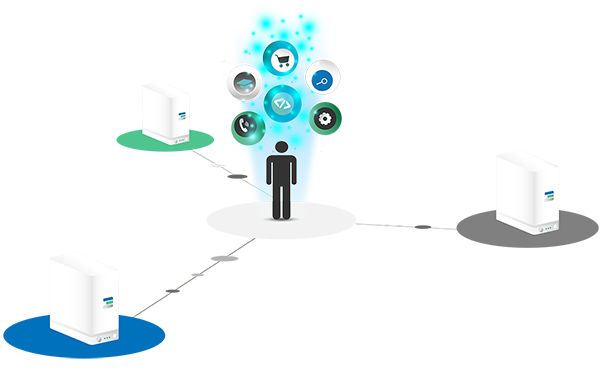

# ThreeFold Grid Manual

Hi! Welcome to the __TF Grid Manual__, the knowledge base for those interested in learning more about how to create and deploy IT Solutions on top of our Peer2Peer Cloud.

## Concepts

- **Cloud** = the engine of the internet  *all compute, storage & network capacity required for the internet to function.*
- **Peer2Peer Cloud** = a cloud not owned by a few  *A cloud created by all of us for everyone, usable by anyone.*
- **ThreeFold Grid** = TFGrid = the biggest active Peer2Peer Cloud in the world.
- **3Bot** = your virtual system administrator who helps you to develop, deploy and manage solutions on the ThreeFold Grid
- **3Node** = the computer (server) which delivers the compute,storage and network capacity to the TFGrid
- **ZOS** = Zero-OS the operating system which empowers the cloud and runs on top of the 3Node's.

## Navigation

- [__Introduction__: what is our peer2peer cloud](peer2peer_cloud_intro)
  - [Grid Intro](grid_intro)
  - [Farming Intro](threefold:farming_intro)
- [Architecture](architecture_overview)
  - Layers
    - [Capacity Layer](architecture_layers_capacity)
    - [Autonomous Layer](architecture_layers_autonomous)
    - [Experience Layer](architecture_layers_experience)
  - Functional Breakdown
    - Compute
      - [Quantum Safe Compute](archi_qscompute)
      - [Zero-OS FS](architecture_flist)
    - Storage
      - [Quantum Safe Storage](archi_qsstorage)
      - [Planetary Secure File System](archi_psfs)
    - Network
      - [Quantum Safe Network](archi_qsnetwork)
      - [Web Gateway](archi_webgateway)
      - [Planetary Secure Network](archi_psnw)
      - [Web 3.0 Interface](archi_interface)
    - [Smart Contract for IT](archi_smartcontract4it)  
    - [3Node](threefold:3node)
    - [3Bot](threefold:3bot)
  - [Architecture Benefits](archi_usp)
    - [Simple](archi_usp_simple)
    - [Energy Efficient](archi_usp_energy_efficient)
    - [Compatibility with IT standards](archi_usp_compatible_fs)
    - [Privacy by Design](archi_usp_private)
    - [Secure](archi_usp_secure)
    - [Scalable](archi_usp_scalable)
    - [Self-healing](archi_usp_selfhealing)
    - [Low Redundancy](archi_usp_redundant)
    - [Energy Efficient](archi_usp_energy_efficient)
- [__Getting Started__](getting_started_all)
- [__3Bot__ Your Virtual System Administrator](3bot)
- [__Develop your own solutions__](develop)

If you're looking for an introduction to ThreeFold in general, please go to our main [__ThreeFold Wiki__](https://wiki.threefold.io) 
