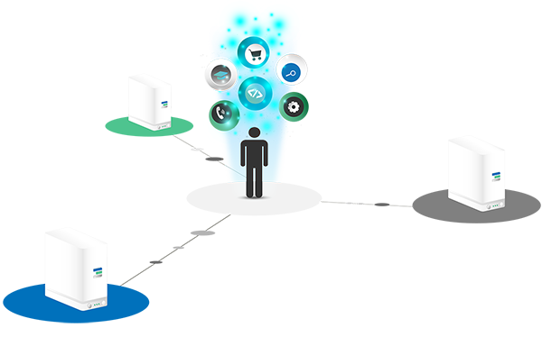

## Why ThreeFold

The Internet is growing at an accelerated rate. To service this demand, a few large companies (Google, Amazon, Alibaba, Facebook, and more) have built and continue to grow supersized, power-hungry, and centralized data centers. These data centers make up the majority of all Internet capacity available today. However, the Internet is expanding much faster than data centers, and the planet could't cope with it. The solution is to have a more distributed, cost-effective, neutral, and sustainable Internet. **ThreeFold** (as an ecosystem) has developed this technology; creating the ThreeFold_Grid (Grid) and a token (TFT), which enable this to happen.

**Because Internet Access is a Human Right**
To make the new internet accessible and equal to all, ThreeFold built an infrastructure that is affordable to all and collectively owned by the network peers. To ensure a fair and equal distribution of the internet to everyone, the expansion and reach to regions that need internet capacity the most will be incentivized and/or sponsored by the Foundation.

**Because Everyone should be autonomous**
The current approach of many governments and countries is to cut the Internet into pieces by limiting its accessibility and enforcing regulations. We need an internet that protects our digital freedom and fair access to global information for everyone, everywhere.

ThreeFold’s internet is a peer-to-peer internet - owned by the users. All the technology of this new internet is open-source and the whole experience is built around the fundamentals of a peer-to-peer network. On this new internet, everyone owns their data and experiences - digital freedom.

**Because Our Planet needs a sustainable internet**
The current industry solutions focus on increasing the use of renewable energies to power data centers. However this is not a viable solution as data centers consume enormous amounts of energy. Therefore, a new solution that could drastically reduce the global internet’s energy consumption is needed.

ThreeFold brings the world the first true peer-to-peer Internet. It uses pioneering technologies that remove the need for centralized and power-hungry data centers, consumes up to 90% less energy, and uses up to 90% less international fiber network capacity. (To learn about ThreeFold power savings, read [here](https://blog.Threefold.io/blog/tfblog/posts/10-times-power-savings-is-this-possible)).

> For more in-depth information on ThreeFold foundation, please go to [ThreeFold's main knowledge base](https://info.threefold.io/)
