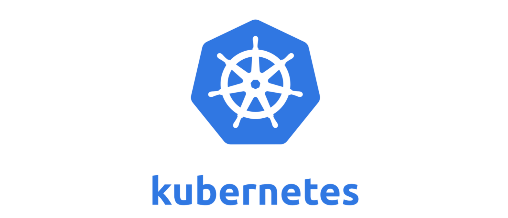

# Kubernetes cluster



This primitive allows a user to deploy a Kubernetes cluster.

A cluster must be composed of at least 2 nodes. One master node and any number of
worker nodes.

A kubernetes cluster could be linked to our other primitives.

## Reservation definition

Schema used to define a kubernetes reservation:

* `size`: Kubernetes VMs come in 2 sizes. see [VM Sizes](#vm-sizes).
* `network_id`: The name of the network created using a [network](network) primitive.
* `ipaddress`: The IP address to give to the VM.
* `cluster_secret`: The value of this field must be the same for all the members of a cluster.
* `master_ips`: If this VM is not the master of the cluster, add the IP address of the master node here.
* `ssh_keys`: A list of SSH public keys to authorize into the VM. Don't forget to add yours here or you won't be able to reach the node at all.
* `public_ip`: The reservation ID of the public IP reserved earlier. The ip should be reserved with the same **node_id**
* `datastore_endpoint`: If this is not an empty string, it will be used as the connection string for an external datastore endpoint for kubernetes state storage
* `disable_default_ingress`: If true, the kubernetes VM will be started without a default traefik ingress controller.

### VM Sizes

| size | vCpu | RAM (GiB) | Storage (GiB) |
| --- | --- | --- | --- |
| 1 | 1 | 2 | 50 |
| 2 | 2 | 4 | 100 |
| 3 | 2 | 8 | 25 |
| 4 | 2 | 8 | 50 |
| 5 | 2 | 8 | 200 |
| 6 | 4 | 16 | 50 |
| 7 | 4 | 16 | 100 |
| 8 | 4 | 16 | 400 |
| 9 | 8 | 32 | 100 |
| 10 | 8 | 32 | 200 |
| 11 | 8 | 32 | 800 |
| 12 | 16 | 64 | 200 |
| 13 | 16 | 64 | 400 |
| 14 | 16 | 64 | 800 |
| 15 | 1 | 2 | 25 |
| 16 | 2 | 4 | 50 |
| 17 | 4 | 8 | 50 |
| 18 | 1| |1 | 25 |

## Example

``` python
zos = j.sals.zos.get()

# define the kubernetes cluster
master_node = '2fi9ZZiBGW4G9pnrN656bMfW6x55RSoHDeMrd9pgSA8T'
worker_node = '72CP8QPhMSpF7MbSvNR1TYZFbTnbRiuyvq5xwcoRNAib'
cluster_secret = 'supersecret'
size = 1
network_name = 'demo_network'
sshkeys = ['ssh-ed25519 AAAAC3NzaC1lZDI1NTE5AAAAIMtml/KgilrDqSeFDBRLImhoAfIqikR2N9XH3pVbb7ex']

master = zos.kubernetes.add_master(
 node_id=master_node,
 network_name=network_name,
 cluster_secret=cluster_secret,
 ip_address='172.24.1.20',
 size=size,
 ssh_keys=sshkeys,
 pool_id=12)

worker = zos.kubernetes.add_worker(
 node_id=worker_node,
 network_name=network_name,
 cluster_secret=cluster_secret,
 ip_address='172.24.2.20',
 size=size,
 master_ip=master.ipaddress,
 ssh_keys=sshkeys,
 pool_id=12)

# deploy both master and worker
master_id = zos.workloads.deploy(master)
worker_id = zos.workloads.deploy(worker)

time.sleep(120)
# inspect the result of the reservation provisioning
master = zos.workloads.get(master_id)

print("provisioning result")
print(master.info.result)
```

## How to log into your VM after deployment

Once the cluster is deployed, you need to connect to one of the nodes and copy the kube-config file.

``` shell
ssh rancher@172.30.1.2 # replace with your master node IP
The authenticity of host '172.30.1.2 (172.30.1.2)' could't be established.
ECDSA key fingerprint is SHA256:Q4kQ94B8QaSbo1EsyI8dQrgBkZyk/USda72c8nwVwIE.
Are you sure you want to continue connecting (yes/no)? yes
Warning: Permanently added '172.30.1.2' (ECDSA) to the list of known hosts.
Welcome to k3OS!

Refer to https://github.com/rancher/k3os for README and issues

By default mode of k3OS is to run a single node cluster. Use "kubectl"
to access it. The node token in /var/lib/rancher/k3s/server/node-token
could be used to join agents to this server.

k3os-15956 [~]$
```

Let's get all nodes of the cluster

``` shell
k3os-15956 [~]$ k3s kubectl get nodes
NAME   STATUS ROLES AGE  VERSION
k3os-15956 Ready master 3m46s v1.16.3-k3s.2
k3os-15957 Ready <none> 2m26s v1.16.3-k3s.2
k3os-15958 Ready <none> 1m42s v1.16.3-k3s.2
```

Copy the config so that we could use kubectl from our local machine. By default it is located in `/etc/rancher/k3s/k3s.yaml` on the master node.

Execute this command on your local machine not in a remote shell.

``` shell
scp rancher@172.30.1.2:/etc/rancher/k3s/k3s.yaml k3s.yaml

> IMPORTANT: Do not forget to update the server IP in the copied yaml file.
> By default, it will be pointing to localhost, this must be changed into the
> IP you used to connect to the VM.
```

If you already have a kube config file usually located in `~/.kube/config`

you could edit it and add the new cluster with the information written on k3s.yaml

Here is an example of `~/.kube/config`

``` yaml
apiVersion: v1
clusters:

* cluster:

 certificate-authority-data: LS0tLS1CRUdLKjhdDGhjDHKHKhDBJWakNCL3FBREFnRUNBZ0VBTUFvR0NDcUdTTTQ5QkFNQ01DTXhJVEFmQmdOVkJBTU1HR3N6Y3kxelpYSjIKWlhJdFkyRkFNVFU0TURjME9EQXhOakFlRncweU1EQXlNRE14TmpRd01UWmFGdzB6TURBeE16RXhOalF3TVRaYQpNQ014SVRBZkJnTlZCQU1NR0dzemN5MXpaWEoyWlhJdFkyRkFNVFU0TURjME9EQXhOakPPOIHjkDHDJHGkFnRUddaW9tdVR1MXQ1aVRlZDhHaVFrQ2FrdnRWL2xpRGJ3MUlxSS94dEkKWmUya2Y3Tm1mL0txR3IrMzN5SVZ5Q0tkaEdlelBCbEsvanNUSkZVSWpzdWpJekFoTUE0R0ExVWREd0DezdzedzenTlZIUk1CQWY4RUJUQURBUUgvTUFvR0NDcUdTTTQ5QkFNQ0EwY0FNRVFDSUJFNTYzcUttY2xiClVQWHc2UXJCbWxQUmlrbWdCVnY0VHlkMVZ0TWNXY3JYQWlCVlJPY3RjMTF1TXFrOGJWVHJOVFNiN0lFS3ZkRjAKelluMzhwME41MdLUVORCBDRVJUSUZJQ0FURS0D=
 server: https://172.30.1.2:6443
 name: k3s

* context:

 cluster: k3s
 namespace: default
 user: k3s
 name: k3s
current-context: k3s
kind: Config
preferences: {}
users:

* name: k3s

 user:
 password: 8719c8d71457366ecaff927cf784
 username: admin
```

or leverage the KUBECONFIG environment variable

``` shell
$ export KUBECONFIG=/home/zgo/k3s.yaml
$ kubectl get pods --all-namespaces
$ helm ls --all-namespaces
```

Or specify the location of the kubeconfig file per command:

``` shell
kubectl --kubeconfig k3s.yaml get pods --all-namespaces
helm --kubeconfig k3s.yaml ls --all-namespaces
```
