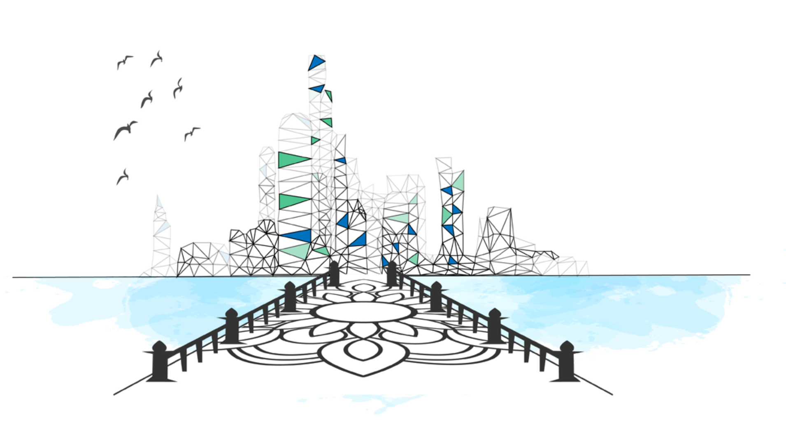
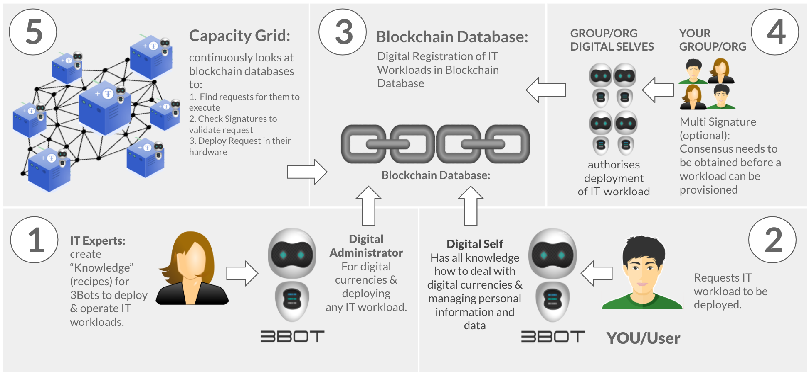

# Smart contract for IT

The TF Grid is orchestrated using a very unique approach.
Each workload gets registered on the TF Grid smartcontract database.

- [Smart contract details](smartcontract_details)
- [Capacity pool concept](smartcontract_details)

### Workload definitions

- [0-Containers](capacity_container)
- [Overlay network](capacity_network)
- [Web Gateway](capacity_webgateway)
- [Kubernetes](capacity_kubernetes)
- [0-DB storage](capacity_0db)
- [Virtual disk](capacity_vdisk)

### The process

#### STEP 1: educate 3Bot = TF Grid SDK

IT Experts: Give knowledge to the 3Bots (it's like god defining our DNA of our cells)

#### STEP 2: Business IT/Customer: Asks their 3Bot to deploy an IT workload following their requirements 

- e.g. give me an archive of 1 PB in CH, e.g. deploy a CRM for 100 users, …
- e.g. deploy my new banking app feature X
- e.g. deploy my artificial intelligence data mining job for ...

#### STEP 3: The 3Bot: Creates & Registers the “IT” smart contract 

The 3Bot: Creates & Registers the “IT” smart contract in the BCDB (Blockchain Database) (note: this could not be done by humans, it's too complicated)

#### STEP 4: Business IT Workload Stakeholders Consensus

Need to give consensus to check the “IT smart contract” and give their approval e.g. another IT expert checks the quality of the code, a legal guy checks GDPR, a business person checks budget 

#### STEP 5: The 3 Nodes execute the workload.

- thousands of 3 nodes could work together to execute the “IT Smart Contract” (if required)
- verify if consensus was reached between the business stakeholders
- verify the validity of the smart contract and download the “IT workload definition”
- download the right files to execute the smart contract and each file gets verified (signature)
- run the required processes and again signatures are checked to make sure the workload is pure.
0 ensures that no person (hacker or IT person) could ever gain access or influence on the execution process.

### Details how the smart contract layer works

- [Smartcontract details](smartcontract_details)
