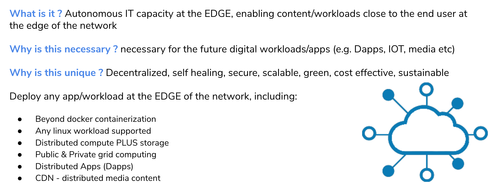
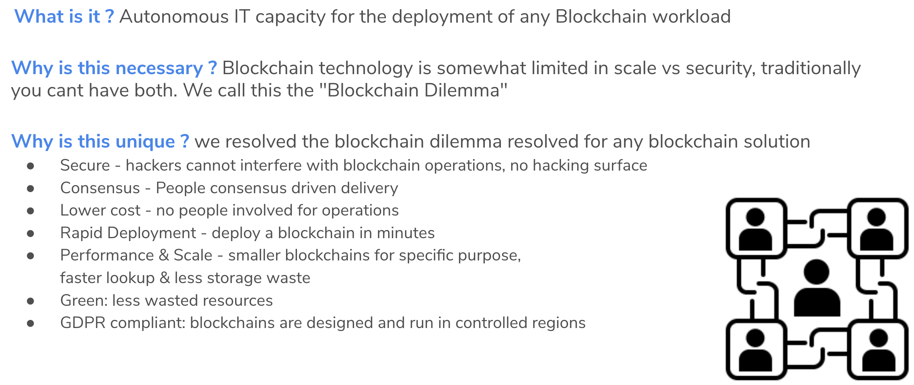

# overview of high-level use cases

## Decentralized, Autonomous, Edge, Grid Computing

TODO: use case Autonomous, Edge, Grid Computing, high level

## BCDB: Secure, Scalable, Distributed Storage Workloads

## Blockchain-as-a-service 

## S3 Storage

TODO: high-level use case S3 Storage

