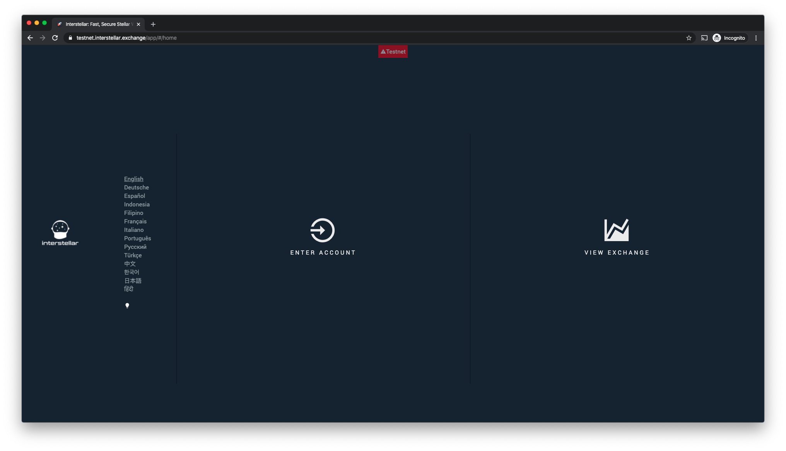
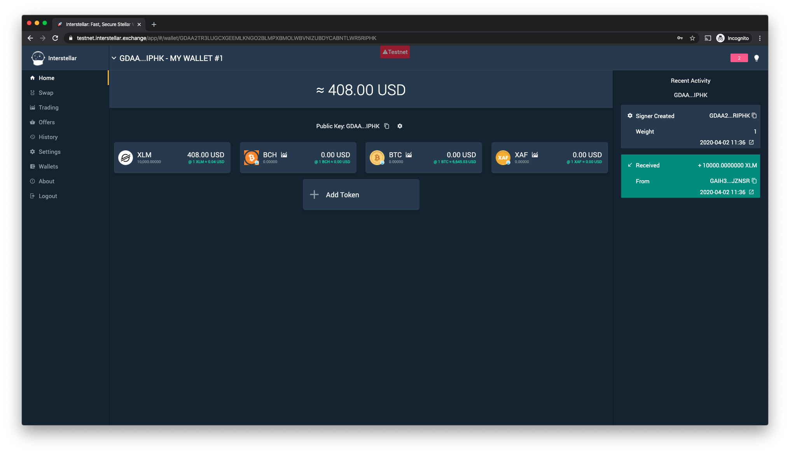
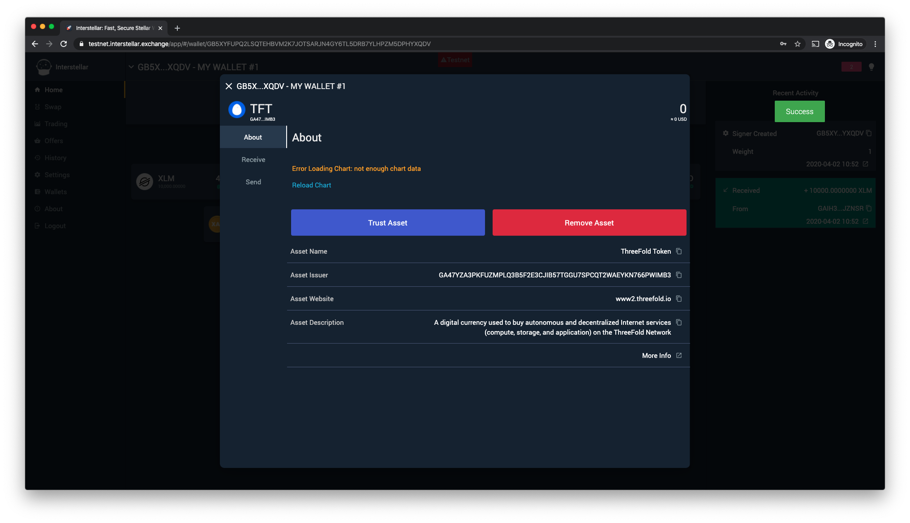
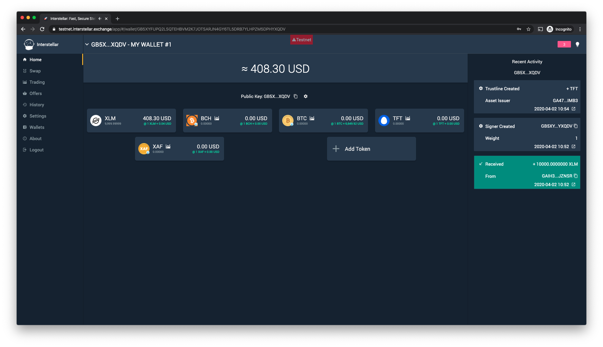
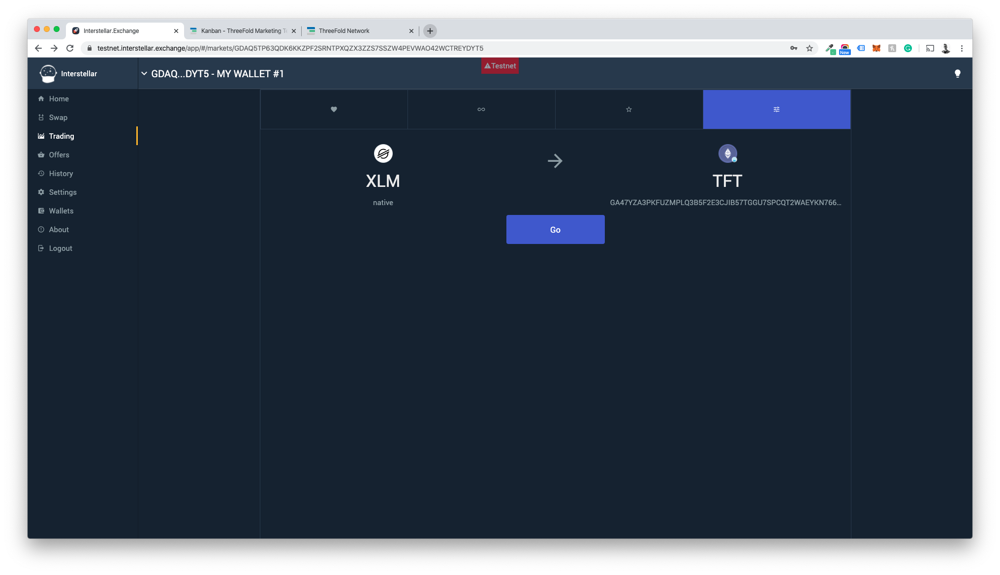
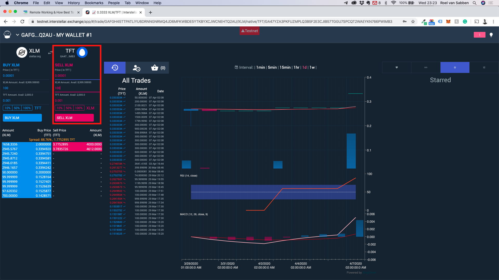
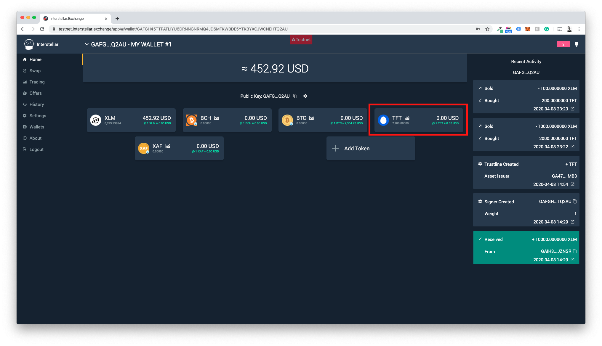

# Buying Tokens on Interstellar

Interstellar.exchange is a decentralized exchange that allows you to buy TFTs.

## Part 1: Create an account on interstellar.exchange

* Click Login/Signup.

* Choose Your Language

* Choose Your Preferred View: Light/Dark

* Click through the 6 USPs of interstellar.exchange

* Click Enter Account
For Interstellar all you need to do is set a password. As the wallet will be linked to your device instead of an email address.

* Set your password, Confirm it, and accept the Terms and Conditions

* Click Login: You now have your account

## Part 2: Create a wallet and adding funds to your account.

* Choose If you want a Generate a Random or Custom wallet adress (we are going for a random one in this case.

* ! DANGERZONE ! You are now presented with your Secret Key. Please follow all steps and read the procedures carefully. Losing your key will most likely result in a loss of your funds. ThreeFold or Interstellar could’t help anyone restore accounts or the funds attached to them in any case!

* You’re account is now created and you will have to send funds (digital currencies that run on the Stellar Blocklchain only only) to one of the wallets attached to your account.

* We have funded our wallet with $408 or 10.000 XLMs for this manual as you could see these are now shown in the account overview.

## Part 3: Adding the TFT Asset to your account.

* Click Add Token in your account overview

* Choose "Manual" option

* Add the following data 
Asset Code: TFT
Asset Issuer: GBOVQKJYHXRR3DX6NOX2RRYFRCUMSADGDESTDNBDS6CDVLGVESRTAC47!

* The Asset is now added to your account, to trade the asset however you will have to create a trustline, you could do this by clicking on the "Trust Asset" Button.

* When you have successfully created a trustline it will say success and the activity will show up in the right-hand column of the account page.

## Part 4: Trading Digital Currencies for TFT

Now that the account is set up and funded and you have the TFT asset listed in your account with a trustline you could now start trading TFT.

* Click Trading in the left sidebar

* Then go to the most right tab to select the currency you would like to trade for TFTs (XLM in the case of the screenshot) and press go

* You could now choose to fullfill a sell order from the order book, do a partial buy of an order, or create you own buy order by stating the amount of TFT you would like to buy and at what price.

* You confirm the transaction and will get a succes message when it has gone through plus a little bell will also ring.

* You now have TFTs in your wallet

