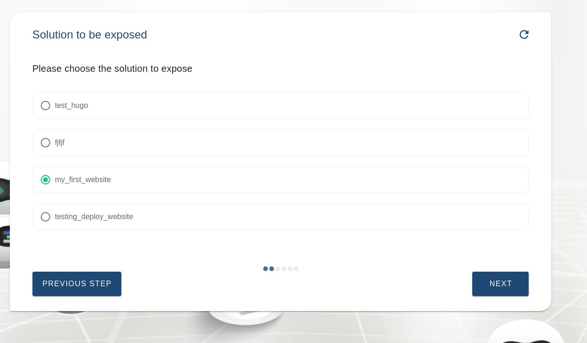

# Deploy your first website

In this section we will guide you through the steps required to be able to host your website.

We will start by creating an Flist that will include the contents of the website and the server configurations used to serve this content. This Flist will be uploaded and hosted on the hub so that it could be used directly in the creation of the container.

This tutorial will be using [Hugo](https://gohugo.io/getting-started/), which is a static site generator to serve the website contents. A simple configuration and basic files will be used.

The tutorial will also use the example "chat flows" to deploy the solution. The chat flows are wizards that guide you through different steps asking you questions to help you generate a reservation understandable by the grid. The Generic Flist chatflow will be used where the url of the Flist we will be creating is used in the process.

## Index

1. [Prepare website content and server](#Prepare-website-content-and-server)
2. [Create Flist with website content](#Create-Flist-with-website-content)
3. [Deploy container](#Deploy-a-container)
4. [Expose website by configuring Web Gateway](#Expose-website-by-configuring-web-gateway)

### Prepare website content and server

First we need to prepare the content of the website to be viewed. In this tutorial a one page html file will be used to demonstrate the idea. Feel free to add all your content however you like.

We will be using [Hugo](https://gohugo.io/getting-started/) to generate the site. To get the hugo binary follow the next steps

```bash
mkdir hugo_0.69.2_Linux-64bit
cd hugo_0.69.2_Linux-64bit

# get the binary compressed
wget https://github.com/gohugoio/hugo/releases/download/v0.69.2/hugo_0.69.2_Linux-64bit.tar.gz
# get the binary of hugo from the tar folder
tar -xvf hugo_0.69.2_Linux-64bit.tar.gz
cp hugo /usr/bin/
```

This will download and extract the binary `hugo` and the license to use Hugo into the folder you created.
To download a different version of hugo you could visit their [releases page](https://github.com/gohugoio/hugo/releases)

After that we need to create the file structure that will have the contents in. We will create a website with the name `my_hugo_website`.We could also use one of many themes available. The following steps are based on [hugo quick start](https://gohugo.io/getting-started/quick-start/)

```bash
hugo new site my_hugo_website
cd my_hugo_website

# Add theme content
git init
git submodule add https://github.com/budparr/gohugo-theme-ananke.git themes/ananke
# Add theme to configuration
echo 'theme = "ananke"' >> config.toml
```

We will now have the folder `my_hugo_website` created with the following structure


We could then add our content under the contents directory or using hugo commands. To test locally just start the server and access it from the browser at `http://localhost:1313`.

```
hugo new posts/my-first-post.md
# start the server
hugo server -s /my_hugo_website/
```

### Create Flist with website content

We are now ready to create our Flist. An Flist (file list) is an archive to store metadata about a filesystem and could be used on the grid to deploy a container with its contents. The Flist should include a startup file as well to indicate if there are any commands to be done once a container is created. In our case we will want to start the hugo server.

We will start by preparing a compressed folder with hugo binary and the new website we just created:

- `bin/hugo`
- `my_hugo_website/`

We could simply create an Flist by compressing the contents and uploading them onto the [hub](https://hub.grid.tf/upload) for conversion.

First you need to tar the contents using

```bash
tar -czvf my_website_Flist.tar.gz -C hugo_Flist .
```

and then upload it to the [hub](https://hub.grid.tf/upload) once you log in with your 3Bot app successfully


Once the upload is complete we now have an Flist ready to be used. The Flist url we will be need is the source which is usually in the following format
 `https://hub.grid.tf/YOUR_3BOT_NAME.3Bot/my_website_Flist.Flist`


### Deploy a container

Now that we have our Flist ready, we are prepared to deploy a container on the grid. To be able to do so you will need to make sure of the following:

- You have a 3Bot identity registered on the TF Grid
- You have tokens that will be used for payment
- You have a deployed network
- You have to create/extend a capacity pool

If any of the previous items is not satisfied you could make sure of them by checking [our docs](@getting_started_all). Once you have your network and pool ready we could move on to deploying your container using the generic container solution.

To start the wizard click the left menu on Solutions then Generic Container


1. Enter a name to give your solution. This will be used locally to save the details of the deployment.

 
 
2. Choose how much CPU, Memory resources and File system size, you want allocated for the container. You could stick to the default values provided.

 

3. Choose if you want to attach an extra volume to the container


4. Choose the pool that you have created to deploy your container on. 

 

5. Choose the network on which you want to deploy your container. Use the same name you entered previously when creating the network

 


6. You then need to enter the link of the Flist you created and uploaded on the hub earlier to be provided in the deployment.

 


7. You will then be asked if you want corex running. In our case there is no need for corex as we will start hugo server directly in the container as we pass the entrypoint (check next step) in the wizard, therefor we will disable it and choose `NO`.

 

8. You now need to provide the entrypoint the container will start with which is the following command to start the server:
`/bin/hugo server -s /my_hugo_website/ --bind 0.0.0.0`

 

9. Choose if you want to select the node for deployment automatically or not, You could stick to the default value provided.

 
 
10. Choose if you want to push the container logs to an external [redis](https://redis.io/) channel

 

11. You could now choose an IP address that will be given to your container in your network. This is the IP address you will be using to access the container

 

12. You could pass any other environment variables that will be used by the Flist startup as well incase you chose a different server with different configurations. In this tutorial we don't need to pass anything so you could leave it empty.

 

13. Choose if you want to assign a global IPv6 address to your workload.

 

14. we will deploy your solution it will take couple of minutes.

 


Once the deployment is successful you should have a container running with the hugo server started to serve your files on port _1313_.


This could be accessed using the \<IP:1313\> when wireguard is configured on your machine.


In the following section we will configure the Web Gateway to expose the website to be able to access it with a domain name instead.

### Expose website by configuring Web Gateway
Now that the website is ready and deployed. We will need to expose it to be accessible without wireguard. We could do this by simply using the Solution expose in the dashboard.
To start the wizard click the left menu on Solutions then Solution expose


1. First we will choose the type of the solution that we want exposed. Since we used a custom Flist and used the Flist deploy wizard then we will choose Flist

 

2. Second step we need to choose the solution deployed that we want exposed. In our case we named it _my_first_solution_ so we could simply choose that.

 

3. We then need to choose the ports to be exposed whether the tls port or the port the server will be served on. Since we started hugo server on the default port we will stick to port 1313

 

4. Now we need to specify the domain name that we will be registering. We have two possible options:

 - You could choose a Managed domain and add a subdomain to it, where the managed domain is a ready domain available that subdomains could simply be added to through the wizard. This way you will only provide a subdomain that will be binded to the domain you chose.

 or

 - You could choose a Custom domain to add an available domain that we will bind to, where you will need to get the domain from a domain provider yourself. You will need to add a CNAME record in your dns manager yourself when following this step.

 Since we have a managed subdomain available we will use that in this tutorial and simply provide a subdomain.

 We could give the name `my_first_website`,

 so that the full domain will be `http://my-first-website.tfgw-testnet-01.gateway.tf/`

 


 


now we will try to deploy the solution

 


Congratulations!

You have your website ready!!


You could now access it from the browser using the full domain you registered

